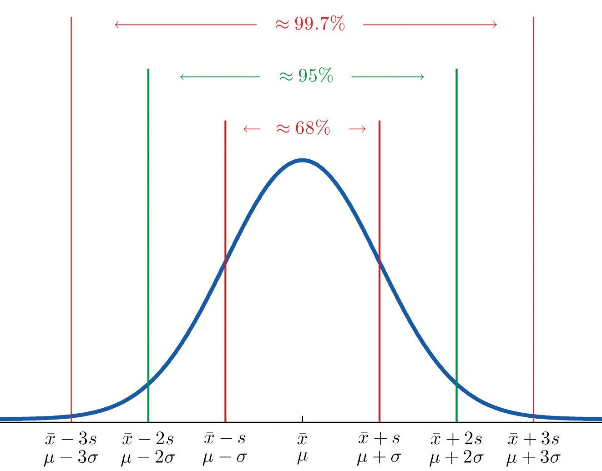
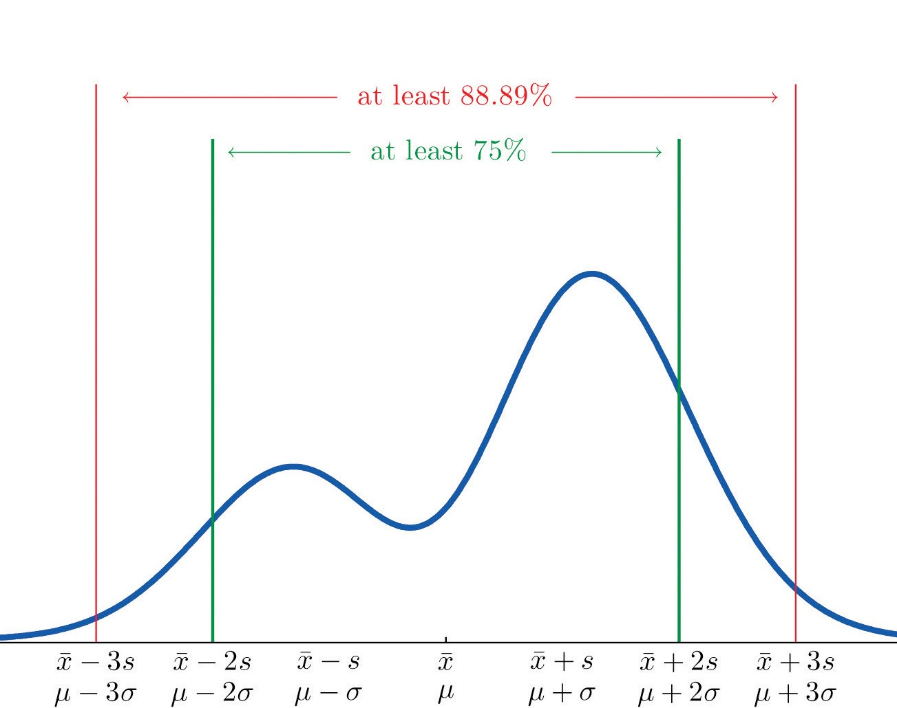
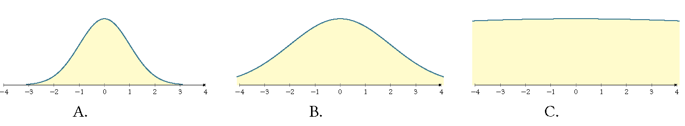

```{r, echo=FALSE}
knitr::opts_chunk$set(comment="#", fig.retina=2)
library(stats)
library(kableExtra)
library(knitr)
library(formattable)
library(ggplot2)
library(ggthemes)
library(ggExtra)
library(dplyr,warn.conflicts = FALSE)
set.seed(3)
load("../Data-Frames-SUNY-Concepts-in-Statistics/actor.rdata")
```


## Learning goals

- Create and interpret graphs (dot plots, pie charts, histograms, or boxplots) as a means of summarizing and communicating data meaningfully.

- Calculate and explain the purpose of measures of location (mean, median), variability (standard deviation, interquartile range).

- Explain the impact of outliers on summary statistics such as mean, median and standard deviation.


---
class: center middle
# Summarizing Data Graphically

---
## Distribution of Quantitative Data

- In data analysis, one goal is to describe **patterns** (known as the **distribution**) of the variable in the data set and create a useful summary about the set. 

<!-- In a graph that summarizes the distribution of a variable, we can see
• the possible values of the variable.
• the number of individuals with each variable value or interval of values.

## Patterns of Data Sets -->

- To describe patterns in data, we use descriptions of **shape**, **center**,
and **spread**. We also describe exceptions to the pattern. We call these exceptions **outliers**.

.center[
  
]


<!-- ---
class: center middle
# Graph Quantitative Data Sets -->


---
## Dot Plots


- A **dot plot** includes all values from the data set, with one dot for each occurrence of an observed value from the set.

- **Example:** The data set contains 15 petal lengths of iris flower. Create a dot plot to describe the distribution of petal lengths.

.center[
```{r echo=FALSE, results = 'asis'} 
cat(paste(head(iris$Petal.Length,15), collapse=", "))
```
]


- **Solution:** For each number in the data set, we draw a dot. We stack dots of the same value from bottom to up.

.center[
```{r echo=FALSE, results = 'asis', fig.width=6, fig.asp=0.5} 
# use the preloaded iris package in R
irisdot <- head(iris["Petal.Length"],15)
# find the max frequency (used `plyr` package)
yheightPL <- max(plyr::count(irisdot, vars = "Petal.Length"))
# basic dotplot (binwidth = the accuracy of the data)
dotchart = ggplot(irisdot, aes(x=Petal.Length), dpi = 600)
dotchart = dotchart + geom_dotplot(binwidth=0.1, method="histodot", dotsize = 0.6, fill="blue")
# dotchart = dotchart + stat_density(aes(y=0.1/7*..count..), geom="line", colour="red", linetype="dashed", size=1,adjust=1.2)
# use coor_fixed(ration=binwidth*dotsize*max frequency) to setup the right y axis height.
dotchart = dotchart + theme_bw() + coord_fixed(ratio=0.1*0.6*yheightPL)
# tweak the theme a little bit
dotchart = dotchart + theme(panel.background=element_blank(),
                            panel.border = element_blank(),
                            panel.grid.minor = element_blank(),
                            # plot.margin=unit(c(-4,0,-4,0), "cm"),
                            axis.line = element_line(colour = "black"),
                            axis.line.y = element_blank(),
)
# add more tick mark on x axis
dotchart = dotchart + scale_x_continuous(breaks = seq(1,1.8,0.1))
# add tick mark on y axis to reflect frequencies. Note yheightPL is max frequency.
dotchart = dotchart + scale_y_continuous(limits=c(0, 1), expand = c(0, 0), breaks = seq(0, 1,1/yheightPL), labels=seq(0,yheightPL))
# remove x y lables and remove vertical grid lines
dotchart = dotchart + labs(x=NULL, y=NULL) + removeGridX()
dotchart
```
]


---
## Pie Charts (1/2)

- A **pie chart** is a pie with sectors represents categories and the area of each sector is proportional to the frequency of each category.


- **Example:** The distribution of majors of 100 students in a sample is shown in the table. Use a pie chart to organize the data.

.center[
| Grade | Frequency (Counts) |
| ----- | ------ |
| Art     | 30      |
| Engineering | 50      |
| Science    | 20      |
]


---
## Pie Charts (1/2)
- Find the relative frequency (percent) of each grade is shown in the following table.

.center[
| Major       | Frequency| Relative Frequency|
| ----------- | -------------------- | ------------------------------- |
| Art         | 30                   | 30%                             |
| Engineering | 50                   | 50%                             |
| Science     | 20                   | 20%                             |
]


- The following shows the pie chart.
.center[
  
]


---
## Histograms (1/4)

- A **histogram** divides values of a variable into equal-sized intervals called **bins**  (classes in some books) and uses rectangular bars to show the **frequency (count)** of observations in each interval. 

- A **frequency distribution** is a table which contains bins, frequencies and/or **relative frequencies** which are  proportions (percentage) defined by the formula
$$
  \text{Relative frequency} =\frac{\text{Class frequency}}{\text{Sample size}}.
$$

- Each bin has a **lower bin limit**, which is the left endpoint of the interval, and an **upper bin limit**, which is the right endpoint of the interval.
  
- The **bin width** is the distance between the lower (or upper) bin limits of two consecutive bins.

- The difference between the maximum and the minimum data entries is called the **range**.
  
- The **midpoint** of a bin is the half of the sum of the lower and upper limits of the bin.

???
Dot plots work well with small data sets. Because, each data entry is a bin that contains all entries with the same value.
  
---
## Histograms (2/4)

<!-- The **upper boundary** of a class is the midpoint between the upper bin limit of the class and the
lower bin limit of the next class in the sequence.
The lower boundary is defined similarly. -->


<!-- - The **cumulative frequency** of a class is the sum of the frequencies of that class and all previous bins. -->


- **Example:** The following data set show the mgp (mile per gallon) of 30 cars.  Construct a frequency table and frequency histogram for the data set using a bin width 4.
<!-- .center[24, 30, 35, 42, 40, 26, 23, 36, 10, 45, 29, 21, 34, 16, 47, 28, 32, 54, 19, 49] -->

<!-- 10.4	10.4	13.3	14.3	14.7	15.2	15.2	15.5	15.8	16.4	17.3	17.8	18.1	18.7	19.2	19.2	19.7	21	21	21.4	21.5	22.8	22.8	24.4	26	27.3	30.4	30.4	32.4	33.9 -->
.center[
```{r echo=FALSE, results = 'asis'} 
cat(paste(head(mtcars$mpg,30), collapse=", "))
```
]

- **Solution:**
  - Find the maximum, minimum and range of the data set. In this example, the minimum is 10.4
  , the maximum is 33.9, and the range is 33.9-10.4=23.5
  
  - Determine the number bins using the roundup of $\frac{\text{range}}{\text{bin width}}$. In this example, the number of bins is $\lceil \frac{23.5}{4}\rceil=6$.
  
  - Choose a starting point as the first lower bin limit. A **convenient starting point** is a value less than the minimum that has *more accuracy than the data set*. For example, in this data set, we may start with 10.35, then add the bin width to get all lower bin limits: 10.35, 14.35, 18.35, 22.35, 26.35, and 30.35.


---

class: middle

## Histograms (3/4)

- **Solution:**(continued)   
  - The upper bin limit can be taken as the next lower bin limit. In this example, the upper bin limits can be taken as 14.35, 18.35, 22.35, 26.35, 30.35 and 34.35.
  
  - Record counts in bins and create the frequency distribution table.
  
  - Graph the histogram using the frequency distribution table.
  

.pull-left[
.middle[.center[
| Bin   | Frequency |
| ----- | --------- |
| 10.35-14.35 | 4         |
| 14.35-18.35 | 9         |
| 18.35-22.35 | 8         |
| 22.35-26.35 | 4         |
| 26.35-30.35 | 1         |
| 30.35-34.35 | 4         |
]]
]  

.pull-right[
```{r echo=FALSE, results = 'asis', fig.width=6, fig.asp=0.6} 
carshist <- head(mtcars["mpg"],30)
ggplot(carshist, aes(x=mpg), dpi=600) +
  geom_histogram(binwidth=4,boundary=10.35,
                 fill="lightblue", col="white",size=1) +
  stat_density(aes(y=4*..count..), geom="line",
               colour="blue", linetype="dashed", size=1,adjust=1.2) +
  geom_vline(aes(xintercept=mean(mpg)),
          color="purple", linetype="dashed", size=1) +
  geom_vline(aes(xintercept=median(mpg)),
          color="red", linetype="dashed", size=1) +
  scale_x_continuous(breaks = seq(10.35, 34.35, 2)) +
  scale_y_continuous(breaks = seq(0, 9, 1)) +
  theme_bw(base_size = 12) +
  theme(panel.grid.minor = element_blank())
```
]

<!-- .pull-right[
  .middle[.center[]]
] -->


---

## Histograms (4/4)

**Remark:** 
- Avoid histograms with large bin widths and small bin widths. [See Histogram 2 of 4 in Concepts in Statistics for an interactive demonstration](https://courses.lumenlearning.com/wmopen-concepts-statistics/chapter/histograms-2-of-4/)

- When bin width is no given, we may first determine the number of bins. There are different approaches. For example, the Rice rule takes the bin number $k = \lceil 2n^{1/3}\rceil$, where $\lceil 2n^{1/3}\rceil$ is the roundup of $2n^{1/3}$. 

- If the number of bins is $k$, then we choose a number with the same or one more decimal place that is greater than $\frac{\text{range}}{k}$, but no more than $\frac{\text{range}}{k-1}$ as the bin width. 

- The area of a bar represents the relative frequency for the bin. There should no space between any two bars. 

- **Bar charts** are usually used to compare data sets from different categories. Histogram should not be bar chart.

- See the [Statistic How To](https://www.statisticshowto.datasciencecentral.com/choose-bin-sizes-statistics/) page for more discussion on choosing bin width.

???
Show a bar chart to students in Excel.  

---
## Common Descriptions of Shape Distribution

- **Right skewed** (reverse $J$-shaped):  A right-skewed distribution has a lot of data at lower variable values. (Example: the histogram example.)

- **Left skewed** ({ $J$-shaped):  A left skewed distribution has a lot of data at higher variable values with smaller amounts of data at lower variable values.

- **Symmetric with a central peak (bell-shaped)**: A
central peak with a tail in both directions. A bell-shaped distribution has a lot of data in the center with smaller amounts of data tapering off in each direction. (Example: the petal length example.)

- **Uniform**: A rectangular shape, the same amount of
data for each variable value.

- For examples of left skewed and uniform distributions, please see the example in [dotpolt 2 of 2 in Concepts in Statistics](https://courses.lumenlearning.com/wmopen-concepts-statistics/chapter/dotplots-2-of-2/)

---
class: center middle
## Measures of Center and Spread

---
## Measure of Centers

- **Mean**: The mean is the average, this is the quotient of the total sum by the total number.

- **Median**: The median is the middle of
the data when all the values are listed in order. The median divides the data into
two equal-sized groups.

- Use the *mean* as a measure of center only for distributions that are *reasonably symmetric* with a central peak. When outliers are present, the mean is not a good choice.

- Use the *median* as a measure of center for all *other cases*.
  
- We need to use a graph to determine the shape of the distribution. So graph the data first.

- Check the webpage on [Skewness of Relative Frequency Histograms](https://saylordotorg.github.io/text_introductory-statistics/s06-02-measures-of-central-location.html) to see the positions of mean and median.

---
## Notations and Calculations about Mean

- Sigma notation: in math, we denote the sum of values  $x_1$, $x_2$, $\dots$, $x_n$ of a variable $x$ by $\sum_{i=1}^n x_i$ or simply by $\sum x$. 

- The **population mean** is 
  $\mu= \frac{\sum x}{N}$, 
  where $N$ is the **population size**, i.e the number of elements in the population. 
  The notation $\mu$ reads as mu.

- The **sample mean** is $\bar{x}=\frac{\sum{x}}{n}$, where $n$ is the **sample size**. The notation $\bar{x}$ reads as $x$--bar.

- **Example:** Find the mean city mpg for a sample of 10 cars.
.center[
```{r echo=FALSE, results = 'asis'} 
cat(paste(head(mpg$cty,10), collapse=", "))
```                      
]
- **Solution:** The mean is
$$\bar{x}=\frac{18+21+20+21+16+18+18+18+16+20}{10}=18.6.$$
The mean mpg of the 10 cars is 18.6 mpg.

---
## Weighted Mean
- The weighted mean of a set of numbers $\{x_1, \dots, x_n\}$ with weights $w_1$, $w_2$, ..., $w_n$ is defined as  $$\frac{\sum w_ix_i}{\sum w_i}.$$

- The mean of a frequency table is weighted mean
$\bar{x}=\frac{\sum f x}{n}$, where $x$ is an element with frequency $f$ and $n$ is the sample size.

- **Example:** In a course, the overall grade is determined in the following way: the homework average counts for 10%, the quiz average counts for 10%, the test average counts 50% , and the final exam counts for 30%. What's the overall grade of the student who earned  92 on homework, 95 on quizzes, 90 on tests and 93 on the final.
- **Solution:** The overall grade is the weighted mean
$$\frac{\sum w_ix_i}{\sum w_i}=\frac{0.1\cdot 92+0.1\cdot 95+0.5\cdot 90+0.3\cdot 93}{0.1+0.1+0.5+0.3}=91.6.$$

???
Show how to use Excel

---
## Exercises on Mean and Weighted Mean

- Find the average petal width for a sample of  10 iris followers.
  
.center[
```{r echo=FALSE, results = 'asis'} 
cat(paste(as.vector(sample(iris$Petal.Width,10)), collapse=", "))
```
]

- Find the mean from the dot plot of sepal length for a sample of 10 iris flowers.
.center[
```{r echo=FALSE, results = 'asis', fig.width=8, fig.asp=0.15} 
# use the preloaded iris package in R
dfirisSL <- head(iris["Sepal.Length"],10)
# find the max frequency (used `dplyr` package)
yheightSL <- max(count(dfirisSL, Sepal.Length)["n"])
sepalmin <- min(dfirisSL)
sepalmax <- max(dfirisSL)
# basic dotplot (binwidth = the accuracy of the data)
irisPL = ggplot(dfirisSL, aes(x=Sepal.Length), dpi = 600)
irisPL = irisPL + geom_dotplot(binwidth=0.1, method="histodot", dotsize = 0.6, fill="blue")
# use coor_fixed(ration=binwidth*dotsize*max frequency) to setup the right y axis height.
irisPL = irisPL + theme_bw() + coord_fixed(ratio=0.1*0.6*yheightSL)
# tweak the theme a little bit
irisPL = irisPL + theme(panel.background=element_blank(),
                        panel.border = element_blank(),
                        panel.grid.minor = element_blank(),
                        # plot.margin=unit(c(-4,0,-4,0), "cm"),
                        axis.line = element_line(colour = "black"),
                        axis.line.y = element_blank(),
)
# add more tick mark on x axis
irisPL = irisPL + scale_x_continuous(breaks = seq(sepalmin,sepalmax,0.1))
# add tick mark on y axis to reflect frequencies. Note yheightSL is max frequency.
irisPL = irisPL + scale_y_continuous(limits=c(0, 1), expand = c(0, 0), breaks = seq(0, 1,1/yheightSL), labels=seq(0,yheightSL))
# remove x y lables and remove vertical grid lines
irisPL = irisPL + labs(x=NULL, y=NULL) + removeGridX()
irisPL
```
]

- Estimate the average highway mpg using the histogram of a sample of 20 cars.

.center[
```{r echo=FALSE, results = 'asis', fig.width=8, fig.asp=0.3} 
# determine the sample size
s <- 20
# select the sample
mpghwy <- head(mpg["hwy"],s)
# determine the number of bins using log rule
nbins <- ceiling(1+log2(s))
# find max, min, start point, end point and bin width
minhwy <- min(mpghwy)
maxhwy <- max(mpghwy)
starthwy <- minhwy-0.5
bwidth<-ceiling((maxhwy-minhwy)/nbins)
endhwy <- starthwy + bwidth*nbins
# find the max and min frequencies
histdata <- hist(mpghwy$hwy, breaks=seq(starthwy, endhwy, bwidth), plot=FALSE, right=FALSE)
maxfreq <- max(histdata$count)
minfreq <- min(histdata$count)
# Basic histogram plot
ggplot(mpghwy, aes(x=hwy), dpi=600) +
geom_histogram(binwidth=bwidth,boundary=starthwy,
                 fill="lightblue", col="white",size=1) +
# add the density curve
#  stat_density(aes(y=4*..count..), geom="line",             colour="blue", linetype="dashed", size=1, adjust=1.2) +
# add the mean vertical line
# geom_vline(aes(xintercept=mean(hwy)),       color="blue", linetype="dashed", size=1) +
# add bin limits to x axis
scale_x_continuous(breaks = seq(starthwy, endhwy, bwidth/2)) +
# add frequency ticks to y axis
scale_y_continuous(breaks = seq(minfreq, maxfreq, 1)) +
# change font size and remove minor grid
theme_bw(base_size = 12) +
theme(panel.grid.minor = element_blank()) +
# change labels for x and y axis
xlab("highway mpg") + 
ylab("Frequency")
```
]


---

## Median, Quartiles, Interquartile Range and Outliers

- The three **quartiles**, Q1, Q2, and Q3 are numbers in an ordered data set that divide the data set into four equal parts. The second quartile is known as the **median**.

- Interquartile Range (IQR for short) is the measure of variation when using the median to measure center. It is defined as the difference of the third and the first quartiles: IQR=Q3-Q1.

- When using the median and IQR to measure center and spread, a data point is considered an **outlier** if it satisfies one of the following conditions.
  - The data value is more than Q3 + 1.5 $\cdot$ IQR.
  - The data value is less than Q1 − 1.5 $\cdot$ IQR.

- The minimum, Q1, Q2, Q3 and maximum are known as the "**five-number summary**" of the data set.
  
---
## Example on Median, IQR and Outliers

- Example: Find the median, quartiles, IQR and outliers (if they exist) of the sample height of 15 trees.

.center[
```{r echo=FALSE, results = 'asis'} 
cat(paste(as.vector(head(trees$Height,15)), collapse=", "))
```
]

- **Solution:** 
  - Sort the data set from small to large.
.center[
```{r echo=FALSE, results = 'asis'} 
cat(paste(sort(as.vector(head(trees$Height,15))), collapse=", "))
```
]
  - Find the median i.e. Q2. The sample size is 15. The middle of the ordered data set is the $\lceil 15/2 \rceil=8$-th number which is 75.
  - Find Q1 and Q3. Q1 is the median of the numbers less than the median. Q3 is the median of the number greater than the median. In this example, Q1 is the 4-th number 69. Q3 is the 4-th to the last, that is 79.
  - IQR=Q3-Q1=79=69=10.
  - Since Q1-1.5IQR=69-1.5 $\cdot$ 10=54 and Q3+1.5IQR=79-1.5 $\cdot$ 10=94, there is no outlier in this sample.

---
## Box Plot (1/2)

- A **box plot** shows a "five-number summary" of the data set. It contains a box, two whiskers and dots (for outliers).

- To create the boxplot for a distribution,
  
  - Draw a box from Q1 to Q3.
  
  - Draw a vertical line in the box at the median.
  
  - Extend a tail from Q1 to the smallest value that is not an outlier and from Q3 to the largest value that is not an outlier.
  
  - Indicate outliers with a solid dot.


---
## Box Plot (2/2)

- **Example:** Create the boxplot for the ages of 32 best actor oscar winners (1970–2001).

.center[
```{r echo=FALSE, results = 'asis'} 
cat(paste(sort(actor_age$Age), collapse=", "))
```
]

- **Solution:** We may use Excel to find the five-number summary.

  - Q2=42.5, Q1=37.5, Q3=49.5, IQR=12, 1.5IQR=18, Q1-1.5IQR= 19.5, Q3+1.5IQR=67.5
  
  - There is an outlier 76. 
  
  - The boxplot is shown below.
  .center[
```{r echo=FALSE, results = 'asis', fig.width=10, fig.asp=0.2} 
load("../Data-Frames-SUNY-Concepts-in-Statistics/actor.rdata")

ggplot(actor_age, aes(x="", y=Age)) +
  geom_boxplot() +
  scale_y_continuous(breaks = c(31, 37.75, 42.5, 48.75, 61, 76),
                     labels = c("31", "37.5", "42.5", "49.5", "61", "76")) +
  theme_bw(base_size = 12) +
  xlab("") + 
  coord_flip() +
  theme(panel.border=element_blank(), 
        axis.line.x = element_line(colour = "black"),
        axis.line.y = element_blank())
```
]

---
## Measure of Variation about Population Mean

- The **deviation** of an entry $x$ in a population data set is the difference $x-\mu$, where $\mu$ is the mean of the population.
  
- The **population variance** of a population of $N$ entries is defined as
$$
	\text{VAR.P}=\sigma^2=\dfrac{\sum(x-\mu)^2}{N}.
$$
- The **population standard deviation** is 
$$
	\text{STDEV.P}=\sigma=\sqrt{\dfrac{\sum(x-\mu)^2}{N}}.
$$ 
---

## Measure of Variation about Sample Mean

- The **deviation** of an entry $x$ in a sample data set is the difference $x-\bar{x}$, where $\bar{x}$ is the mean of the sample.

- The **sample variance** and **sample standard deviation** are defined similarly
$$
	\text{VAR.S}=s^2=\dfrac{\sum(x-\bar{x})^2}{n-1}, \qquad
	\text{SEDEV.S}=s=\sqrt{\dfrac{\sum(x-\bar{x})^2}{n-1}},
$$
where $n$ is the sample size.

- **Rounding rule:** for mean, variance and standard deviation, we keep one more digits than the accuracy of the data set.

???
Show how to use Excel to find SD

---
## Example on Standard Deviation

- **Example:** Find the mean and standard deviation ages of a sample of  32 best actor oscar winners (1970–2001).

.center[
```{r echo=FALSE, results = 'asis'} 
cat(paste(sort(actor_age$Age), collapse=", "))
```
]

- **Solution:** We use the Excel functions `AVERAGE()` and `STDEV.S()` to find the mean and sample standard deviation respectively.
The mean is `r round(mean(actor_age$Age),1)`. The sample standard deviation is `r round(sd(actor_age$Age),1)`.


---

## Exercises on Boxplot and SD (1/2)

- A sample of GPAs from ten students random chosen from a college are recorded as follows.
.center[1.90, 3.00, 2.53, 3.71, 2.12, 1.76, 2.71, 1.39, 4.00, 3.33]

  - Create a boxplot for this sample.
  - Find the standard deviation of this sample.

- Read examples and try exercises in [Interquartile Range and Boxplots in Concepts in Statistics 1-3](https://courses.lumenlearning.com/wmopen-concepts-statistics/chapter/interquartile-range-and-boxplots-1-of-3/)

- Read examples and try exercises in [Standard Deviation 1-4](https://courses.lumenlearning.com/wmopen-concepts-statistics/chapter/standard-deviation-1-of-4/)

- A sample of the highest temperature of 10 days has a standard deviation $5^\circ\mathrm{C}$ in Celsius. If we want to know the standard deviation in Feirenheit, do we need to recaculate using the sample? What is the standard deviation in Fahrenheit. 
  
---
## The Empirical Rule

If a data set has an **approximately bell-shaped** distribution, then

1. approximately 68% of the data lie within one standard deviation of the mean.

2. approximately 95% of the data lie within two standard deviations of the mean.

3. approximately 99.7% of the data lies within three standard deviations of the mean.

.center[

]


.small[
Image source: [Figure 2.16 "The Empirical Rule"  in Introductoray Statistics](https://saylordotorg.github.io/text_introductory-statistics/s06-05-the-empirical-rule-and-chebysh.html#fwk-shafer-ch02_s05_s01_f02)
]
 

---
## Chebyshev’s Theorem

- For any numerical data set, at least $1−1/k^2$
of the data lie within $k$ standard deviations of the mean, where $k$ is any positive whole number that is at least 2.

.center[

]


.small[
Image source: [Figure 2.19 "Chebyshev’s Theorem"  in Introductoray Statistics](https://saylordotorg.github.io/text_introductory-statistics/s06-05-the-empirical-rule-and-chebysh.html#fwk-shafer-ch02_s05_s02_f01)
]

---

## Applications of the Empirical Rule and Chebyshev's Theorem

- **Example:** A population data set with a bell-shaped distribution has mean $\mu = 6$ and standard deviation $\sigma = 2$. Find the approximate proportion of observations in the data set that lie: 
  1. between 4 and 8;
  2. below 4.

- **Solution:** Apply the Empirical Rule, there are 68% of data lie between 6-2=4 and 6+2=8. Since the distibution is symmetric, then 34% of data lie between 4 and 6, and 34% of data lie between 6 and 8. Then there are only 50%-34%=26% of data lie below 4.

- **Example:** A sample data set has mean $\bar{x}=6$
and standard deviation $s = 2$. Find the minimum proportion of observations in the data set that must lie
between 2 and 10.

- **Solution:** Apply Chebyshev's theorem, there are 75% of data are between $\bar{x}-2s=2$ amd $\bar{x}+2s=10$.

- **Exercise:** Try exercises in [2.5 The Empirical Rule and Chebyshev’s Theorem in Introductory Statistics](https://saylordotorg.github.io/text_introductory-statistics/s06-05-the-empirical-rule-and-chebysh.html#fwk-shafer-ch02_s05_s01_f02).

---
class: center middle

# Quiz

---

## Quiz 2

- A student survey was conducted at a major university. The following histogram shows distribution of alcoholic beverages consumed in a typical week. 
  - What is the typical number of drinks a student has during a week? 
  - Do the data suggest that drinking is a problem in this university?
.center[
```{r echo=FALSE, results = 'asis', fig.width=12, fig.asp=0.425} 
load("../Data-Frames-SUNY-Concepts-in-Statistics/drinking.rdata")
drinking <- rename(data)
drinkinghabit<- drinking$Alcohol[!is.na(drinking$Alcohol)]
dfdrk <- data.frame(drinkinghabit)
colnames(dfdrk) <- c("Alcohol")
drhist <- ggplot(dfdrk, aes(x=Alcohol), dpi=600) +
  geom_histogram(binwidth=4, boundary=0,fill="lightblue", col="white") + 
  scale_x_continuous(breaks = seq(0, 36, 1)) + 
  scale_y_continuous(breaks = seq(0, 140,5)) +
  theme_bw(base_size = 12) +
geom_vline(aes(xintercept=mean(Alcohol)),       color="blue", linetype="dashed", size=1) +
geom_vline(aes(xintercept=median(Alcohol)), color="red", linetype="dashed", size=1) + 
# geom_vline(aes(xintercept=quantile(Alcohol)[2]), color="black", linetype="dashed", size=1) + 
#geom_vline(aes(xintercept=quantile(Alcohol)[4]), color="yellow", linetype="dashed", size=1) + 
ylab("Frequency")
#ggplot(dfdrk, aes(x="", y=Alcohol), dpi=600)+
#geom_boxplot(fill = "green")
drhist
```
]
  .small[.small[*The red line is through the median and the blue line is through the mean.*]]


---
## Quiz 3

- A teacher decide to curve the final exam by adding 10 points for each student. Which of
the following statistic will NOT change:
A. median,   B. mean,   C. interquartile range,   D. standard deviation?
** Please explain your conclusion. **

- Which distribution of data has the SMALLEST standard deviation? Please explain your conclusion.

.center[

]

---
class: center, middle

# Lab Instruction in Excel

---
## How to Create a Histogram in Excel
Suppose your data set is in `Column A` in Excel.

- Find the mininum and maximum using the Excel functions `min()` and `max()` respectively. In the cell `B1`, put the *first lower bin limit*, which is a number slightly less than the minimum but has more decimal places than the data set. 
  
- Create the first upper bin limit in `C1` using the formula `B1+binwidth`. Then hold the left-click at the lower right corner of `C1` and drag down to get other upper limits. 
  
- In Data menu, look for the Data Analysis ToolPak. In the popup windows, find Histogram.
  
- In the input range, select your data set.
In the bin range, select upper bins.

- Check Chart Output and hit OK. You will see the frequency table and histogram in Sheet 2.

- Change the gap between bars. Right click a bar and choose `Format Data Series...` and change the `Gap Width` to 2% or 1%.

---
## How to Create a Dotplot in Excel

- If you have a raw data set, follow the same procedure a creating a histogram but with a bin width equal the same accuracy of the data. For example, if you data set consists of integers, then choose 1 as the bin-width.

- Change the format of bars in the histogram. 
  - Right click a bar and select `Format Data Series...`.
  
  - Find `Fill & Line` and select both `Picture or texture fill` and `Stack and Scale with`. 
  
  - Click the button `Oneline...` and input *dot* in `search bing` and hit enter. 
  
  - Select a picture you like and you will get a dot-plot.

---
## How to Find the Mean, Median and Standard Deviation 

- To find the mean, you may use the function `average()`.

- To find the median, you may use the function `median()`.

- To find the **p**opulation standard deviation, you may use the function `STDEV.P()`.

- To find the **s**ample standard deviation, you may use the function `STDEV.S()`.

- To find quartiles, you may need to sort the data. To do so, select the data set, then in the menu `Data`, click the button `AZ` or `Sort`.