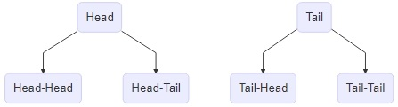
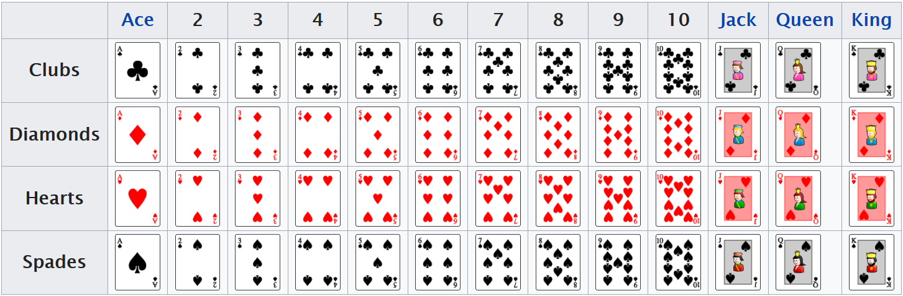

```{r, echo=FALSE}
knitr::opts_chunk$set(comment="#", fig.retina=2, crayon.enabled = TRUE, cache=TRUE)
set.seed(15)
library(stats)
library(kableExtra)
library(knitr)
library(formattable)
library(ggplot2)
library(ggthemes)
library(ggExtra)
library(dplyr,warn.conflicts = FALSE)
library(animation)
library(gifski)
```

# Textbooks

- [Concepts in Statistics](https://courses.lumenlearning.com/wmopen-concepts-statistics/)

- [Introductory Statistics](https://open.umn.edu/opentextbooks/textbooks/introductory-statistics)

---
class: center middle

# Learning Goals

---

## Learning Goals for Probability and Probability Distribution

- Construct sample spaces and calculate probabilities for simple and/or compound events.

- Use appropriate rules of probability for compound events.

---

## Probability (1/2)

- A **probability experiment** is a trial that can be infinitely repeated and leads to well-defined results.

- An **outcome** is the result of a single trial of a probability experiment.

- The **sample space** of a probability experiment is the set of all possible outcomes.

- An **event** is a subset of the sample space.

- A **probability** $P(E)$ is the measures of how likely an event $E$ will occur in a probability experiment. The probability of an event $E$ is defined as
  $$P(E)=\dfrac{\text{number of outcomes in }E}{\text{number of outcomes in }S}$$

---

## Probability (2/2)

**Example:**
  Imagine flipping one fair coin (which means the chance of a head and the chance of a tail are the same). What is the probability of getting the head.

  **Solution:**
  There are two possible outcomes: Head or Tail.
  So the sample space is the set $S = \{\text{Head}, \text{Tail}\}$.
  The event $E$ of getting a head is $E=\{\text{Head}\}$.  
  The probability $P(E)=\dfrac{1}{2}=0.5$.

---

## Empirical Probability (1/2)

- An **empirical (or a statistical) probability** is the relative frequency of occurrence of outcomes from observations in repeated experiments:

$$P(E)=\dfrac{\text{number of occurrence of event } E}{\text{total number of observations}}=\dfrac{\text{frequency in }E}{\text{total frequency}.}$$

**Example:**
  A statistics class has 5 math majors and 20 other majors. If a students was randomly select from the class, what's the probability that the selected students is a math major?

  **Solution:**
  The sample space is the set of all students in the statistics class.
  The event is the set of the 5 math majors.
  Then the probability is
  $$
    P(E)=\dfrac{\text{frequency of math majors}}{\text{total frequency of students}}=\dfrac{5}{25}=0.2.
  $$

---

## Empirical Probability (2/2)

**Example:** Coin Flip Simulation

  The purpose of this activity is to experiment with a simulation of flipping a **fair** coin, and to see if the P(H) = 0.5.

.center[
<iframe src="https://www.geogebra.org/material/iframe/id/112248/width/800/height/480/border/888888/rc/false/ai/false/sdz/false/smb/false/stb/false/stbh/true/ld/false/sri/false/at/auto" width="900px" height="360px"></iframe>
]

  Source: [GeoGebra](http://ggbtu.be/mLZbwMZtJ) License: [CC BY SA](http://creativecommons.org/licenses/by/3.0/us/)

---

## Theoretical Probability (1/2)

- When all outcomes in the sample space are equally likely, the probability of a desired event $E$, known as a **theoretical probability**,  is calculated by
  $$P(E)=\dfrac{\text{number of desired outcomes for event }E}{\text{number of all possible outcomes}}.$$

- **Equally likely** means that each outcome of an experiment occurs with equal chance.

- **Fundamental Counting Principle:** if there are $m$ ways of doing something and $n$ ways of doing another thing, then there are $m\cdot n$ ways of performing both actions

- **Tree diagrams** are often used for counting all possible outcomes.

---

## Theoretical Probability (2/2)

**Example:** Find the probability of getting two heads when tossing a fair coins twice.

  **Solution:** In the first time, the coin has two possible outcomes. The second time, the coin still has two possible outcomes. By the fundamental counting principle, we know that the sample space $S$ contains $2\cdot 2=4$ possible outcomes.
  .center[

]
  The event $E$ of getting 2 heads contains only one outcome: head and head. So the probability of getting two head when flipping a fair coin twice is $$P(E)=\frac{1}{4}.$$

---

## Law of Large Numbers (1/2)

- The empirical probability of an event is an "estimate" that based upon observed data from an experiment.

- The theoretical probability of an event is an "expected" probability based upon counting rules.

- **Law of Large Numbers:** As an experiment is repeated over and over, that is the number of trials getting larger and larger,  the empirical probability of an event approaches the theoretical probability of the event. ([Wiki: Law of large numbers](https://en.wikipedia.org/wiki/Law_of_large_numbers).)

<!--**Example:**

  Source: [The Law Of Large Numbers: Intuitive Introduction](https://www.probabilisticworld.com/law-large-numbers/) -->

---

## Law of Large Numbers (2/2)

**Example:** A demonstration for the law of large number by simulating coin flipping.
.center[
<iframe src="http://ucsmp.uchicago.edu/secondary/applets/law-of-large-numbers/" width="900px" height="456px" alt="Law of Large Numbers from UCSMP" frameborder="0" allowfullscreen marginheight=0px marginwidth=0px></iframe>
]
.small[
Source: [The University of Chicago School Mathematics Project](http://ucsmp.uchicago.edu/secondary/applets/law-of-large-numbers/)
]

---

## Basic Probability Rules (1/2)

- For an event $E$, the probability $P(E)$ is ranged from 0 to 1: $$ 0\leq P(E)\leq 1. $$

- The probability of an event $E=\{e_1,e_2, \cdots ,e_k\}$ of distinct outcome is equal to the sum of probabilities of individual outcomes: $$P(E)=P(e_1)+P(e_2)+\cdots+P(e_k),$$
where $P(e_i)$ is the probability of getting the outcome $e_i$.

- The **complement** $E^c$ of event $E$ is the set of all outcomes in a sample space that are not included in
event $E$. The probabilities $P(E)$ and $P(E^c)$ satisfies the identity: $$P(E)+P(E^c)=1.$$

---

## Basic Probability Rules (2/2)

**Example:** A six-sided die is rolled. Find the probability of the event $E$ getting a number less than 3, that is, $E=\{x | x <3\}$. Find the probability of the complement $E^c$ of the event $E$. Verify that $P(E)+P(E^c)=1$.

  **Solution:** The sample space of the six-sided die is $\{1,2,3,4,5,6\}$.
  The event $E$ consists of 2 numbers: $E=\{1, 2\}$.
  The probability is $$P(E)=\frac26=\frac16+\frac16=P(x=1)+P(x=2).$$
  The complement $E^c=\{3, 4, 5, 6\}$ and the probability is $$P(E^c)=\frac46=\frac23.$$
  It is clear that $P(E)+P(E^c)=\frac26+\frac46=1.$

---

## The Addition Rule (1/3)

- The **intersection of events** $A$ and $B$, denoted $A \cap B$ (a.k.a. $A \text{ and } B$), is the collection of all outcomes that are in both events $A$ and $B$.

- The **probability of the intersection** of two events is $$P(A\cap B)=\dfrac{\text{numbers of elements in } A\cap B}{\text{number of elements in the sample space }S}.$$

- Two events $A$ and $B$ are **mutually exclusive** if $P(A\cap B)=0$.

- The **union of events** $A$ and $B$, denoted $A \cup B$ (a.k.a. $A \text{ or } B$), is the collection of all outcomes that are in either the event $A$ or the event $B$.

- The **probability of the union** of two event is $$P(A\cup B)=\dfrac{\text{numbers of elements in } A\cup B}{\text{number of elements in the sample space }S}.$$

---

## The Addition Rule (2/3)

- **Addition Rule:** the probability of the union of two events $A$ and $B$ is $$P(A\cup B)=P(A)+P(B)-P(A\cap B).$$

**Example:** When randomly drawing a card from a deck of 52 cards, what's the probability of getting a heart face (king, queen, or jack)? What's the probability of getting a heart or a face? What's the probability of getting a club and spade?
.center[
  
<br>
  Image source: [Wikipedia: Standard 52-card deck](https://en.wikipedia.org/wiki/Standard_52-card_deck)
]

---

## The Addition Rule (3/3)

  **Solution:** The sample space $S$ consists of 52 cards as shown in the above picture. Among hearts, there are 3 face card. So $$P(\text{heart and face})=\frac{3}{52}=\frac{1}{14}.$$ 
  There are $22$ cards that are hearts or faces. So $$P(\text{heart or face})=\frac{22}{52}=\frac{11}{26}.$$
  Since there is no card which is club and spade, $$P(\text{club and spade})=0.$$
  
  **Note:** $P(\text{heart})=\frac{13}{52}$ and $P(\text{face})=\frac{12}{52}$, the addition formula also gives $$P(\text{heart or face})=\frac{13}{52}+\frac{12}{52}-\frac{3}{52}=\frac{22}{52}=\frac{11}{26}.$$

---

## The Multiplication Rule (1/3)

- The **conditional probability** of $A$ given $B$, written as $P(A|B)$, is the probability that event $A$ will occur given that the event $B$ has already occurred, that is, $$P(A|B)=\dfrac{\text{numbers of elements in }A\cap B}{\text{number of elements in }B}.$$

- **Multiplication Rule:** the probability of the intersection of two events $A$ and $B$ satisfies the following equality $$P(A\cap B)=P(B)P(A|B)=P(A)P(B|A).$$

- The multiplication rule gives a formula for conditional probability: $$P(B|A)=\dfrac{P(A\cap B)}{P(A)}\qquad\qquad P(A|B)=\dfrac{P(A\cap B)}{P(B)}.$$

- Two events $A$ and $B$ are **independent** if $$P(A|B)=P(A) \text{ or } P(B)=P(B|A).$$ Equivalently, $$P(A\cap B)=P(A)P(B).$$

---

## The Multiplication Rule (2/3)

**Example:** Given that the diamond ace card was drawn from a standard 52-card deck, what's the probability of getting a card with number 8 from the deck of cards?

  **Solution:** Let $A$ be the deck of cards without the diamond ace. Then $A$ has 51 elements. Let $B$ be the collection of cards with 8. In $A\cap B$, there are 4 cards. So $$P(B|A)=\frac{4}{51}.$$

**Example:** Consider flipping a fair coin and rolling a fair six-sided die together.
  - What's the probability that the coin shows a head?
  - Given that a head occurs, what's the probability that the die shows a number bigger than 4?
  - What's the probability of getting a head and a number bigger than 4?
  - Verify that flipping a head and rolling a number bigger than 4 are independent events.

---

## The Multiplication Rule (3/3)

  **Solution:** By the fundamental counting principle, the sample space consists of $2\times 6=12$ elements. Let $H$ be the event of getting a head and $D$ be the event getting a number bigger than 4. Then $$H=\{H1, H2, H3, H4, H5, H6\}\quad \text{ and }\quad D\cap H=\{H5, H6\}.$$
  
  The probability of getting a head is $P(H)=\frac12$.
  
  Given that a head shows, the change of getting a number bigger than 4 is $P(D|H)=\frac{2}{6}=\frac13$.
  
  By the multiplication rule, $P(H\cap D)=P(H)P(D|H)=\frac12\cdot\frac13=\frac16$.
  
  Note that $D=\{H5, T5, H6, T6\}$. Then $P(D)=\frac{4}{12}=\frac{1}{3}=P(D|H)$. So $H$ and $D$ are independent.

---

## More Examples on Probability Rules (1/2)

**Example:** Two six-sided fair dice were rolled. Find the probability of getting two numbers whose sum is at least 4.

  **Solution:** Let $E$ be the event of the sum is at least 4. Then the complement $E^c$ consists pairs of numbers whose sum are at most 3. There are 3 such pairs: $E^c=\{(1, 1), (1, 2), (2, 1)\}$.
  
  Using the definition or rules of probability, we know $P(E^c)=\frac{1}{12}.$
  
  Indeed, the sample space contains $6\cdot 6=36$ possible out comes. Hence, $P(E^c)=\frac{3}{36}=\frac{1}{12}$.
  
  Because rolling two dice are independent and any two outcomes are mutually exclusive. We see that $P(E^c)=P((1,1))+P((1,2))+P((2,1))=\frac16\cdot\frac16+\frac16\cdot\frac16+\frac16\cdot\frac16=\frac{1}{12}.$
  
  Apply the complement rule, we find $P(E)=1-P(E^c)=\frac{11}{12}$.

---

## More Examples on Probability Rules (2/2)

**Example:** Two cards were randomly drawn from a standard deck of 52 cards without replacement, which means the first card will not be put back. Find the probability of getting exactly one club card.

  **Solution:** There are two situations with exactly one club card: (club, not club), (not club, club).
  
  The probability in those two situations are
  $$P(\text{(club, not club)})=P(\text{club})\cdot P(\text{not club|club})=\frac{13}{52}\cdot\frac{39}{51},$$
  $$P(\text{(not club, club)})=P(\text{not club})\cdot P(\text{club|not club})=\frac{39}{52}\cdot\frac{13}{51}.$$
  Then the probability of getting exactly one club is
  $$P(\text{exactly one club})=\frac{13}{52}\cdot\frac{39}{51}+\frac{39}{52}\cdot\frac{13}{51}=\frac{39}{102}.$$

<!-- 
**Example:** Two cards were randomly drawn from a standard deck of 52 cards without replacement, which means the first card will not be put back.
  - Find the probability that getting two spades.
  - Find the probability that getting exactly one spade face card.

  **Solution:** Let $S1$ be the event of getting a spade in the first drawing and $S2|S1$ be the event of getting the second spade given the first card is a spade. The probability $P(S1)=\frac{13}{52}=\frac14$. The probability of $P(S2|S1)=\frac{12}{51}$. Then the probability of getting two spades is
  $$P(S1 \text{ and } S2)=P(S1)P(S2|S1)=\frac{1}{4}\cdot\frac{12}{51}=\frac{4}{51}.
 $$

  Let $NS1$ and $NS2$ be events of not getting a spade card in first and second drawing respectively. The probability of getting exactly one spade card is
  $$
  P(S1 \text{ and } NS2)+P(NS1\text{ and } S2)= \frac{13}{52}\cdot \frac{39}{51} + \frac{39}{52}\cdot\frac{13}{51}=\frac{39}{102}.
  $$ 
-->

---
class: center middle

# Exercises

---

## Exercises on Probability Rules

- **Exercise:** Two fair dice are thrown. Find the probabilities of the following events:  
  - the sum of the two numbers is 3.
  - the sum of the two numbers is at most 3.
  - the sum of the two numbers is at least 3.

- **Exercise:** A box contains 10 pens, 6 black and 4 red. Two pens are drawn without replacement, which means that the first one is not put back.
  - What is the probability that both pens are red?
  - What is the probability that at most one pen is red?
  - What is the probability that at least one pen is red?

- **Exercise:** [Example 22 in Section 3.3 Conditional Probability and Independent Events](https://saylordotorg.github.io/text_introductory-statistics/s07-03-conditional-probability-and-in.html)

- For more examples and/or exercises, please read
  - [Basic Concepts of Probability in Introductory Statistics](https://saylordotorg.github.io/text_introductory-statistics/s07-basic-concepts-of-probability.html), and
  - [Module 6: Probability and Probability Distributions in Concepts in Statistics](https://courses.lumenlearning.com/wmopen-concepts-statistics/chapter/probability-rules-1-of-3/)


<!-- --- -->

<!-- ## Quiz 6 -->

<!-- Please explain the difference and connection between theoretical probability and empirical probability. (You may use examples.) -->


