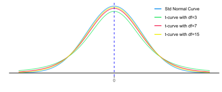

```{r, echo=FALSE}
knitr::opts_chunk$set(comment="#", fig.retina=2, crayon.enabled = TRUE, dpi=600)
set.seed(15)
library(stats)
library(kableExtra)
library(knitr)
library(formattable)
library(ggplot2)
library(ggthemes)
library(ggExtra)
library(dplyr,warn.conflicts = FALSE)
library(animation)
library(gifski)
library(latex2exp)
# library(learnr)
```

```{css, echo=F}
.remark-slide table, .remark-slide table thead th {
    border-top: 0px;
    border-bottom: 0px;
}
.remark-slide thead, .remark-slide tr:nth-child(even){
  background-color: white;
}
table{
  border-collapse: collapse;
}
.remark-slide thead:empty {
  display: none;
}
```

# Textbooks

- [Concepts in Statistics](https://courses.lumenlearning.com/wmopen-concepts-statistics/)

- [Introductory Statistics](https://open.umn.edu/opentextbooks/textbooks/introductory-statistics)

---
class: center middle

# Learning Goals

---

## Learning Goals for Confidence Intervals

- Determine whether the study meets the conditions under which inferences on a population parameter may be performed.

- Demonstrate understating of confidence level $1-\alpha$.

- Explain when and why to use the normal distribution or the *t*-distribution for a given study.

- Determine the appropriate degrees of freedom associated with the *t*-distribution.

- Determine the critical values using tables or Excel functions.

- Describe how the following will affect the width of the confidence interval:
  - increasing the sample size;
  - increasing the confidence level.

- Construct and interpret a confidence intervals for one population mean and one population proportion.

---
class: center middle

# Estimations

---

## Point Estimation

- When estimating a population parameter, we may consider the statistic of a random sample as an estimate of the population parameter. But We expect some chance error.

- Estimating an unknown parameter by a single number calculated from a sample is called a **point estimation**. The single number (statistic) from the sample is called a **point estimate**.

- Point estimate gives no indication of how reliable the estimate is or how large the error is.

**Example:** From a box of 20 pencils of two colors, black and blue, 10 pencils were randomly drawn. 6 out of the 10 pencils are black. What proportion of black pencils are in the box.

**Solution:** Since the sample proportion is 0.6, one may make a point estimation that 60% of the box, or 12 are black pencils. However, we don't know how close the sample proportion is to the population proportion.

---

## Interval Estimation (1/2)

- To increase the chance, we estimate an unknown parameter using intervals that are obtained by adding chance errors to a point estimate.
  
- Estimating an unknown parameter using an interval of values which likely contains the true value of the parameter is called a **interval estimation**. The interval is called an **interval estimate**.

- The probability $1-\alpha$ that the interval estimate will capture the true value of the parameter is called the [**confidence level**](https://saylordotorg.github.io/text_introductory-statistics/s11-estimation.html).

- Click the following link to see an interactive visualization of an interpretation of the confidence level
 [https://rpsychologist.com/d3/CI/](an interactive visualization).

- The 90%, 95% and 99% level of confidence are frequently used in statistical study. The 95% level of confidence is the standard confidence level for scientific polls published in the media and online.

---

## Interval Estimation (2/2)

- Recall that the **standard error** of a statistic, denoted by SE, is the standard deviation of the sampling distribution.

**Example:** A randomly selected 100 students at a college have an average GPA 3.0. How likely does the interval $[3.0-2\cdot\text{SE}, 3.0+2\cdot\text{SE}]$ contain the average GPA $\mu$ of that college?

**Solution:** The probability that the interval $[3.0-2\cdot\text{SE}, 3.0+2\cdot\text{SE}]$ contains the population mean $\mu$ equals the probability that the sample satistic 3.0 lies in the interval $[\mu-2\cdot\text{SE}, \mu+2\cdot\text{SE}]$. Since, $[\mu-2\cdot\text{SE}, \mu+2\cdot\text{SE}]$ contains 95.5% of data of the population. That means, we can be 95.5% confidence that the interval $[3.0-2\cdot\text{SE}, 3.0+2\cdot\text{SE}]$ contains the average GPA $\mu$ of that college.

---
class: center middle

# Confidence Intervals

---

## Confidence interval (1/2)

- When the sampling distribution of a statistic is approximately symmetric, we take interval estimates in the following form
  $$[\text{Statistic}- \text{E}, \text{Statistic}+ \text{E}],$$
  where the value $\text{E}$ is called the **marginal error** or **margin of error**.

- At the confidence level $100(1-\alpha)\%$, the marginal error $\text{E}$ is value such that $100(1-\alpha)\%$ of the intervals $[\text{Statistic}- \text{E}, \text{Statistic}+ \text{E}]$ contains the true parameter $\mu_\text{stat}$.
  
- Equivalently, the marginal error $\text{E}$ is value such that $100(1-\alpha)\%$ of statistics are in the interval $[\mu_\text{stat}- \text{E}, \mu_\text{stat}+ \text{E}]$.

- Denote by $X$ the random variable for sample statistics. Then $\text{E}$ satisfies the following probability equation $$P(\mu_\text{stat}-\text{E}< X < \mu_\text{stat}+\text{E})=1-\alpha.$$

---

## Confidence interval (2/2)

- Because the parameter $\mu_\text{stat}$ is unknown. If we standardize the random variable $X$ by $Z=\frac{X-\mu_\text{stat}}{\text{SE}}$, we get
  $$\textstyle P\left(-\frac{\text{E}}{\text{SE}}<Z<\frac{\text{E}}{\text{SE}}\right)=1-\alpha,$$
  where the random variable $Z$ has a mean $0$ and standard deviation $1$.

- The above probability equation suggests the following formula
  $$\textstyle \text{Marginal Error}=\text{Critical value}\cdot \text{Standard Error},$$
  where the **critical value** is [the value $z_{\alpha/2}$ so that $P(-z_{\alpha/2}<Z<z_{\alpha/2})=1-\alpha$](https://saylordotorg.github.io/text_introductory-statistics/s11-01-large-sample-estimation-of-a-p.html).

- Let $X$ be a point estimate, we call the interval $[X-z_{\alpha/2}\text{SE}, X+z_{\alpha/2}\text{SE}]$ a **confidence interval** at the $100(1-\alpha)\%$ level of confidence.

---

## Confidence Intervals for a Proportion (1/3)

- When estimating the population proportion $p$, we use the value $\hat{\sigma}_{\hat{p}}$ defined below to estimate the standard error $\sigma_{\hat{p}}$ of sample proportions: $$\hat{\sigma}_{\hat{p}}=\sqrt{\dfrac{\hat{p}(1-\hat{p})}{n}}.$$

- When $n$ is large enough, the $100(1-\alpha)\%$ confidence interval for $p$ has the form
  $$\left[\hat{p}-z_{\alpha/2}\sqrt{\frac{\hat{p}(1-\hat{p})}{n}}, \hat{p}+z_{\alpha/2}\sqrt{\frac{\hat{p}(1-\hat{p})}{n}}\right],$$
  where [the critical value $z_{\alpha/2}$ satisfies that $P(Z<-z_{\alpha/2})=\alpha/2$](https://saylordotorg.github.io/text_introductory-statistics/s11-01-large-sample-estimation-of-a-p.html) for the standard normal variable $Z$. In Excel, $-z_\alpha/2$=`NORM.S.INV(α/2)`.

- The sample size $n$ is considered large enough if $n\hat{p}\ge 10$ and $n(1-\hat{p})\ge 10$.

???
By the central limit theorem, the random variable $\hat{p}$ is normal distributed. The chance that $p\in \left[\hat{p}-z_{\alpha/2}\sqrt{\frac{\hat{p}(1-\hat{p})}{n}}, \hat{p}+z_{\alpha/2}\sqrt{\frac{\hat{p}(1-\hat{p})}{n}}\right]$ is the same as the chance that $\hat{p}\in \left[p-z_{\alpha/2}\sqrt{\frac{p(1-p)}{n}}, p+z_{\alpha/2}\sqrt{\frac{p(1-p)}{n}}\right]$. That shows $z_{\alpha/2}$ satisfying
$$P(-z_{\alpha/2}<\dfrac{\hat{p}-p}{\sqrt{\frac{p(1-p)}{n}}<z_{\alpha/2})=1-\alpha.$$

---

## Confidence Intervals for a Proportion (2/3)

**Example:** In a random sample of 100 students in college, 65 said that they come to college by bus.

- Give a point estimate of the proportion of all students who come to college by bus.

- Construct a 99% confidence interval for that proportion.

**Solution:** A good point estimate would be a sample proportion. Here the sample proportion is $\hat{p}=65/100=0.65$.

As $n\hat{p}=100\cdot 0.65=65>10$ and $n(1-\hat{p})=100\cdot 0.35=35>10$, which implies the sample is large enough, approximately the standard error is $$\sqrt{\frac{\hat{p}(1-\hat{p})}{n}}=\sqrt{\frac{0.65(1-0.65)}{100}}\approx 0.048.$$

---

## Confidence Intervals for a Proportion (3/3)

**Solution:(Continued)** At 99% level of confidence, the value $\alpha=1-0.99=0.01$ and $\alpha/2=0.01/2=0.005$. Using the standard normal distribution table or the Excel function `NORM.S.INV()` for the equation $P(Z<-z_{0.005})=0.005$, we find the critical value $-z_{0.005}\approx -2.576$, equivalently $z_{0.005}=2.576$.

Thus the confidence interval at 99% level is
$$\begin{aligned}&\left[\hat{p}-z_{\alpha/2}\sqrt{\frac{\hat{p}(1-\hat{p})}{n}}, \hat{p}+z_{\alpha/2}\sqrt{\frac{\hat{p}(1-\hat{p})}{n}}\right]\\=&[0.65-2.576\cdot 0.048, 0.65+2.576\cdot 0.048]\approx (0.526,0.774).\end{aligned}$$
Conclusion: we are 99% confident that the true proportion of all students at the college who take bus lies in the interval $(0.526,0.774)$.

**Example:** [Estimating a Population Proportion](https://courses.lumenlearning.com/wmopen-concepts-statistics/chapter/estimating-a-population-proportion-1-of-3/) in the book Concepts in Statistics.

---

## Confidence Intervals for a Mean $\mu$ with Known $\sigma$ (1/2)

- Suppose the population standard deviation $\sigma$ is given and the sampling distribution is approximately normal with the standard error $\sigma/\sqrt{n}$. The confidence interval for a population mean $\mu$ at the confidence level $1-\alpha$ is
  $$\left[\bar{x}-z_{\alpha/2}\frac{\sigma}{\sqrt{n}}, \bar{x}+z_{\alpha/2}\frac{\sigma}{\sqrt{n}}\right],$$
  where [the critical value $z_{\alpha/2}$ satisfies that $P(Z<-z_{\alpha/2})=\alpha/2$](https://saylordotorg.github.io/text_introductory-statistics/s11-01-large-sample-estimation-of-a-p.html) for the standard normal variable $Z$. In Excel, $-z_\alpha/2$=`NORM.S.INV(α/2)`.

- By the central limit theorem, when $n>30$ or the population distribution is approximately normal, we may assume that the sampling distribution is approximately normal with the standard error $\sigma/\sqrt{n}$.

---

## Confidence Intervals for a Mean $\mu$ with Known $\sigma$ (2/2)

**Example:** A random sample of 50 students from a college gives a mean GPA 2.51. Suppose the standard deviation of GPA of all students at the college is 0.43. Construct a 99% confidence interval for the mean GPA of all students at the college.

**Solution:** We first gather information from the question:

- The sample size is $n=50$, 
- The sample mean is $\bar{x}=2.51$,
- The population standard deviation is $\sigma=0.43$, and
- The confidence level is $1-\alpha=0.99$ which implies that $\alpha/2=0.005$.

Now let's find the critical value and the standard error.

- The critical value $z_{0.005}$=`-NORM.S.INV(0.005)` $\approx 2.576$
- The standard error is $\sigma_{\bar{x}}=\sigma/\sqrt{n}=0.43/\sqrt{50}\approx 0.06.$

Then the marginal error is $\text{E}=z_{0.005}\cdot\sigma_{\bar{x}}=2.576\cdot 0.06\approx 0.16.$ One may conclude with the 99% confidence that the true mean GPA of all students is contained in the confidence interval $[2.51-0.16, 2.51+0.16]=[2.45, 2.67]$.

---

## Student's $t$-Distribution (1/2)

- When the population standard deviation is unknown, we replace $\sigma$ by  the sample standard deviation $s$ and use $s/\sqrt{n}$ as an estimate to the standard error for the sampling distribution of the sample mean.

- When we use the estimated standard error $s/\sqrt{n}$ to build a confidence interval, the .red[normal distribution may NOT] be appropriate for calculating the critical value.

- When the random variable $\bar{x}$ is approximately normal, the random variable $t=\dfrac{\bar{x}-\mu}{s/\sqrt{n}}$ has a **[Student's $t$-distribution](https://en.wikipedia.org/wiki/Student%27s_t-distribution) with the degree of freedom $n-1$**.

.center[

]

???

- This result was discovered by William Gosset, an employee of the Guinness brewing company, who published his result using the name Student.

- Unlike in the case of a sample proportion, the sample standard deviation $s$ is not determined by the sample mean $\bar{x}$.

---

## Student's $t$-Distribution (2/2)

- The $t$-distributions is a family of curves, called ** $t$-curves**, parameterized by the degrees of freedom.

- The $t$-distribution has the following important properties.
  1. Similar to the standard normal curve, it is .blue[symmetric about 0] and the .blue[total area] under a $t$-curve .blue[is 1].
  2. The $t$-distribution has slightly more variation (i.e. $t$-curves are .blue[slightly “fatter”]) than the standard normal distribution.
  3. When the .blue[degree of freedom increases], the $t$-distribution becomes .blue[closer to the standard normal distribution].

**Example:** Interactive visualizations of the $t$-distribution and the standard normal distribution.

- [https://rpsychologist.com/d3/tdist/](https://rpsychologist.com/d3/tdist/)

- [https://istats.shinyapps.io/tdist/](https://istats.shinyapps.io/tdist/)

---

## Critical Values for $t$-Distributions

**Example:** A sample of size 15 drawn from a normally distributed population. Find the critical value $t_{\alpha/2}$ needed in construction of a confidence interval:

- when the level of confidence is 90%;
- when the level of confidence is 95%;
- when the level of confidence is 99%.

**Solution:** Find the critical value $t_{\alpha/2}$ by using the $t$-value table.
.center[
| |        |        |   C-I     |        |        |
| ------------------- | ------ | ------ | ------ | ------ | ------ |
|   df                  | 99% | 98% | 95% | 90% | 80% |
| 14                  | .red[2.9768] | 2.6245 | .red[2.1448] | .red[1.7613] | 1.345  |
]

Find the critical values by the Excel function `T.INV(left tail area, df)` or `T.INV.2T(tail area, df)`. For example,

$t_{0.005}$ =`T.INV.2T(0.01, 14)`=`-T.INV(0.005, 14)`=`T.INV(1-0.005, 14)`=`r round(qt(1-0.005, 14),4)`.

---

## Confidence Intervals for a Mean $\mu$ with .red[Unknown] $\sigma$ (1/3)

- Suppose the sampling distribution is approximately normal. The confidence interval for a population mean $\mu$ at the confidence level $1-\alpha$ is
  $$\left[\bar{x}-t_{\alpha/2}\frac{s}{\sqrt{n}}, \bar{x}+t_{\alpha/2}\frac{s}{\sqrt{n}}\right],$$
  where $t_{\alpha/2}$ is the critical value such that $P(T<-t_{\alpha/2})=\alpha/2$ under the Student $t$-distribution.

- In practice, when $n>30$ or the population distribution is approximately norm, the sampling distribution is approximately norm.

---

## Confidence Intervals for a Mean $\mu$ with .red[Unknown] $\sigma$ (2/3)

**Example:** A sample of size 16 is randomly drawn from a normally distributed population. The sample has a mean 79 and standard deviation 7. Construct a confidence interval for that population mean at the 90% level of confidence.

**Solution:** Since the population is normally distributed, and the population standard deviation is unknown, we apply the formula $\text{E}=t_{\alpha/2}\cdot\dfrac{s}{\sqrt{n}}$ for marginal error.

Since the sample size is 16, the degree of freedom is .red[df=15].

At 90% confidence level, $\alpha=1-0.9=0.1$.

From the table or using the function `T.INV.2T(0.1, 15)`, we find that $t_{0.05}\approx 1.753$.

Then the marginal error is $\text{E}=1.173\cdot 7/\sqrt{16}\approx 3$. Thus $\bar{x}-\text{E}=79-3=76$ and $\bar{x}+\text{E}=79+3=82$.

With 90% confidence, we may conclude that the true population mean is contained in the interval $[76, 82]$.

---

## Confidence Intervals for a Mean $\mu$ with .red[Unknown] $\sigma$ (3/3)

**Example:** The data blow shows numbers of hours worked from 40 randomly selected employees from several grocery stores in the county.

```{r echo=FALSE}
hours <- c(30,26,33,26,26,33,31,31,21,37,27,20,34,35,30,24,38,34,39,31,22,30,23,23,31,44,31,33,33,26,27,28,25,35,23,32,29,31,25,27)
hours.df=matrix(hours,ncol=20,byrow=TRUE)
hours.df <- as.data.frame(hours.df)

hours.df[] <- mutate_all(hours.df, function(x) {
    cell_spec(x,
      color = spec_color(x, begin=0.4, end = 0.9,  direction = 1)
    )
  }
)

kable(hours.df, col.names = NULL, escape = F, align = "c", "html") %>%
  kable_styling()
```

Construct 99% confidence interval for the mean worked time.

**Solution:** Since the sample size is 40 (>30), by the central limit theorem, the sample mean is approximately normally distributed.
Using the Excel functions `AVERAGE()` and `STDEV.S()` to the data, we find $\bar{x}\approx 29.6$ and $s\approx 5.3$.

Since $df=40-1=39$ and $\alpha=1-0.99=0.01$, the critical value $t_{0.005}\approx 2.708$ and the marginal error is $\text{E}=2.708\cdot 5.3/\sqrt{40}\approx 2.3$. Thus $\bar{x}-\text{E}=29.6-2.3=27.3$ and $\bar{x}+\text{E}=29.3+2.3=31.6$

With a 99% confidence, one may conclude that the true mean worked hours is contained in the interval $[27.3, 31.6]$.

---

## Choose Between Normal Distribution and $t$-Distribution

- Population is .blue[approximately normally] distributed
and the population standard deviation $\sigma$ is .blue[known]: use the .blue[normal distribution].

- Population is .yellow[approximately normally] distributed
and the population standard deviation $\sigma$ is .yellow[*unknown*]: use the $t$-.yellow[*distribution*].

- Population distribution unknown, but .gold[sample size is large enough], i.e. $n>30$.
  - If $\sigma$ is .gray[known], then choose .gray[normal distribution].
  - If $\sigma$ is .purple[*unknown*], then either one can be used but the  $t$-.purple[*distribution*] is more accurate.

- **.red[Warning:]** Population distribution unknown and the .red[sample size is small, neither] the $t$-distribution nor the normal distribution is reliable.

- For small samples, there is method called "[The Shapiro–Wilk test](http://www.sthda.com/english/wiki/normality-test-in-r#normality-test)" which can be used to determine if we may assume the sampling distribution is approximately normal.

- Even $n>30$, we should have a visual inspection (using histogram for example) of the normality.

---
class: middle center

# Precision of Confidence Intervals

---

## Factors Affect the Width of Confidence Intervals

- The width of a confidence interval, equals twice the standard error, gives a measure of precision of the estimation.

- Recall, for population proportion and mean,
  $$\text{Marginal Error} = \text{Critical Value}\cdot \frac{\text{(estimated) Population SD}}{\sqrt{\text{Sample Size}}}$$

- The formula tells us the precision of a confidence interval is affected by the confidence level, the variability, and the sample size.
  
  - Larger the confidence levels give larger critical values and errors.
  
  - Populations (and samples) with more variability gives larger errors.

  - Larger sample sizes give smaller errors.

---

## Sample Size Determination (1/3)

- In practice, we may desire a marginal error of E. With a fixed confidence level $100(1-\alpha)\%$, the larger the sample size the smaller the marginal error.

- When estimating population proportion, if we can produce a reasonable guess $\hat{p}$ for population proportion, then an appropriate minimum sample size for the study is determined by
  $$n=\left(\frac{z_{\alpha/2}}{\text{E}}\right)^2\cdot \hat{p}(1-\hat{p}).$$

- When estimating population mean, if we can produce a reasonable guess $\sigma$ for the population standard deviation, then an appropriate minimum sample size is given by $$n=\left(\dfrac{z_{\alpha/2}\cdot \sigma}{\text{E}}\right)^2.$$

---

## Sample Size Determination (2/3)

**Example:** Suppose you want to estimate the proportion of students at QCC who live in Queens. By surveying your classmates, you find around 70% live in Queens. Use this as a guess to determine how many students would need to be included in a random sample if you wanted the error margin for a 95% confidence interval to be less than or equal to 2%.

**Solution:** We may use $\hat{p}=0.7$ as a reasonable guess for the population proportion.

At the 95% level, the critical value is $z_{0.025}\approx 1.96$.

The marginal error is given as 0.02.

Then the appropriate minimal sample size is determined by
$$n=\left(\frac{z_{\alpha/2}}{\text{E}}\right)^2\cdot \hat{p}(1-\hat{p})=(1.96/0.02)^2\cdot 0.7\cdot(1-0.7)=2016.84.$$

Since the sample size has to be an integer, to get a error no more than 2% at the level 95%,  the minimal sample size should be at least 2017.

---

## Sample Size Determination (3/3)

**Example:** Find the minimum sample size necessary to construct a 99% confidence interval for the population mean with a margin of error E =0.2. Assume that the estimated population standard deviation is $\sigma=1.3$.

**Solution:** At the 99% level, we have $\alpha/2=(1-0.99)/2=0.005$.

The critical value $z_{0.005}\approx 2.576$.

The desired marginal error is $\text{E}=0.2$.

The estimated population standard deviation is $\sigma=1.3$.

Then the minimal sample size is approximately
$$n=\left(\dfrac{z_{\alpha/2}\cdot \sigma}{\text{E}}\right)^2\approx (2.576\cdot 1.3/0.2)^2 \approx 280.4.$$

To get a error no more than 0.2 at the level 95%,  the minimal sample size should be at least 281.

---
class: center middle

# Exercise

---

## Conceptual Questions on Confidence Intervals

Resource: [Conceptual Questions on Confidence Intervals](http://www2.stat.duke.edu/~jerry/sta101/confidenceintervalsans.html)

Decide whether the following statements are true or false. Explain your reasoning.

- The statement, "the 95% confidence interval for the population mean is (350, 400)" means that 95% of the population values are between 350 and 400.
- For a given standard error, lower confidence levels produce wider confidence intervals.
- If you increase sample size, the width of confidence intervals will increase.
- If you take large random samples over and over again from the same population, and make 95% confidence intervals for the population average, about 95% of the intervals should contain the population average.

---

## Exercises on Confidence Intervals for Population Proportion

**Exercise:** To try to understand the reason for returned goods, the manager of a store examines the records on 40 products that were returned in the last year. Reasons were coded by 1 for “defective,” 2 for “unsatisfactory,” and 0 for all other reasons, with the results shown in the table.
```{r echo=FALSE}
returned <- c(0,0,0,0,2,0,0,0,0,0,2,0,0,0,0,0,0,0,0,0,0,0,0,1,0,0,0,0,2,0,2,0,0,0,0,0,0,2,0,0)
returned.df=matrix(returned,ncol=20,byrow=TRUE)
returned.df <- as.data.frame(returned.df)

returned.df[] <- mutate_all(returned.df, function(x) {
    cell_spec(x,
      color = spec_color(x, begin=0.4, end = 0.9,  direction = 1)
    )
  }
)

kable(returned.df, col.names = NULL, escape = F, align = "c", "html", booktabs = T) %>%
  kable_styling()
```

- Give a point estimate of the proportion of all returns that are because of something wrong with the product, that is, either defective or performed unsatisfactorily.

- Construct an 80% confidence interval for the proportion of all returns that are because of something wrong with the product.

**Exercise:** (Exercise 8 in [7.3 Large Sample Estimation of a Population Proportion](https://saylordotorg.github.io/text_introductory-statistics/s11-03-large-sample-estimation-of-a-p.html))

---

## Exercises on Confidence Intervals for Population Mean

**Exercise:** (Constructing a Confidence Interval for Pregnancy Length in [Estimating a Population Mean (1 of 3)](https://courses.lumenlearning.com/wmopen-concepts-statistics/chapter/estimating-a-population-mean-1-of-3/))

**Exercise:** (How Much Alcohol Do College Students Drink? in [Estimating a Population Mean (2 of 3)](https://courses.lumenlearning.com/wmopen-concepts-statistics/chapter/estimating-a-population-mean-2-of-3/))

**Exercise:** (Exercise 8 in [7.1 Large Sample Estimation of a Population Mean](https://saylordotorg.github.io/text_introductory-statistics/s11-01-large-sample-estimation-of-a-p.html))
Four hundred randomly selected working adults in a certain state, including those who worked at home, were asked the distance from their home to their workplace. The average distance was 8.84 miles with standard deviation 2.70 miles. Construct a 98% confidence interval for the mean distance from home to work for all residents of this state.

**Exercise:** (Exercise 7 in [7.2 Small Sample Estimation of a Population Mean](https://saylordotorg.github.io/text_introductory-statistics/s11-02-small-sample-estimation-of-a-p.html))
City planners wish to estimate the mean lifetime of the most commonly planted trees in urban settings. A sample of 16 recently felled trees yielded mean age 32.7 years with standard deviation 3.1 years. Assuming the lifetimes of all such trees are normally distributed, construct a 99.8% confidence interval for the mean lifetime of all such trees.

---

## Exercises on Sample Size Determination

**Exercise:** (Exercise 7 in [7.4 Sample Size Considerations](https://saylordotorg.github.io/text_introductory-statistics/s11-04-sample-size-considerations.html))

A software engineer wishes to estimate, to within 5 seconds, the mean time that a new application takes to start up, with 95% confidence. Estimate the minimum size sample required if the standard deviation of start up times for similar software is 12 seconds.

**Exercise:** (Exercise 13 in [7.4 Sample Size Considerations](https://saylordotorg.github.io/text_introductory-statistics/s11-04-sample-size-considerations.html))

The administration at a college wishes to estimate, to within two percentage points, the proportion of all its entering freshmen who graduate within four years, with 90% confidence. Estimate the minimum size sample required.

---
class: center middle

# Quiz

---

## Quiz 8

- Determine if the following statement is true or false. Please explain your reasoning.

  *The statement, "the 95% confidence interval for the population mean is (3, 4)", is equivalent to the statement, "there is a 95% probability that the population mean is between 3 and 4".*

- Name two conditions under each the $t$-distribution should be used to construct confidence intervals.

- Suppose samples are randomly selected. Determine how does the sample size affect the precision of the confidence interval?

---
class: center middle

# Lab Instructions in Excel

---

## Excel Functions for $t$-Distributions

Suppose a Student's $t$-distribution has the degree of freedom $\text{df}=n-1$.

- Find a probability for a given $t$-value.

  - The area of the left tail of the $t$-value may be calculated by the function `T.DIST(t,df,true)`.

  - The area of the right tail of the $t$-value may be calculated by the function `T.DIST.R(t,df)`.

  - The area of two tails of the $t$-value (here $t$>0) may be calculated by function `T.DIST.2T(t,df)`.

- Find the critical value for a given probability $p$.

  - When the area of the left tail is given, the function `T.INV(p,df)` may be used.
  
  - When the area of both tails is given, the function `T.INV.2T(p,df)` may be used. This function is good for construction confidence interval.