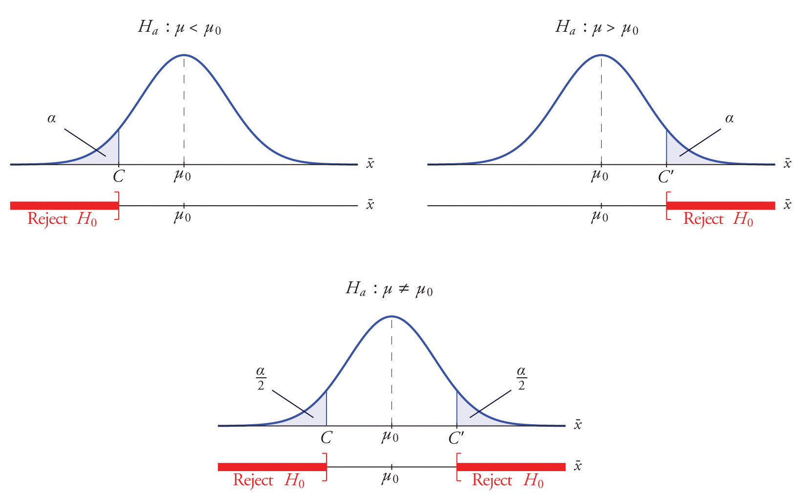
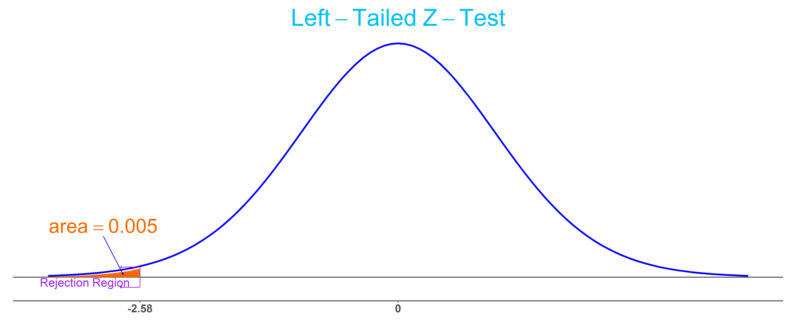
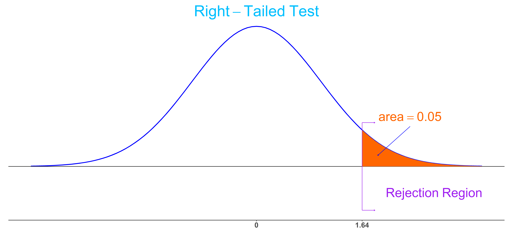
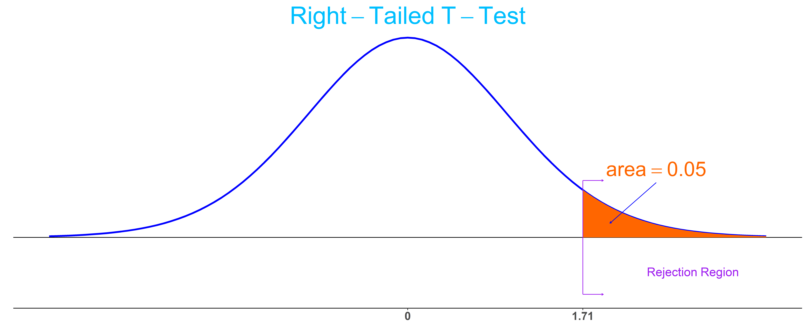

```{r, echo=FALSE}
knitr::opts_chunk$set(comment="#", fig.retina=2, crayon.enabled = TRUE, dpi=600)
set.seed(15)
library(stats)
library(kableExtra)
library(knitr)
library(formattable)
library(ggplot2)
library(ggthemes)
library(ggExtra)
library(dplyr,warn.conflicts = FALSE)
library(animation)
library(gifski)
library(latex2exp)
```

```{css, echo=F}
.remark-slide table, .remark-slide table thead th {
  border-top: 0px;
  border-bottom: 0px;
  padding:0px;
}
.remark-slide table thead th[style] {
  padding-left: 0px !important;
  padding-right: 0px !important;
}

.remark-slide thead tr th, .remark-slide tr:nth-child(2n){
  background: LightCyan;
}

table thead tr:empty{
  visibility: hidden;
}

strong, b {
    color: DarkBlue;
}

.footnote {
    font-size: 80%;
    bottom: 0.5em;
    color: #c8e10b;
}

.remark-slide-content {
    padding: 1em 2em 1em 2em;
}

.DataTable tr:nth-child(2n){
    background-color: white !important;
}

.latex-macros{
  display: none;
}
```

<div class="latex-macros">

$$\require{color}$$
$$\definecolor{purple}{RGB}{226, 15, 233}$$
$$\definecolor{grey}{RGB}{177, 159, 149}$$

</div>

# Textbooks

- [Concepts in Statistics](https://courses.lumenlearning.com/wmopen-concepts-statistics/)

- [Introductory Statistics](https://open.umn.edu/opentextbooks/textbooks/introductory-statistics)

---
class: center middle

# Learning Goals

---

## Learning Goals for Hypothesis Tests

- Choose appropriate null and alternative hypotheses.

- Determine whether the test should be one-sided or two-sided.

- Calculate $Z$-test statistics and $T$-test statistics.

- Calculate the $P$-value or the rejection region.

- Determine whether to reject or fail reject the alternative hypotheses.

- Interpret the results of a test of significance in context.

- Perform an appropriate hypothesis test for a statement using data from a random sample.

---
class: center middle

# Ideas, Concepts and The Procedure in Hypothesis

---

## The Basic Idea of Hypothesis Testing

- The testing procedure starts with an initial assumption that the statement on population parameter is true.

- We test this initial assumption using a random sample. If the initial assumption is really the truth, then the test statistic from a random sample shouldn't be too far away from the center of the sampling distribution. Conversely, if the test statistic is .green[too far away] from the center, then we should .green[not believe in] the initial assumption.

- To determine how far is too far away, we need to specify a threshold, a prior probability, or equivalently a critical value.

- If the test statistic is at least extreme as the critical value, then the testing is significant enough to allow us to reject the initial assumption. Otherwise, we cannot draw a definite conclusion.

- The prior probability measures the chance that the initial assumption was wrongly rejected.

---

## Two Hypotheses

- A statistical **hypothesis** is a statement about a population parameter.

- A **hypothesis test** is a process that uses sample statistics to test a **hypothesis**.

- To test a population parameter, we choose a pair of hypotheses, the null hypothesis and the alternative hypothesis which are contradictory to each other.

- The **null hypothesis**, denoted by $H_0$, is the statement about the population parameter that is assumed to be true.

- The **alternative hypothesis**, denoted $H_a$, is a statement about the population parameter that is contradictory to the null hypothesis.

**Example:** To test a statement is that
the population mean is 1, we set the null hypothesis as $H_0$: $μ = 1$. Depending on the given information, the alternative hypothesis can be $H_a$: $μ\ne 1$, or $H_a$: $μ > 1$, or $H_a$: $μ < 1$.

If the statement is that the population mean is less than 1, then we set $H_0$: $μ=1$ and $H_a$: $μ > 1$

---

## The Logic of Hypothesis Testing

The logic of hypothesis testing and two types of error can be summarized in the following table.

```{r HypoTest, echo=F}
row1 <- c("", "\\(H_0\\) is true", "\\(H_0\\) is false")
row2 <- c("Reject \\(H_0\\)", ".red[Type I Error]", ".green[Correct decision]")
row3 <- c("Fail to Reject \\(H_0\\)", ".green[Correct decision]", ".red[Type II Error]")

tb <- rbind(row2, row3)

tb <- as.data.frame(tb)
row.names(tb)<-NULL
colnames(tb) <- row1

kable(tb, format = "html", escape=F, align = "c")%>%
#    add_header_above(c("", "Truth of \\(H_0\\)" = 2))%>%
    kable_styling(full_width = F, protect_latex=T)
```

The interpretation of hypothesis testing is summarized in the following table.

```{r HypoTestDec, echo=F}
rowa <- c("", "Testing statement is \\(H_0\\)", "Testing statement is \\(H_a\\)")
rowb <- c("Reject \\(H_0\\)", ".green[There is enough evidence to reject the statement]", ".green[There is enough evidence to support the statement]")
rowc <- c("Fail to Reject \\(H_0\\)", ".blue[There is not enough evidence to reject the statement]", ".blue[There is not enough evidence to support the statement]")

tbd <- rbind(rowb, rowc)

tbd <- as.data.frame(tbd)
row.names(tbd)<-NULL
colnames(tbd) <- rowa

kable(tbd, format = "html", escape=F)%>%
#    add_header_above(c("", "Interpretation" = 2))%>%
    kable_styling(full_width = F, protect_latex=T)
```

---

## Concepts in Hypothesis Testing (1/5)

- Rejecting the null hypothesis when it is indeed true is called a **type I error**. The maximum allowable probability of making a type I error is called the **level of significance**, denoted by $\alpha$.

- Failing to reject the null hypothesis when the it is false is called a **type II error**. The probability of a type II error is usually denoted by $\beta$. The **power of a hypothesis test**, equals $1-\beta$, is the probability of rejecting the null hypothesis when it is false.

  [An illustration of errors](https://effectsizefaq.com/2010/05/31/i-always-get-confused-about-type-i-and-ii-errors-can-you-show-me-something-to-help-me-remember-the-difference/) and
  [A demonstration of errors and the power](https://istats.shinyapps.io/power/).

- The sample statistic used to test the assumption is called a **test statistic**. In practice, standardized sample statistics are used and test statistics refer to standard ones.

- A **rejection region** is the range of values for which the null hypothesis is unlikely to be true. (An interactive demonstration: [Rejection regions for hypothesis tests](https://hselab.shinyapps.io/critvalues/).)

.center[
|Sign in $H_a$ | $\ne$ | $<$ | $>$  |
|---|---|---|
|Rejection region  | Both sides | Left side | Right side |
]

???
$$\alpha=P(\text{Type I error})= P(\text{reject a true }H_0).$$  

---

## Concepts in Hypothesis Testing (2/5)

- A **critical value** is a value that separates the rejection region from its complement. The calculation depends on the sampling distribution of the test statistic.

  - When the sampling distribution is non-standard, we calculate the critical value using by finding the standard critical value first and then apply the formula $$\text{Critical value}= \text{Std. critical value}\cdot\text{SE}+\text{Mean}.$$
  
  - Alternatively, one may use the sampling distribution of the standard test statistic, $$\text{Std. test statistic}=\frac{\text{Test statistic} - \text{Mean}}{\text{SE}}.$$

- To make a decision, one may also compare probabilities. The **\\( P \\)-value** (observed significance) of a test statistic is the probability of obtaining a sample statistic at least as extreme as the (observed) test statistic, given that the null hypothesis were true.
.center[
|Sign in $H_a$ | $\ne$ | $<$ | $>$  |
|---|---|---|
| $P$-value  | Double of the tail area | Left tail area | Right tail area |
]

---

## Concepts in Hypothesis Testing (3/5)

**Example:** The rejection region for a population mean according to $H_a$.

.center[
  
]

.footnote[
  **Figure Resource:** Section [8.1 The Elements of Hypothesis Testing](https://saylordotorg.github.io/text_introductory-statistics/s12-01-the-elements-of-hypothesis-tes.html) in Introductory Statistics.
]

---

## Concepts in Hypothesis Testing (4/5)

**Example:** At the significance level $\alpha=0.05$, construct the a rejection region for the following test and make a decision if $H_0$ should be rejected.
.center[
  Testing $H_{0}: p=0.50$ vs. $H_{a}: p\ne 0.50, n=360, \hat{p}=0.56$.
]

We know that the sample size is sufficiently large to validly perform the $Z$-test<sup>*</sup>.

**Solution:**
Due to the form of $H_a: p\ne 0.50$, the rejection region should contain both tails. So each tail has the area $\alpha/2=0.025$. Using `Norm.S.Inv(0.025)`, we find the *standard critical value* $z_{0.025}$=`r round(-qnorm(0.025, 0, 1),2)`. So the rejection region is $(-\infty, -1.96]\cup[1.96,\infty)$.

The test statistic is $\hat{p}=0.56$ and the $Z$-test statistic is
  $$z=\frac{\hat{p}-p_0}{\sqrt{p_0(1-p_0)/n}}=\frac{0.56-0.5}{\sqrt{0.5\cdot 0.5/360}}\approx`r round((0.56-0.5)/sqrt(0.5*0.5/360),2)`.$$

The $Z$-test statistic is in the rejection region. So we *reject* $H_0$.

.footnote[
  [*] Here, $Z$-test means that the sampling distribution of the (standard) test statistic is (standard) normal.
]

---

## Concepts in Hypothesis Testing (5/5)

- **Remark:** One may also calculate the standard error $\text{SE}=\sqrt{p_0(1-p_0)/n}$ first, and use `Norm.Inv(`\\(\alpha/2\\), $p_0$, SE`)` to find the *critical value* $c_{\alpha/2}$.

**Example:** Find the $P$-value for the test in the above example and make a decision.

**Solution for the previous example using $P$-value:**
Because $H_a$ is $\color{purple}{p\ne p_0}$ and $\color{grey}{\hat{p}=0.56>p_0}$, the $P$-value is the .purple[double] of the .grey[right tail] area, that is, the $P$-value equals $2P(\hat{p}>0.56)$.

We first find the standard error of the null distribution:
$$\text{SE}=\sqrt{p_0(1-p_0)/n}=\sqrt{0.5\cdot0.5/360}=`r round(sqrt(0.5*0.5/360),2)`.$$

Using Excel, the $P$-value is calculated by `=2*(1-Norm.Dist(0.56,0.5,0.03,true)` $\approx$ `r round(2*(1-pnorm(0.56,0.5,0.03)), 4)`.

Since the $P$-value is smaller than $\alpha$, we reject the null hypothesis $H_0$.

---

## Hypothesis Testing Procedure (1/3)

1. Check if the sample size is large enough and determine if a $Z$-test or $T$-test can be performed. For proportion, $Z$-test may be used. For mean, if $\sigma$ is known, the $Z$-test may be used. If $\sigma$ is unknown, the $T$-test may be used.

2. State the null and alternative hypothesis. The null hypothesis always contains the equal sign.

3. Set a significance level $\alpha$. Commonly used levels are $\alpha=0.01$, $\alpha=0.05$ and $\alpha=0.1$.

4. Calculate the standardized test statistic: the $Z$-test statistic or the $T$-test statistic.

5. Calculate the $P$-value, or construct the rejection region. (.green[Recommend to draw pictures.])
.center[
|Sign in $H_a$ | $\ne$ | $<$ | $>$  |
|---|---|---|
| Test | Two-tailed | Left-tailed | Right-tailed|
]

6. Make a test decision about the null hypothesis $H_0$. We reject $H_0$ if the test statistic falls in the rejection region or the $P$-value less than the significance level $\alpha$.

7. State an overall conclusion.

<!-- .footnote[
  [*] SE may be replaced by an estimate eSE. Example: $\text{eSE}=s/\sqrt{n}$ if $\sigma$ is unknown.
] -->

---

## Hypothesis Testing Procedure (3/3)

**Example:** Suppose you want to determine if a coin is fair. You toss the coin 50 times and observe 16
heads and 34 tails. If the coin is fair, the probability of getting 16 heads or less is about 0.008 = 0.8%. At the significant level 0.01, do you think that the coin is fair?

**Solution:**

1. Since $n\hat{p}=16$ and $n(1-\hat{p})=34$, a $Z$-test is valid.

2. To test if the coin is fair, we set the null hypothesis as $H_0$: $p=p_0=0.5$. The experiment suggests that we should set the alternative hypothesis as $H_a$: $p<0.5$.

3. The significance level is $\alpha=0.01$.

4. The test statistic is $\hat{p}=\frac{16}{50}=0.32$ and the standardization is $z=$`r round((0.32-0.5)/sqrt(0.5*0.5/50),2)`

5. From $H_a$, we know that the test is left-tailed. The $P$-value is then $P=0.008$.

6. Since $P=0.008<0.01=\alpha$, we reject the null hypothesis $H_0$.

7. At the significance level 0.01, there is enough evidence to claim that the coin is unfair.

???
Draw a normal curve to show the rejection region.

---

## Some Remarks

- Test statistics often refer to the standard test statistics which gives more detail on the relative difference.
  
- The $P$-value is slightly more popular in hypothesis testing. Because it gives a more detailed explanation of the data and is easier for making decision at different significance levels.

- The hypothesis test decision can be interpreted using the confidence interval. The rejection region of a hypothesis test can be obtained as the complement of a confidence interval.

- When testing a proportion, some statisticians use the test statistic $z=\dfrac{\hat{p}-p_0}{\sqrt{\hat{p}(1-\hat{p})/n}}$ so that the interpretation the confidence interval is consistent with the hypothesis test decision. ([See the note in the bottom of the linked webpage](https://newonlinecourses.science.psu.edu/stat414/node/267/))

- A hypothesis testing procedure is comparable to a criminal trial: a defendant is considered not guilty as long as his or her guilt is not proven. See Wiki page on [Statistical Hypothesis Testing](https://en.wikipedia.org/wiki/Statistical_hypothesis_testing) for more detail on the comparison.

<!--

.center[
  |                               |   \\(H_0\\) is true <br>  Truly not guilty    |   \\(H_a\\) is true <br> Truly guilty   |
| :-------------------------------: | :--------------------------: | ----------------------------- |
| Accept null hypothesis <br>  Acquittal |        Right decision        | Wrong decision <br> Type II Error |
| Reject null hypothesis <br> Conviction | Wrong decision <br>  Type I Error | Right decision                |
]

.footnote[
  [*] See Wiki page on [Statistical Hypothesis Testing](https://en.wikipedia.org/wiki/Statistical_hypothesis_testing) for more detail on the comparison.
]
-->

---
class: center middle

# Hypothesis Testing About a Population Proportion

---

## Test a Proportion Using the Rejection Region (1/2)

**Example:** The government of a particular country reports its literacy rate as 52%. A nongovernmental organization believes it to be less. The organization takes a random sample of 600 inhabitants and obtains a literacy rate of 42%. Perform the relevant test at the 0.5% level of significance.

**Solution:** We check if the sample is sufficiently large. Note that $\hat{p}=0.42$ and $n=600$. Then $n\hat{p}=600\cdot 0.42\ge 10$ and $n(1-\hat{p})=600\cdot 0.58\ge 10$. By the Central Limit Theorem, the sampling distribution of the sample proportion is approximately normal.

We set the null hypothesis as $H_0$: $p=0.52$ and the alternative hypothesis as $H_a$: $p<0.52$. By the form of $H_a$, We should use the left-tailed test.

From the given level of significance $\alpha=0.005$, we find the standardized critical value $z_{0.005}=$ `Norm.S.Inv(0.005)` $=`r round(qnorm(0.005, 0, 1), 2)`$ from the equation $P(Z<z_{0.005})=0.005$.

Let's also standardize the test statistic $\hat{p}$. The standard test statistic is
$$z=\frac{0.42-0.52}{\sqrt{0.52\cdot(1-0.52)/600}}=`r round((0.42-0.52)/sqrt(0.52*(1-0.52)/600), 2)`.$$

---

## Test a Proportion Using the Rejection Region (2/2)

**Solution: (Cont.)**
The rejection region is the interval $(-\infty, `r round(qnorm(0.005, 0, 1), 2)`]$.

.center[
  
]

Since $z=-4.9<-2.58$, the test statistic falls in the rejection region. We reject the null hypothesis $H_0: p=0.52$.

At the level of 0.5%, the sample provides enough evidence to support the organization's suspect that the rate is less than 52%.

---

## Test a Proportion Using the $P$-Value (1/3)

**Example:** It was claimed that 14% of drivers who use a seat belt in a state that does not have a mandatory seat belt law. An advertising campaign was conducted to increase this proportion. Two months after the campaign, 106 out of a random sample of 590 drivers were wearing seat belts. Was the campaign successful?

**Solution:** Since $n\hat{p}=106> 10$ and $n(1-\hat{p})=590-106> 10$. So the sampling distribution is approximately normal.

We set the null hypothesis as $H_0$: $p=0.14$ and the alternative hypothesis as $H_a$: $p>0.14$. By the form of $H_a$, We should use the right-tailed $Z$-test.

We may choose the level of significance as $\alpha=0.05$.

The test statistic is $\hat{p}=106/590=`r round(106/590,2)`$. The $Z$-test statistic is
$$z=\frac{0.18-0.14}{\sqrt{0.14\cdot(1-0.14)/590}}=`r round((0.18-0.14)/sqrt(0.14*(1-0.14)/590), 2)`.$$

---

## Test a Proportion Using the $P$-Value (2/3)

**Solution: (Cont.)**
Since $H_a$ has the $>$ sign, the $P$-value is the right tail area of the $Z$-test statistic. Using Excel or The Standard Normal Distribution Table, we find that the $P$-value is
  $$P(Z>z)=1-P(Z<z)=1-`r round(pnorm(2.8, 0, 1),4)`=`r 1-round(pnorm(2.8, 0, 1),4)`.$$

Because the $P$-value is smaller than the confidence level $\alpha=0.05$. We reject the null hypothesis.

Since $H_0$ is rejected, $H_a$ is supported.

At 5% level of significance, there is enough evidence to conclude that the campaign is successful.

**Example:** Suppose a coin toss turns up 20 heads out of 50 trials. At 0.01 significance level, is there enough evidence to conclude that the coin toss is unfair?

**Solution:** Since there are 18 success and 32 failures in the 50 trials, the sample size is considered large enough so that the sampling distribution of the sample proportion is approximately normal.

To test if the coin is unfair, we set $H_0: p=p_0=0.5$ and $H_a: p\ne 0.5$.

---

## Test a Proportion Using the $P$-Value (3/3)

**Solution: (Cont.)** Since $H_a$ has the $\ne$ sign, we use two-tailed $Z$-test.

We first find the test statistic $\hat{p}=18/50=0.36$.

The standard test statistic is
$$z=\frac{\hat{p}-p_0}{\sqrt{p_0(1-p_0)/n}}=\frac{0.36-0.5}{\sqrt{0.5(1-0.5)/50}}=`r round(-0.14/sqrt(0.5*0.5/50),3)`.$$

The $P$-value $p$ is the double of the probability $P(Z<-1.98)$. Using the Excel, we find that $p=$ `2*Norm.S.DIST(-1.98,TRUE)` $\approx `r round(2*pnorm(-1.98),4)`$.

Because the $P$-value $p=0.0477<0.05=\alpha$, we reject the null hypothesis $H_0$ and accept the alternative hypothesis $H_a$.

Base on the testing, at the significance level 0.05. there is enough evidence to claim that the coin is unfair.

---
class: center middle

# Hypothesis Testing About a Population Mean

---

## Test a Mean with Known $\sigma$ Using the Rejection Region (1/2)

**Example:** Residences on a certain street claim that the mean speed of automobiles run through the street is greater than the speed limit of 25 miles per hour. A random sample of 100 automobiles has a mean speed of 26 miles per hour. Assume the population standard deviation is 4 miles per hour. Is there enough evidence to support the claim of the residences at the significance level $\alpha = 0.05$?

**Solution:** The sample size is $n=100>30$. So the sampling distribution of sample means is approximately normal by the central limit theorem.

To test the claim of the residences, we set $H_0:\mu=25$ and $H_a: \mu >25$.

Because $H_a$ contains the $>$ sign and $\sigma$ is known, we use right-tailed $Z$-test.

Since the population standard deviation is  $\sigma=4$. We use the standard normal distribution to find the critical value.

With the given significance level $\alpha=0.05$, we find the critical value is $z_{0.05}=`r round(qnorm(1-0.05),2)`$ given by the Excel function `Norm.S.Inv(1-0.05)`.

---

## Test a Mean with Known $\sigma$ Using the Rejection Region (2/2)

The rejection region is the interval $[1.64, \infty)$.

.center[
  
]

The $Z$-test statistic is $z=\frac{\bar{x}-\mu_0}{\sigma/\sqrt{n}}=\frac{26-25}{4/\sqrt{100}}=2.5$. It is in the rejection region. So we reject the $H_0:\mu=25$ and support the $H_a:\mu>25$.

At the confidence level $\alpha=0.05$, there is enough evidence to support the claim of the residences that the average speed of automobile is above the speed limit.

---

## Test a Mean with Unknown $\sigma$ Using the Rejection Region (1/2)

**Example:** A car manufacturer claims that a new fuel injection design increases the mean mileage on a certain model of car above its current 28.5 miles per gallon level. Twenty-five of the new designs were checked and the mean recorded as 30.0 miles per gallon with a standard deviation of 3.8 miles per gallon. Assume that mean mileages are approximately normally distributed. Evaluate this claim at the 5% level of significance.

**Solution:** Since the population is approximately normally distributed, the sampling distribution of sample means is approximately normal by the central limit theorem.

To test the claim of the residence, we set $H_0:\mu=\mu_0=28.5$ and $H_a: \mu >28.5$. 

Because the alternative hypothesis claims "greater" and $\sigma$ is unknown, we use right-tailed $T$-test.

Since the population standard deviation is unknown. We use the $T$-distribution to test the claim.

The degree of freedom is $\text{df}=15-1=14$ With the given significance level $\alpha=0.05$, we find the critical value is $t_{0.05}=`r round(qt(1-0.05, 24),2)`$ given by the Excel function `T.Inv(1-0.05)`.

---

## Test a Mean with Unknown $\sigma$ Using the Rejection Region (2/2)

**Solution: (Cont.)** The critical region is $[1.71, \infty)$

.center[
  
]

The $T$-test statistic is
$t=\frac{\bar{x}-\mu_0}{s/\sqrt{n}}=\frac{30-28.5}{3.8/\sqrt{25}}=`r round((30-28.5)/3.8*sqrt(25),2)`.$

Because $t=1.97>t_{0.05}=1.71$, that is, the $T$-test statistics in in the rejection region. We reject $H_0$ and support the alternative hypothesis $H_a:\mu>28.5$.

At the significance level 5%, there is enough evidence to support the claim that new designs increase the mean milage.

---

## Test a Mean with Unknown $\sigma$ Using the $P$-value (1/3)

**Example:** An instructor would like to know if the students enrolled in a math course in the  current semester performed better than studented in the last semester. The mean final exam from last semester is 75.5. The final exam scores of 40 randomly selected 40 students were obtained

<div class="DataTable">

```{r echo=FALSE}
finalgrade <- c(93,88,69,74,76,81,78,77,74,63,67,81,80,82,68,88,76,69,75,78,75,77,94,87,74,88,63,75,94,88,91,77,76,68,80,88,68,83,72,72)
finalgrade.df=matrix(finalgrade,ncol=20,byrow=TRUE)
finalgrade.df <- as.data.frame(finalgrade.df)

finalgrade.df[] <- mutate_all(finalgrade.df, function(x) {
    cell_spec(x,
      color = spec_color(x, begin=0.4, end = 0.9,  direction = 1)
    )
  }
)

kable(finalgrade.df, col.names = NULL, escape = F, align = "c", "html", booktabs = T) %>%
  kable_styling()
```

</div>

Do the data provide evidence that the students in this semester performed significantly better on the final than last semester?

**Solution:** The sample size is $n=40$ which is large enough so that the sampling distribution for the sample mean is approximately normal. We will take the $P$-value approach.

Set $H_0: \mu=75.5$ and $H_a: \mu>75.5$.

Using Excel functions `Average()` and `STDEV.S()`, we find the sample mean is $\bar{x}\approx `r round(mean(finalgrade),2)`$ and sample standard deviation is $s\approx `r round(sd(finalgrade),2)`$.

---

## Test a Mean with Unknown $\sigma$ Using the $P$-value (2/3)

**Solution: (Cont.):** The $T$-test statistic is calculated by
$$t=\frac{\bar{x}-\mu_0}{s/\sqrt{n}}=\frac{(78.17-75.5)}{8.39/\sqrt{40}}\approx `r round((78.17-75.5)/8.39*sqrt(40),3)`.$$

Because $H_a$ contains the $>$ sign and $\sigma$ is unknown, we use the right-tailed $T$-test.

The degree of freedom is $\text{df}=40-1$ The $P$-value is the right tail area under the $T$-curve, that is `T.DIST.R(2.013, 39)`=`r round(1-pt(2.013, 39),4)`.

Since the $P$-value is less than 5%, at the 5% level of significance, we may reject $H_0$. So at 5% level of significance,  there is enough evidence to support the claim that the students in this semester performed significantly better on the final than last semester.

However, using the 2% level of significance, with the given data, we fail to reject $H_0$. Then, at the 2% level of significance, there is not enough evidence to support the claim.

---

## Test a Mean with Unknown $\sigma$ Using the $P$-value (3/3)

**Example:** A certain manufacturer claims that average numbers of candies in a certain sized bag that they produce is 20. To test the claims, you collected a random sample of 10 bags and find the mean is 18 and the standard deviation is 2.7. Assume the numbers of candies are normally distributed. At the significance level $\alpha=0.05$, does your analysis support the manufacturer's claim?

**Solution:** Since the population is normally distributed, the sampling distribution for the sample mean is approximately normal.

Set $H_0: \mu=20$ and $H_a: \mu\ne20$.

Since $H_a$ has the $\ne$ sign and the population standard deviation is unknown, we use two-tailed $t$-test. We will find the $P$-value.

The $T$-test statistics is $t=\frac{18.2-20}{2.7/\sqrt{10}}\approx`r round((18-20)/2.7*sqrt(10), 3)`.$ Using the Excel, we find that the $P$-value is $p\approx$ `T.DIST.2T(2.342,9)`=`r round(2*pt(round((18-20)/2.7*sqrt(10), 3),9),4)`.

Since the $P$-value is smaller that the significance level, we reject $H_0$ which means there is not enough evidence to support the manufacturer's claim at the significance level 0.05.

---
class: center middle

# Exercise

---

## Conceptual Understanding on Hypothesis Testing

**Exercise** Decide whether the following statements are true or false. Explain your reasoning.

- In case of a left-tailed test, we reject the null hypothesis if the sample statistic is significantly smaller than the hypothesized population parameter.

- A $P$-value of 0.08 is more evidence against the null hypothesis than a $P$-value of 0.04.

- The statement, "the $P$-value is 0.03", is equivalent to the statement, "there is a 3% probability that the null hypothesis is true".

- Even though you rejected the null hypothesis,  it may still be true.

- Failing to reject null hypothesis means the null hypothesis is true.

- That the $P$-value of a sample statistic is $p=0$ means the null hypothesis cannot be true.

<!-- .footnote[Questions are partially taken from [Conceptual questions on hypothesis testing](http://www2.stat.duke.edu/~jerry/sta101/tests.html)] -->

---

## Exercises on Hypothesis Testing for a Population Proportion

**Exercise:** A statistics instructor at a college believes that more than 40% of students have taken a remedial course. A surveys of randomly selected 100 of students shows that 42 students have taken a remedial course. At the significance level $\alpha=0.02$, does the instructor have enough evidence support that the belief that more 40% have taken a remedial course.

**Exercise:** Learning by doing in [Module 8: Inference for One Proportion - Hypothesis Test for a Population Proportion (2 of 3) and (3 of 3)](https://courses.lumenlearning.com/wmopen-concepts-statistics/chapter/hypothesis-test-for-a-population-proportion-2-of-3/).

**Exercise:** Exercise 1 in [8.5 Large Sample Tests for a Population Proportion](https://saylordotorg.github.io/text_introductory-statistics/s12-05-large-sample-tests-for-a-popul.html)

**Exercise:** Exercise 11 in [8.5 Large Sample Tests for a Population Proportion](https://saylordotorg.github.io/text_introductory-statistics/s12-05-large-sample-tests-for-a-popul.html)

**Exercise:** Exercise 16 in [8.5 Large Sample Tests for a Population Proportion](https://saylordotorg.github.io/text_introductory-statistics/s12-05-large-sample-tests-for-a-popul.html)

---

## Exercises on Hypothesis Testing for a Population Mean (1/2)

**Exercise:** Suppose the standardized test statistic has $Z$-distribution. Find the rejection region for each of the following testing scenario.

- $H_{0}: \mu=27 \text{ vs. } H_{a} : \mu<27$ with $\alpha=0.01$
- $H_{0}: \mu=52 \text{ vs. } H_{a} : \mu \neq 52$ with $\alpha=0.05$
- $H_{0}: \mu=-105 \text{ vs. } H_{a} : \mu>-105$ with $\alpha=0.02$

**Exercise:** Suppose we’re conducting a hypothesis testing for a population mean. Find the $P$-value for each of the following testing scenario with the given sample size $n$ and the test statistics $t$.

- $H_{0}: \mu=25 \text { vs. } H_{a} : \mu<25$, $n=30$, $t=-2.43$.
- $H_{0}: \mu=35 \text { vs. } H_{a} : \mu>35$, $n=50$, $t=2.13$.
- $H_{0}: \mu=-7.9 \text { vs. } H_{a} : \mu\ne-7.9$, $n=40$, $t=-1.99$.

**Exercise:** Learning by Doing in [Module 10: Inference for Means - Hypothesis Test for a Population Mean (4 of 5)](https://courses.lumenlearning.com/wmopen-concepts-statistics/chapter/hypothesis-test-for-a-population-mean-4-of-5/).

---

## Exercises on Hypothesis Testing for a Population Mean (2/2)

**Exercise:** In a college report, it says the mean age of student is 23.4 years old. An instructor thinks that the mean age is younger than 23.4. He randomly surveyed 50 students and found that the sample mean is 21.5 and the standard deviation is 1.9. At the significance level $\alpha=0.025$, is there enough evidence to support the instructor's estimation?

**Exercise:** Exercise 11 in [8.2 Large Sample Tests for a Population Mean](https://saylordotorg.github.io/text_introductory-statistics/s12-02-large-sample-tests-for-a-popul.html)

**Exercise:** Exercise 18 in [8.2 Large Sample Tests for a Population Mean](https://saylordotorg.github.io/text_introductory-statistics/s12-02-large-sample-tests-for-a-popul.html)

**Exercise:** Exercise 9 in [8.4 Small Sample Tests for a Population Mean](https://saylordotorg.github.io/text_introductory-statistics/s12-04-small-sample-tests-for-a-popul.html)

---
class: center middle

# Quiz

---

## Quiz 10

1. Determine if the following statements are true or false. Please explain your reasoning.

   - The $P$-value of the test statistic is $p = 0.06$. At the significance level $\alpha=0.01$, the null hypothesis $H_0$ should be rejected.

   - A two-tailed test has larger probability of getting a type I error that a one-tailed test.

   - That a test statistic falls in the rejection region means the $P$-value is smaller than the significance level.

2. An administrator at a college believes that the student absence rate is higher than 15%. Explain how should the administrator test the statement.

---
class: center middle

# Lab Instructions in Excel

---

## Excel Functions for Normal Distributions

- Let $Z$ be a standard normal random varaible. In Excel, $P(Z<z)$ is given by `NORM.S.DIST(z,TRUE)`.

- Let $X$ be a normal random variable with mean $\mu$ and standard deviation $\sigma$, that is $X\sim \mathcal{N}(\mu, \sigma^2)$. In Excel, $P(X<x)$ is given by `NORM.DIST(x,mean,sd,TRUE)`.

- When a cumulative probability $p=P(X<x)$ of a normal random variable $X$ is given, we can find $x$ using `NORM.INV(p,mean,sd)`.

- When a cumulative probability $p=P(Z<z)$ of a standard normal random variable $Z$ is given, we can find $z$ using `NORM.S.INV(p)`.

---

## Excel Functions for $T$-Distributions

Suppose a Student's $T$-distribution has the degree of freedom $\text{df}=n-1$.

- To find a probability for a given $T$-value

  - The area of the left tail of the $T$-value may be calculated by the function `T.DIST(t,df,true)`.

  - The area of the right tail of the $T$-value may be calculated by the function `T.DIST.R(t, df)`.

  - The area of two tails of the $T$-value (\\(t>0\\)) may be calculated by function `T.DIST.2T(t,df)`.

- To find the critical value for a given probability $p$

  - When the area of the left tail is given, the function `T.INV(p,df)` may be used.
  
  - When the area of both tails is given, the function `T.INV.2T(p,df)` may be used. This function is good for construction confidence interval.