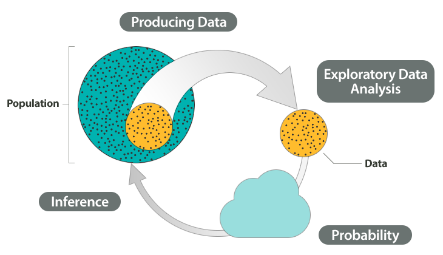
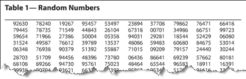
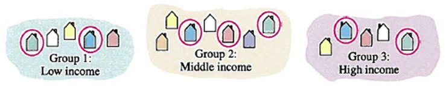
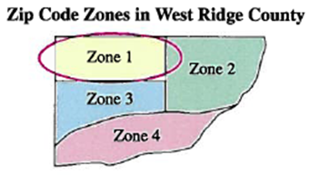

```{r, echo=FALSE, warning=FALSE}
knitr::opts_chunk$set(comment="#", fig.retina=2, crayon.enabled = TRUE)
library(stats)
library(kableExtra)
library(knitr)
library(formattable)
library(ggplot2)
library(ggthemes)
library(ggExtra)
library(dplyr,warn.conflicts = FALSE)
xaringanExtra::use_fit_screen()
```

# Textbooks

- [MA336 Statistics](https://stats.libretexts.org/Courses/Queensborough_Community_College/MA336%3A_Statistics)

---

# Learning goals for statistical studies

- Distinguish between a population and a sample.

- Determine whether a study is an observational study or an experiment.

- Determine the goal of a statistical study and what types of conclusions are appropriate.

- Recognize typical forms of sampling biases such as convenience sample and voluntary response.

- Explain why randomization should be used.

- Describe how to implement a randomized design:  Simple random sample, Stratified random sample, Cluster random sample, Systematic random sample.

- Determine whether the conclusion of an experiment design is appropriate.

- Identify the lurking variable and confounding variable.

---
class: center middle

# Statistical Studies

---

## The Big Picture

.center[

]

Image source: [Concepts in Statistics (lumen learning)](https://courses.lumenlearning.com/wmopen-concepts-statistics/chapter/why-it-matters-why-it-matters-types-of-statistical-studies-and-producing-data/)

---

## Basic statistical concepts (1/4)

- **Data** consists of information from observation, counts, measurements, responses or experiments.

- A **population** is the collection of all objects that are of interest.

- A **parameter** is a number that is a property of the population.

- A **sample** is a subset of a population.

- A **statistic** is a number, such as a percentage, that represents a property of a sample.

---

## Basic statistical concepts (2/4)

1. Determine if the group is a population or sample

  1. The grade of all students in a math class.  
  2. 10 students in a math class earned "A".

- **Answer:**  
  1. Population,  
  2. Sample.

2. Identify statistic concepts in the following study: To learn the percentage of students go to school by public transportation, 500 students at a college were survey. 50% say they go to school by public transportation  

- **Answer:**  
  - Population: all students at the college  
  - Sample: 500 being surveyed  
  - Parameter: unknown percentage  
  - Statistic: 50%

---

## Basic statistical concepts (3/4)

- In statistics, a **variable** is a characteristic, or attribute of interest that we gather about individuals or objects. There are two types of variables according to their values.
  - **Categorical variables** (or qualitative variables) represent attributes, labels or nonnumerical entries, such as names, and colors.
  
  - **Quantitative variables** represent numerical measurements or counts, such as weights and number of students in each class.

---

## Basic statistical concepts (4/4)

- Identify the type variables.

| Variable | Type |
|---|---|
|Age  | *Quantitative* |
|Hair color|   *Qualitative*|
|GPA | *Quantitative* |
| Education attainment (AS, BS, MS, etc.) | *Qualitative* |

---

## Practice: basic statistical concepts

Identify the population, sample, the variable of study, the type of the variable, the population parameter and the sample statistics.

*An administrator wishes to estimate the passing rate of a certain course. She takes a random sample of 50 students and obtains their letter grades of that course. Among the 50 students, 32 students earned a grade C or better.*

---

## Types of statistical studies

- A statistical study can usually be categorized as an **observational study** or an **experiment** by the mean of study.

  - An observational study observes individuals and measures variables of interest. The main purpose of an observational study is to describe a group of individuals or to investigate an association between two variables.
  
  - An experiment intentionally manipulates one variable in an attempt to cause an effect on another variable. The primary goal of an experiment is to provide evidence for a cause-and-effect relationship between two variables.

---

## Example: types of statistical studies

- Which type of study will answer the question best.

  1. what proportion of all college students in the United States have taken classes at a community college?
  
  2. Does use of computer-aided instruction in college math classes improve test scores?
  
- **Answer:** 1. Observational, 2.experimental

See [Types of Statistical Studies (2 of 4) in the textbook Concepts in Statistics](https://courses.lumenlearning.com/wmopen-concepts-statistics/chapter/types-of-statistical-studies-2-of-4/) for more examples.

---

## Practice: Observational vs Experimental

Identify the type of statistical study:

1. *A study took random sample of adults and asked them about their bedtime habits. The data showed that people who drank a cup of tea before bedtime were more likely to go to sleep earlier than those who didn't drink tea.*

    A. Observational  
    B. Experimental

2. *Another study took a group of adults and randomly divided them into two groups. One group was told to drink tea every night for a week, while the other group was told not to drink tea that week. Researchers then compared when each group fell asleep.*

    A. Observational  
    B. Experimental

.footmark[
Source: [Khan Academy](https://www.khanacademy.org/math/probability/study-design-a1/observational-studies-experiments/a/observational-studies-and-experiments)
]

---

## Questions about population (1/2)

| **Type of Research Question**                                | **Examples**                                                 |
| ------------------------------------------------------------ | ------------------------------------------------------------ |
| **Make an estimate about the population** (often an estimate about an *average* value or a *proportion* with a given characteristic) | What is the *average* number of hours that community college students work each week?   What *proportion* of all U.S. college students are enrolled at a community college? |
| **Test a claim about the population** (often a claim about an *average* value or a *proportion* with a given characteristic) | Is the *average* course load for a community college student greater than 12 units?   Do the *majority* of community college students qualify for federal student loans? |

---

## Questions about population (2/2)

| **Type of Research Question**                                | **Examples**                                                 |
| ------------------------------------------------------------ | ------------------------------------------------------------ |
| **Compare two populations** (often a comparison of population averages or proportions with a given characteristic) | In community colleges, do female students have a *higher* GPA than male students?   Are college athletes *more* likely than non-athletes to receive academic advising? |
| **Investigate a correlation** between two variables in the population | Is there a *correlation* between the number of hours high school students spend each week on Facebook and their GPA?   Is academic counseling *associated* with quicker completion of a college degree? |

---

## Question on cause-and-effect

- A research question that focuses on a cause-and-effect relationship is common in disciplines that use experiments, such as medicine or psychology.
  - Does cell phone usage increase the risk of developing a brain tumor?
  - Does drinking red wine lower the risk of a heart attack?

- In a study of a relationship between two variables, one variable is the **explanatory variable**, and the other is the **response variable**. 

---

## Example: cause-and-effect or correlation

Determine if the question is a cause-and-effect question? What are the explanatory and response variables?

  1. Does use of computer-aided instruction in college math classes improve test scores?
  2. Does tutoring correlate with improved performance on exams?

**Answer:**

  1. This question investigate a cause-and-effect relationship. The explanatory variable is computer-aided instruction and the response variable is the test scores.

  2. This question investigate a correlation between variables in a population and is not a cause-and-effect question. The explanatory variable is tutoring and the response variable is the performance.

---

## Example: appropriate conclusions of a study

***In general, we should not make cause-and-effect statements from observational studies unless impact of confounding variables can be significantly decreased.***

- A researcher studies the medical records of 500 randomly selected patients. Based on the information in the records, he divides the patients into two groups: those given the recommendation to take an aspirin every day and those with no such recommendation. He reports the percentage of each group that developed heart disease.

  Determine whether the study supports the conclusion that taking aspirin lowers the risk of heart attacks.

- **Answer:** The conclusion claims a cause-and-effect relationship. To answer the question, we need an experimental study. However, the study has no control on data which makes it inappropriate.

---

## Practice: cause-and-effect

Does higher education attainment lead to higher salary?

1. Determine if the question is a cause-and-effect question?  
2. What are the explanatory and response variables?  
3. If a student want to study this question, what type of statistical study can be used? What kind of conclusion can be drawn?

---

## Sampling plans

To make accurate inference, the sample must be representative of the population.

- A **sampling plan** describes exactly how we will choose the sample.

- A sampling plan is **biased** if it systematically favors certain outcomes.

- In **random Sampling**, every individual or object has an equal chance of being selected.

---

## Methods of random sampling (1/2)

- **Simple random sample**: groups of the same size are randomly selected. Table of random numbers, calculator and softwares are often used to generate random numbers.
.center[ ]

- **Stratified random sample**: The population is first split into homogeneous groups, i.e. subjects in the same group share the same attribute. Then a same proportion or a same number of subjects from each group are selected randomly.
.center[ ]

???
Show how to generate a random number using the Excel function **RANDBETWEEN()**
In the latest version of Excel, a new function **RANDARRAY()** is available.

---

## Methods of random sampling (2/2)

- **Cluster sample**: The population is first split into groups. Then some groups are selected randomly.
.center[ ]

- **Systematic sample**: First, a starting number is chosen randomly. Then take every $n$-th piece of the data.
.center[ ]

---

## Practice: sampling methods

`r knitr::include_url('https://www.myopenmath.com/embedq2.php?id=429240&seed=2022&showansafter', height='560px')`

<!-- Determine the type of sampling method. -->

<!-- 1. A market researcher polls every tenth person who walks into a store. -->

<!-- 2. 100 students whose student id numbers matches 100 numbers generated by a computer randomization program. -->

<!-- 3. The first 30 people who walk into a sporting event are polled on their television preferences. -->

---

## Bad sampling

- Biased sampling
  - Online polls. These are examples of a voluntary response sample.
  - Mall surveys. These  are an example of a convenience sample.

 [See Sampling (1 of 2) in the textbook for examples](https://courses.lumenlearning.com/wmopen-concepts-statistics/chapter/sampling-1-of-2/)

- Undercoverage

  - It occurs when some groups in the population are left out of the process of choosing a sample. For example, random survey math students to estimate the average GPA or a college.

---

## Example: appropriate sampling design

Suppose that you want to estimate the proportion of students at your college that use the library.

  Which sampling plan will produce the most reliable results?
  
  1. Select 100 students at random from students in the library.
  
  2. Select 200 students at random from students who use the Tutoring Center.
  
  3. Select 300 students who have checked out a book from the library.
  
  4. Select 50 students at random from the college.

--

**Answer:** The 4th sampling plan is the most reliable plan. The first three undercover the college.

In general, the larger sample size, the more accurate of conclusion. However, we have to avoid bad sampling.

---

## Practice: identify the flaw(s) in the study

Students at an elementary school are given a questionnaire that they are asked to return after their parents have completed it. One of the questions asked is, "Do you find that your work schedule makes it difficult for you to spend time with your kids after school?" Of the parents who replied, 85% said "no". Based on these results, the school officials conclude that a great majority of the parents have no difficulty spending time with their kids after school.

.footmark[
Problem 1.39 (a) in [Openintro Statistics](https://www.openintro.org/book/os/)
]

---

## Elements of experimental design (1/2)

- To establish a cause-and-effect relationship, we want to make sure that the explanatory variable is the only thing that impacts the response variable. We therefore want to get rid of all other factors that might affect the response. These factors are called confounding variables. 

- **Control** reduces the effects of extraneous variables (i.e., variables other than the independent variable and the dependent variable). These extraneous variables are called lurking variables.

- Three control strategies are control groups, placebos, and blinding.

  - A **control group** is a baseline group that receives no treatment or a neutral treatment.

  - A neutral treatment that has no "real" effect on the dependent variable is called a **placebo**, and a participant's positive response to a placebo is called the **placebo effect**.

  - **Blinding** is the practice of not telling participants whether they are receiving a placebo. **Double-blinding** is the practice of not telling both  both the participants and the researchers which group receiving a treatment or a placebo.

---

## Elements of experimental design (2/2)

- **Randomization** ensures that this estimate is statistically valid.

  - With random assignment, we can be fairly confident that any differences we observe in the response of treatment groups is due to the explanatory variable.

- **Replication** reduces variability in experimental results and increases their significance.

  - Although randomization helps to insure that treatment groups are as similar as possible, the results of a single experiment, applied to a small number of objects or subjects, should not be accepted without question.  
  - Any good experiment should be reproducible, and in particular, replication should yield similar results.

---

## Practice: experimental design

A company tested their new golf ball by having 20 professional golfers each hit 100 shots with the company's new ball and 100 shots with the golfer's current ball (in a random order). The labels were removed, so the golfers didn't know which balls were which. The golfers, on average, hit their shots significantly farther with the new ball.

The company cites this study in an advertisement claiming that this new ball will help all golfers hit farther shots.

Is the company's claim appropriate? Why?

.footmark[
Source: [Khan Academy](https://www.khanacademy.org/math/ap-statistics/gathering-data-ap/xfb5d8e68:inference-experiments/e/issues-experiments)
]

---

## Confounding variable vs lurking variable

- A **confounding variable* is a variable other than the explanatory variable that has at least a partial effect on the response variable.

  **Example:** In the study of the relation between a type fertilizer and tomato size, the amount of sunshine will be a confounding variable. It contributes to the growth of tomato.

- A **lurking variable* is a variable other than the explanatory and response variables that has effects on both the explanatory variable and the response variable.

  **Example:** People find that there is a positive association between number of firefighters and amount of damage. However, both are affected the size of fire.

---

## Practice: is coffee the reason for poor health

`r knitr::include_url('https://www.myopenmath.com/embedq2.php?id=584820&seed=2022&showansafter', height='560px')`


---
class: center middle

# Lab Instructions in Excel

---

## Random numbers by Excel (1/3)

- **Example:** Randomly generate a number between 0 and 1.

  - Step 1: Choose a cell, say `A1`
  
  - Step 2: click insert function button $f_x$.
  
  - Step 3: In the popup window, search "random" and select **RAND**.
  
  - Step 4: Click OK, you will get a randomly generated number.

  Alternatively, you may also manually enter the function: `=rand()` in the cell and hit enter.

---

## Random numbers by Excel (2/3)

- **Example:** Generate 10 random integers of 2 digits.

  - Step 1: Generate a random integer, say in the cell `A1`, using the Excel function `randbetween(bottom,top)`.
  
  - Step 2: Move the mouse cursor to the lower right corner of the cell `A1`. A solid plus `+` will appear.
  
  - Step 3: Hold the left-click of the mouse and drag the cell to horizontally or vertically to get 10 numbers.

Using `randbetween`, you will find that some numbers were repeated. If you are using the latest version of Excel, you may use `randarray` to generate numbers without repetition.

---

## Random numbers by Excel (3/3)

- **Example:** Generate 10 random integers of 2 digits without repetition.

  - In the cell with 10 empty cells below it, say `A1`, apply the Excel function `=randarray(rows,columns,min,max,integer)`. In this case, you should set rows=10, columns=1, min=10, max=99, and choose integer to be TRUE.

---

## Table in Excel

- **Insert a table**

  - Step 1: In the menu bar, select Insert.
  
  - Step 2: Look for Table and click it.
  
  - Step 3: In the popup windows, you may enter the two diagonal cell locators. For that, press Shift and select the two diagonal cells of you table.
  
  - Step 4: Click OK. You will see the table.

- **Remark:** Tables are normally used for more than one variables, that are characteristic or attributes being studied, such as attendance rate and grade. In table, a column is usually used to put entries of a data set for a certain variable. Rows are used as labels of individual entries.

---

## Insert or delete cells

- **Insert or delete cells, rows or columns**

  - Step 1: Highlight by left clicking the cell(s), row, or column that you want to insert or delete.
  
  - Step 2: Right-click the highlighted cell, row or column
  
  - Step 3: In the popup window, select insert or delete and follow the instruction.

---

## Install the Analysis ToolPak

- We will use analysis toolpak frequently for analyzing data.

- To install the add-in `The Analysis ToolPak`:

  - Step 1: In the Excel menu bar, select Home.
  
  - Step 2: Choose and click options
  
  - Step 3: In the popup window, choose and click Add-ins.
  
  - Step 4: In the new display, look for Manage: Excel Add-ins and click Go next to it.
  
  - Step 5: In the new popup windows, select The Analysis ToolPak and then click the OK button.
