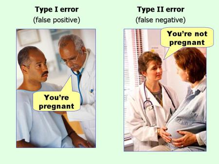

```{r, echo=FALSE, warning=FALSE}
knitr::opts_chunk$set(comment="#", fig.retina=2, crayon.enabled = TRUE, dpi=600)
set.seed(15)
library(stats)
library(kableExtra)
library(knitr)
library(formattable)
library(ggplot2)
library(ggthemes)
library(ggExtra)
library(dplyr,warn.conflicts = FALSE)
library(animation)
library(gifski)
library(latex2exp)
xaringanExtra::use_fit_screen()
```

<div class="latex-macros">
$$\require{color}$$
$$\definecolor{purple}{RGB}{226, 15, 233}$$
$$\definecolor{grey}{RGB}{177, 159, 149}$$
</div>

## Learning Goals for Hypothesis Tests

- Choose appropriate null and alternative hypotheses.

- Determine whether the test should be one-sided or two-sided.

- Calculate $Z$-test statistics and $T$-test statistics.

- Calculate the $P$-value<!-- or the rejection region-->.

- Determine whether to reject or fail reject the alternative hypotheses.

- Interpret the results of a test of significance in context.

---

## The Basic Idea of Hypothesis Testing

- The testing procedure starts with an initial assumption that the statement on population parameter is true.

- We test this initial assumption using a random sample. If the initial assumption is really the truth, then the test statistic from a random sample shouldn't be too far away from the center of the sampling distribution. Conversely, if the test statistic is .green[too far away] from the center, then we should .green[not believe in] the initial assumption.

- To determine how far is too far away, we need to specify a threshold, a prior probability, or equivalently a critical value.

- If the test statistic is at least extreme as the critical value, then the testing is significant enough to allow us to reject the initial assumption. Otherwise, we cannot draw a definite conclusion.

- The prior probability measures the chance that the initial assumption was wrongly rejected.

---

## Two Hypotheses

- A statistical **hypothesis** is a statement about a population parameter.

- A **hypothesis test** is a process that uses sample statistics to test a **hypothesis**.

- To test a population parameter, we choose a pair of hypotheses, the null hypothesis and the alternative hypothesis which are contradictory to each other.

- The **null hypothesis**, denoted by $H_0$, is the statement about the population parameter that is assumed to be true.

- The **alternative hypothesis**, denoted $H_a$, is a statement about the population parameter that is contradictory to the null hypothesis.

---

## Example: Identify the Null and the Alternative Hypotheses

1. Test a statement that the population mean is 1.
2. Test a statement that the population mean is more than 3.
3. Test a statement that the population mean is no more than 3.

--

**Solution:** Keep in mind that the null hypothesis should always contains the equal sign. The alternative hypothesis is contrary to the null hypothesis.

1. We may set set the null hypothesis as $H_0$: $μ = 1$. Depending on the given information, otherwise, we may set the alternative hypothesis as $H_a$: $μ\ne 1$.
2. We may set set the null hypothesis as $H_0$: $μ = 3$ and the alternative hypothesis as $H_a$: $μ>3$.
3. We may set set the null hypothesis as $H_0$: $μ \le 3$ and the alternative hypothesis as $H_a$: $μ>3$.

---

## The Logic of Hypothesis Testing

The logic of hypothesis testing and two types of error can be summarized in the following table.

```{r HypoTest, echo=F}
row1 <- c("", "\\(H_0\\) is true", "\\(H_0\\) is false")
row2 <- c("Reject \\(H_0\\)", ".red[Type I Error]", ".green[Correct decision]")
row3 <- c("Fail to Reject \\(H_0\\)", ".green[Correct decision]", ".red[Type II Error]")

tb <- rbind(row2, row3)

tb <- as.data.frame(tb)
row.names(tb)<-NULL
colnames(tb) <- row1

kable(tb, format = "html", escape=F, align = "c")%>%
#    add_header_above(c("", "Truth of \\(H_0\\)" = 2))%>%
    kable_styling(full_width = F, protect_latex=T)
```

The interpretation of hypothesis testing is summarized in the following table.

```{r HypoTestDec, echo=F}
rowa <- c("", "If the claim to be tested is in \\(H_0\\)", "If the claim to be tested is in \\(H_a\\)")
rowb <- c("Reject \\(H_0\\)", ".green[There is enough evidence to reject the claim]", ".green[There is enough evidence to support the claim]")
rowc <- c("Fail to Reject \\(H_0\\)", ".blue[There is not enough evidence to reject the claim]", ".blue[There is not enough evidence to support the claim]")

tbd <- rbind(rowb, rowc)

tbd <- as.data.frame(tbd)
row.names(tbd)<-NULL
colnames(tbd) <- rowa

kable(tbd, format = "html", escape=F)%>%
#    add_header_above(c("", "Interpretation" = 2))%>%
    kable_styling(full_width = F, protect_latex=T)
```

---

## Type of Errors in Hypothesis Testing

- Rejecting the null hypothesis when it is indeed true is called a **type I error**. The maximum allowable probability of making a type I error is called the **level of significance**, denoted by $\alpha$.

- Failing to reject the null hypothesis when the it is false is called a **type II error**. The probability of a type II error is usually denoted by $\beta$. The **power of a hypothesis test**, equals $1-\beta$, is the probability of rejecting the null hypothesis when it is false.

.center[
  
]

.footmark[
  Source: [An illustration of errors](https://effectsizefaq.com/2010/05/31/i-always-get-confused-about-type-i-and-ii-errors-can-you-show-me-something-to-help-me-remember-the-difference/).
 See also [the interactive demonstration of errors and the power](https://istats.shinyapps.io/power/).
]

???
$$\alpha=P(\text{Type I error})= P(\text{reject a true }H_0).$$  

---

## Type of Tests

- If $H_a$ has the form $\mu\neq \mu_0$ the test is called a **two-tailed test**.

- If $H_a$ has the form $\mu<\mu_0$ the test is called a **left-tailed test**.

- If $H_a$ has the form $\mu>\mu_0$ the test is called a **right-tailed test**.

- Each of the last two forms is also called a **one-tailed test**.

<!-- --- -->
<!-- 
## Rejection Region and Critical Value

- The sample statistic used to test the assumption is called a **test statistic**.

- A **rejection region** is the range of values for which the null hypothesis is unlikely to be true.

.center[
|Sign in $H_a$ | $\ne$ | $<$ | $>$  |
|---|---|---|
|Rejection region  | Both sides | Left side | Right side |
]

- A **critical value** is a value that separates the rejection region from its complement. The calculation depends on the sampling distribution of the test statistic.

.footmark[
 See the interactive demonstration for [rejection regions for hypothesis tests](https://hselab.shinyapps.io/critvalues/).
]

- If a test statistic falls in the rejection region, then we may and will reject the null hypothesis. -->

<!-- --- -->
<!-- 
## Visualization: Rejection Region and Critical Value

.center[
  
]

.footmark[
  Source: [Figure 8.2 in Section 8.1 in Introductory Statistics](https://saylordotorg.github.io/text_introductory-statistics/s12-01-the-elements-of-hypothesis-tes.html).
] -->

<!-- --- -->
<!-- 
## Computational Remarks

- Based on the central limit theorem, when testing a hypothesis on mean or proportion, we will use either a (standard) normal distribution or a Student’s t-distribution.

- The critical value(s) at the significance level $\alpha$ can be calculated in two steps:
  1. find the standard critical value
  2. Apply the (inverse) standardization formula
    $$\text{Critical value}= \text{Std. critical value}\cdot\text{SE}\pm\text{Mean}.$$

- To make a decision using rejection region, alternately, it is usually more convenient to compare the standard critical value with the **standardized test statistic**:
  $$\text{Std. test statistic}=\frac{\text{Test statistic} - \text{Mean}}{\text{SE}}.$$ -->

<!-- --- -->
<!-- 
## Standardized Rejection Region

- The standardized test statistic has a standard normal distribution

| Symbol in $H_a$ | Type of Test   | Rejection Region |
|:---------:|:-------:|:-------:|
| $<$   | Left-tailed test  | $(-\infty, -z_\alpha]$    |
| $>$  | Right-tailed test | $[z_\alpha, \infty)$    |
| $\neq$   | Two-tailed test   | $(-\infty, -z_{\alpha/2}]\cup [z_{\alpha/2}, \infty)$ |

- The standardized test statistic has a Student's $t$-distribution

| Symbol in $H_a$ | Type of Test  | Rejection Region |
|:---------:|:-------:|:-------:|
| $<$  | Left-tailed test  | $(-\infty, -t_\alpha]$   |
| $>$  | Right-tailed test | $[t_\alpha, \infty)$  |
| $\neq$  | Two-tailed test   | $(-\infty, -t_{\alpha/2}]\cup [t_{\alpha/2}, \infty)$ |

- Recall that $z_{c}$=`NORM.S.INV(1-c)` (or $t_c$=`T.INV(1-c, df)`) is the the value such that $P(Z<z_c)=1-c$ (respectively $P(T<t_c)=1-c$). -->

<!-- --- -->

<!-- ## Example: Make a Decision Using Rejection Region -->

<!-- Suppose the population standard deviation is $\sigma=4.3$. At the significance level $\alpha=0.02$, construct the a standardized rejection region for the following test for the population mean
.center[
Test $H_0: \mu=21.6$ vs. $H_a: \mu<21.6$.
]

Make a decision if a random sample has the size $n=70$ and mean $\bar{x}=20.5$. -->

<!-- -- -->
<!-- 
**Solution:** Due to the form of $H_a: \mu< 21.6$, the rejection region should contain the left tail.

Then the standard critical value is $z_{0.02}$=`NORM.S.INV(1-0.02)` $\approx$ `r c1=round(-qnorm(1-0.02, 0, 1),3); c1`. So the standard rejection region is $(-\infty, `r c1`]$.

Because the standardized test statistic
$$
z=\frac{\bar{x}-\mu_0}{\sigma/\sqrt{n}}
=\frac{20.5-21.6}{4.3/\sqrt{70}}\approx `r round((20.5-21.6)/(4.3/sqrt(70)),3)`
$$
is in the rejection region. We reject the null hypothesis. -->

---

## Observed Significance

- To make a decision, one may also compare probabilities. The **observed significance** (**\\( P \\)-value**) of a test statistic is the probability of obtaining a sample statistic at least as extreme as the (observed) test statistic, given that the null hypothesis were true.

- $P$-Value as Tail area

  .center[
  |Sign in $H_a$ | $\ne$ | $<$ | $>$  |
  |---|---|---|
  | $P$-value  | Double of the tail area | Left tail area | Right tail area |
  ]

- Making decision by comparing the $P$-value with the significance level $\alpha$:
  
  - reject $H_0$ if $p≤\alpha$ and

  - do not reject $H_0$ if $p>\alpha$.

---

## Example: Make a Decision Using the $P$-value

Given the following testing hypotheses

.center[
$H_{0}: p=0.50$ vs. $H_{a}: p\ne 0.50, n=360, \hat{p}=0.56$,
]

find the $P$-value for the test and make a decision at the 5% level of significance.

--

**Solution:** Because $H_a$ is $\color{purple}{p\ne p_0}$ and $\color{grey}{\hat{p}=0.56>p_0}$, the $P$-value is the .purple[double] of the .grey[right tail] area, that is, the $P$-value equals $2P(\hat{p}>0.56)$.

We first find the standard error of the null distribution:
$$\text{SE}=\sqrt{p_0(1-p_0)/n}=\sqrt{0.5\cdot0.5/360}=`r round(sqrt(0.5*0.5/360),2)`.$$

The $P$-value is approximately `r round(2*(1-pnorm(0.56,0.5,0.03)), 4)` which can be calculated by the Excel function `2*(1-NORM.DIST(0.56,0.5,0.03,TRUE)`.

Since the $P$-value is smaller than $\alpha$, we reject the null hypothesis $H_0$.

---

## Practice: Conceptual Understanding on Hypothesis Testing

Decide whether the following statements are true or false. Explain your reasoning.

- In case of a left-tailed test, we reject the null hypothesis if the sample statistic is significantly smaller than the hypothesized population parameter.

- A $P$-value of 0.08 is more evidence against the null hypothesis than a $P$-value of 0.04.

- The statement, "the $P$-value is 0.03", is equivalent to the statement, "there is a 3% probability that the null hypothesis is true".

- Even though you rejected the null hypothesis, it may still be true.

- Failing to reject null hypothesis means the null hypothesis is true.

- That the $P$-value of a sample statistic is $p=0$ means the null hypothesis cannot be true.

.footmark[
Questions are partially taken from [Conceptual questions on hypothesis testing](http://www2.stat.duke.edu/~jerry/sta101/tests.html)
]

---

## Practice: Identify Hypotheses and and Determine the Type of Test

`r knitr::include_url('https://www.myopenmath.com/embedq2.php?id=168392&seed=2020&showansafter', height='560px')`

<!-- --- -->
<!-- 
## Practice: Find the Rejection Region

Suppose the standardized test statistic has $Z$-distribution. Find the standard rejection region for each of the following testing scenario.

- $H_{0}: \mu=27 \text{ vs. } H_{a} : \mu<27$ with $\alpha=0.01$
- $H_{0}: \mu=52 \text{ vs. } H_{a} : \mu \neq 52$ with $\alpha=0.05$
- $H_{0}: \mu=-105 \text{ vs. } H_{a} : \mu>-105$ with $\alpha=0.02$ -->

---

## Practice: Find the $P$-value

Suppose we’re conducting a hypothesis testing for a population mean. Find the $P$-value for each of the following testing scenario with the given sample size $n$ and the test statistics $t$.

- $H_{0}: \mu=25 \text { vs. } H_{a} : \mu<25$, $n=30$, $t=-2.43$.
- $H_{0}: \mu=35 \text { vs. } H_{a} : \mu>35$, $n=50$, $t=2.13$.
- $H_{0}: \mu=-7.9 \text { vs. } H_{a} : \mu\ne-7.9$, $n=40$, $t=-1.99$.

---

## Practice: Make a Decision Based on the $P$-value

`r knitr::include_url('https://www.myopenmath.com/embedq2.php?id=462486&seed=2020&showansafter', height='560px')`

---

## Practice: Interpret a Decision

`r knitr::include_url('https://www.myopenmath.com/embedq2.php?id=336259&seed=2020&showansafter', height='560px')`

<!-- --- -->

<!--
## Quiz 10

1. Determine if the following statements are true or false. Please explain your reasoning.

   - The $P$-value of the test statistic is $p = 0.06$. At the significance level $\alpha=0.01$, the null hypothesis $H_0$ should be rejected.

   - A two-tailed test has larger probability of getting a type I error that a one-tailed test.

   - That a test statistic falls in the rejection region means the $P$-value is smaller than the significance level.

2. An administrator at a college believes that the student absence rate is higher than 15%. Explain how should the administrator test the statement. -->

---
class: center middle

# Lab Instructions in Excel

---

## Excel Functions for Normal Distributions

- Let $Z$ be a standard normal random varaible. In Excel, $P(Z<z)$ is given by `NORM.S.DIST(z,TRUE)`.

- Let $X$ be a normal random variable with mean $\mu$ and standard deviation $\sigma$, that is $X\sim \mathcal{N}(\mu, \sigma^2)$. In Excel, $P(X<x)$ is given by `NORM.DIST(x,mean,sd,TRUE)`.

- When a cumulative probability $p=P(X<x)$ of a normal random variable $X$ is given, we can find $x$ using `NORM.INV(p,mean,sd)`.

- When a cumulative probability $p=P(Z<z)$ of a standard normal random variable $Z$ is given, we can find $z$ using `NORM.S.INV(p)`.

---

## Excel Functions for $T$-Distributions

Suppose a Student's $T$-distribution has the degree of freedom $\text{df}=n-1$.

- To find a probability for a given $T$-value

  - The area of the left tail of the $T$-value may be calculated by the function `T.DIST(t,df,true)`.

  - The area of the right tail of the $T$-value may be calculated by the function `T.DIST.RT(t, df)`.

  - The area of two tails of the $T$-value (\\(t>0\\)) may be calculated by function `T.DIST.2T(t,df)`.

- To find the critical value for a given probability $p$

  - When the area of the left tail is given, the function `T.INV(p,df)` may be used.
  
  - When the area of both tails is given, the function `T.INV.2T(p,df)` may be used. This function is good for construction confidence interval.
