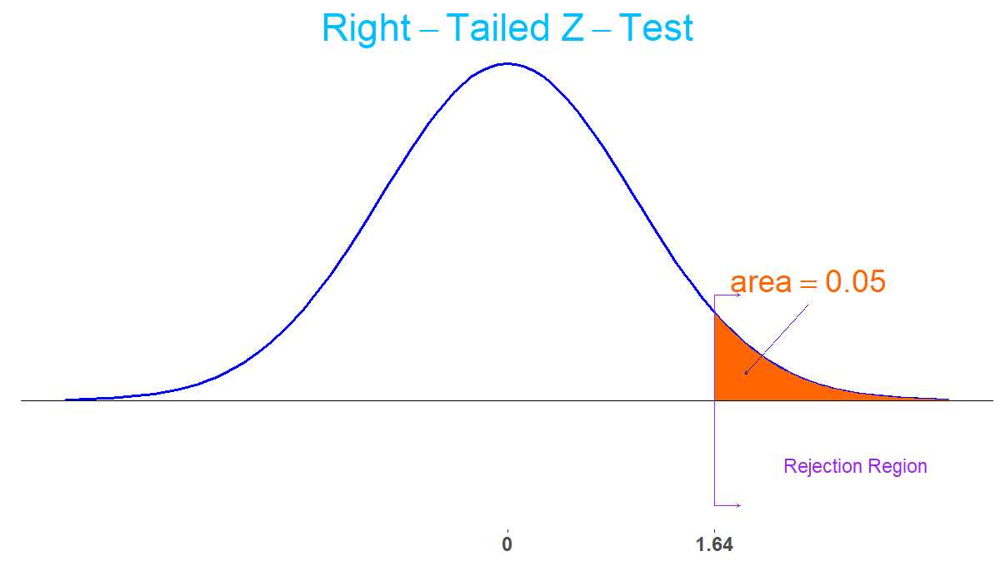
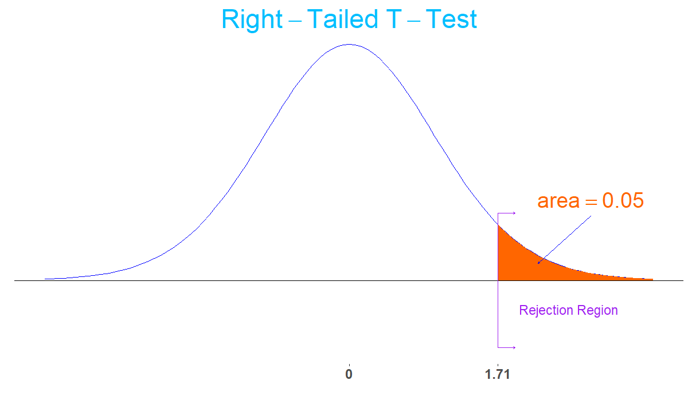

```{r, echo=FALSE, warning=FALSE}
knitr::opts_chunk$set(comment="#", fig.retina=2, crayon.enabled = TRUE, dpi=600)
set.seed(15)
library(stats)
library(kableExtra)
library(knitr)
library(formattable)
library(ggplot2)
library(ggthemes)
library(ggExtra)
library(dplyr,warn.conflicts = FALSE)
library(animation)
library(gifski)
library(latex2exp)
xaringanExtra::use_fit_screen()
```

<div class="latex-macros">
$$\require{color}$$
$$\definecolor{purple}{RGB}{226, 15, 233}$$
$$\definecolor{grey}{RGB}{177, 159, 149}$$
</div>

## Learning Goals for Hypothesis Tests

- Perform an appropriate hypothesis test for a statement about mean using data from a random sample.

- Perform an appropriate hypothesis test for a statement about proportion using data from a random sample.

---

## Hypothesis Testing Procedure

1. Check if the sample size is large enough and determine if a $Z$-test or $T$-test can be performed. For proportion, $Z$-test may be used. For mean, if $\sigma$ is known, the $Z$-test may be used. If $\sigma$ is unknown, the $T$-test may be used.

2. State the null and alternative hypothesis. The null hypothesis always contains the equal sign (and possibly together with a less than or greater than symbol, depending on $H_a$.)

3. Set a significance level $\alpha$. Commonly used levels are $\alpha=0.01$, $\alpha=0.05$ and $\alpha=0.1$.

4. Calculate the standardized test statistic: the $Z$-test statistic or the $T$-test statistic.

5. Calculate the $P$-value<!--, or construct the rejection region.--> (.green[Recommend to draw pictures]).  
  .center[
  |Sign in $H_a$ | $\ne$ | $<$ | $>$  |
  |---|---|---|
  | Test | Two-tailed | Left-tailed | Right-tailed|
  ]

6. Make a test decision about the null hypothesis $H_0$. We reject $H_0$ if <!--the test statistic falls in the rejection region or-->the $P$-value less than the significance level $\alpha$.

7. State an overall conclusion.

<!-- --- -->

<!-- ## Some Remarks -->
<!-- 
- Test statistics often refer to the standard test statistics which give more details on the relative difference.
  
- The $P$-value is slightly more popular in hypothesis testing. Because it gives a more detailed explanation of the data and is easier for making decision at different significance levels.

- A hypothesis test decision may be interpreted using the confidence interval. The rejection region of a hypothesis test can be obtained as the complement of a confidence interval.

- A hypothesis testing procedure is comparable to a criminal trial: a defendant is considered not guilty as long as his or her guilt is not proven. See Wiki page on [Statistical Hypothesis Testing](https://en.wikipedia.org/wiki/Statistical_hypothesis_testing) for more detail on the comparison. -->

<!-- - For a right-tail $Z$-test, the $P$-value of a sample can be obtained by the Excel function `Z.TEST(array, mu, standard deviation)` -->

<!-- --- -->

<!-- ## Example: Test a Mean with Known SD Using Rejection Region (1/2) -->

<!-- Residences on a certain street claim that the mean speed of automobiles run through the street is greater than the speed limit of 25 miles per hour. A random sample of 100 automobiles has a mean speed of 26 miles per hour. Assume the population standard deviation is 4 miles per hour. Is there enough evidence to support the claim of the residences at the significance level $\alpha = 0.05$? -->

<!-- -- -->
<!-- 
**Solution:** The sample size is $n=100>30$. So the sampling distribution of sample means is approximately normal by the central limit theorem.

To test the claim of the residences, we set $H_0:\mu=25$ and $H_a: \mu >25$.

Because $H_a$ contains the $>$ sign and $\sigma$ is known, we use right-tailed $Z$-test.

Since the population standard deviation is  $\sigma=4$. We use the standard normal distribution to find the critical value.

With the given significance level $\alpha=0.05$, we find the critical value is $z_{0.05}=`r round(qnorm(1-0.05),2)`$ given by the Excel function `NORM.S.INV(1-0.05)`. -->

<!-- --- -->

<!-- ## Example: Test a Mean with Known SD Using Rejection Region (2/2) -->

<!-- **Solution: (Continued)** The rejection region is the interval $[1.64, \infty)$. -->
<!-- 
.center[
  
] -->
<!-- 
The $Z$-test statistic is $z=\frac{\bar{x}-\mu_0}{\sigma/\sqrt{n}}=\frac{26-25}{4/\sqrt{100}}=2.5$. It is in the rejection region. So we reject the $H_0:\mu=25$ and support the $H_a:\mu>25$.

At the confidence level $\alpha=0.05$, there is enough evidence to support the claim of the residences that the average speed of automobile is above the speed limit. -->

<!-- --- -->

<!-- ## Example: Test a Mean with Unknown SD Using Rejection Region (1/2) -->

<!-- A car manufacturer claims that a new fuel injection design increases the mean mileage on a certain model of car above its current 28.5 miles per gallon level. Twenty-five of the new designs were checked and the mean recorded as 30.0 miles per gallon with a standard deviation of 3.8 miles per gallon. Assume that mean mileages are approximately normally distributed. Evaluate this claim at the 5% level of significance. -->

<!-- -- -->

<!-- **Solution:** Since the population is approximately normally distributed, the sampling distribution of sample means is approximately normal by the central limit theorem.

To test the claim of the residence, we set $H_0:\mu=\mu_0=28.5$ and $H_a: \mu >28.5$.

Because the alternative hypothesis claims "greater" and $\sigma$ is unknown, we use right-tailed $T$-test.

Since the population standard deviation is unknown. We use the $T$-distribution to test the claim.

The degree of freedom is $\text{df}=25-1=24$ With the given significance level $\alpha=0.05$, we find the critical value is $t_{0.05}=`r round(qt(1-0.05, 24),2)`$ given by the Excel function `T.INV(1-0.05, 24)`. -->

<!-- --- -->
<!-- 
## Example: Test a Mean with Unknown SD Using Rejection Region (2/2)

**Solution: (Continued)** The critical region is $[1.71, \infty)$.

.center[
  
]

The $T$-test statistic is
$$
t=\dfrac{\bar{x}-\mu_0}{s/\sqrt{n}}=\dfrac{30-28.5}{3.8/\sqrt{25}}=`r round((30-28.5)/3.8*sqrt(25),2)`.
$$

Because $t=1.97>t_{0.05}=1.71$, that is, the $T$-test statistics in in the rejection region. We reject $H_0$ and support the alternative hypothesis $H_a:\mu>28.5$.

At the significance level 5%, there is enough evidence to support the claim that new designs increase the mean mileage. -->

---

## Example: Test a Mean with Known SD Using $P$-value (1/2)

Residences on a certain street claim that the mean speed of automobiles run through the street is greater than the speed limit of 25 miles per hour. A random sample of 100 automobiles has a mean speed of 26 miles per hour. Assume the population standard deviation is 4 miles per hour. Is there enough evidence to support the claim of the residences at the significance level $\alpha = 0.05$?

--

**Solution:** The sample size is $n=100>30$. So the sampling distribution of sample means is approximately normal by the central limit theorem.

To test the claim of the residences, we set $H_0:\mu=25$ and $H_a: \mu >25$.

Because $H_a$ contains the $>$ sign and $\sigma$ is known, we use right-tailed $Z$-test.

Since the population standard deviation is  $\sigma=4$. We use the standard normal distribution to find the $P$-value.

---

## Example: Test a Mean with Known SD Using $P$-value (2/2)

**Solution: (Continued)** 

The $Z$-test statistic is $z=\frac{\bar{x}-\mu_0}{\sigma/\sqrt{n}}=\frac{26-25}{4/\sqrt{100}}=2.5$. 

Since $H_a:\mu>25$, the $P$-value is the right-tailed area calculated as
\\(P(Z>2.5)=\\)`1-NORM.S.DIST(2.5,TRUE)`\\(\approx 0.006\\).

Because the $P$-value is less than the significance level $\alpha=0.05%

At 5% level of significance, there is enough evidence to support the claim of the residences that the average speed of automobile is above the speed limit.

.footmark[Note: Without calculating the \\(Z\\)-test statistic, the \\(P\\)-value can also be calculated by the Excel function `1-NORM.DIST(26, 25, 4/SQRT(100), TRUE)`.]

---

## Example: Test a Mean with Unknown SD Using $P$-value

**Example:** A certain manufacturer claims that average numbers of candies in a certain sized bag that they produce is 20. To test the claims, you collected a random sample of 10 bags and find the mean is 18 and the standard deviation is 2.7. Assume the numbers of candies are normally distributed. At the significance level $\alpha=0.05$, does your analysis support the manufacturer's claim?

--

**Solution:** Since the population is normally distributed, the sampling distribution for the sample mean is approximately normal.

Set $H_0: \mu=20$ and $H_a: \mu\neq 20$.

Since $H_a$ has the $\ne$ sign and the population standard deviation is unknown, we use two-tailed $t$-test. We will find the $P$-value.

The $T$-test statistics is $t=\frac{18-20}{2.7/\sqrt{10}}\approx`r round((18-20)/2.7*sqrt(10), 3)`.$ Using the Excel, we find that the $P$-value is \\(p\approx\\)`2*T.DIST(-2.342,9,TRUE)`=`r round(2*pt(round((18-20)/2.7*sqrt(10), 3),9),4)`.

Since the $P$-value is smaller than the 5% significance level, we reject $H_0$ can conclude that there is enough evidence to deny the manufacturer's claim.

---

## Example: Test a Mean Using $P$-value from a Data Set (1/2)

An instructor would like to know if the students enrolled in a math course in the  current semester performed better than students in the last semester. The mean final exam from last semester is 75.5. The final exam scores of 40 randomly selected 40 students were obtained

<div class="DataTable">

```{r echo=FALSE}
finalgrade <- c(93,88,69,74,76,81,78,77,74,63,67,81,80,82,68,88,76,69,75,78,75,77,94,87,74,88,63,75,94,88,91,77,76,68,80,88,68,83,72,72)
finalgrade.df=matrix(finalgrade,ncol=20,byrow=TRUE)
finalgrade.df <- as.data.frame(finalgrade.df)

finalgrade.df[] <- mutate_all(finalgrade.df, function(x) {
    cell_spec(x,
      color = spec_color(x, begin=0.4, end = 0.9,  direction = 1)
    )
  }
)

kable(finalgrade.df, col.names = NULL, escape = F, align = "c", "html", booktabs = T) %>%
  kable_styling()
```

</div>

Do the data provide evidence that the students in this semester performed significantly better on the final than last semester?

--

**Solution:** The sample size is $n=40$ which is large enough so that the sampling distribution for the sample mean is approximately normal. We will take the $P$-value approach.

Set $H_0: \mu=75.5$ and $H_a: \mu>75.5$.

Using Excel functions `AVERAGE()` and `STDEV.S()`, we find the sample mean is $\bar{x}\approx `r round(mean(finalgrade),2)`$ and sample standard deviation is $s\approx `r round(sd(finalgrade),2)`$.

---

## Example: Test a Mean Using $P$-value from a Data Set (2/2)

**Solution: (Continued):** The $T$-test statistic is calculated by
$$t=\frac{\bar{x}-\mu_0}{s/\sqrt{n}}=\frac{(78.17-75.5)}{8.39/\sqrt{40}}\approx `r round((78.17-75.5)/8.39*sqrt(40),3)`.$$

Because $H_a$ contains the $>$ sign and $\sigma$ is unknown, we use the right-tailed $T$-test.

The degree of freedom is $\text{df}=40-1$ The $P$-value is the right tail area under the $T$-curve, that is `1-T.DIST(2.013, 39, TRUE)`=`r round(1-pt(2.013, 39),4)` which can also be obtained by `T.DIST.RT(2.013, 39)`.

Since the $P$-value is less than 5%, at the 5% level of significance, we may reject $H_0$. So at 5% level of significance, there is enough evidence to support the claim that the students in this semester performed significantly better on the final than last semester.

However, if the 2% level of significance is used, with the given data, we fail to reject $H_0$. Then, at the 2% level of significance, there is not enough evidence to support the claim.

---

## Example: Fairness of a Coin

Suppose you want to determine if a coin is fair. You toss the coin 50 times and observe 16 heads and 34 tails. At the significant level 0.01, do you think that the coin is fair? If not, does the coin favor the head or tail?

--

**Solution:** Since $n\hat{p}=16$ and $n(1-\hat{p})=34$, a $Z$-test is valid.

To test if the coin is fair, we set the null hypothesis as $H_0$: $p=0.5$. The experiment suggests that we should set the alternative hypothesis as $H_a$: $p<0.5$.

The test statistic is $\hat{p}=\frac{16}{50}=0.32$ and the standardization is
$$z=\dfrac{\hat{p}-p_0}{\sqrt{p_0(1-p_0)/n}}=\dfrac{0.32-0.5}{\sqrt{0.5(1-0.5)/50}}\approx `r round((0.32-0.5)/sqrt(0.5*0.5/50),2)`.$$

From $H_a$, we know that the test is left-tailed. The $P$-value is then `NORM.S.DIST(-2.55,TRUE)`\\(\approx 0.008\\).

Because $0.008<0.01=\alpha$, we reject the null hypothesis $H_0$. Therefore, at the significance level 0.01, there is enough evidence to claim that the coin favors the tail.

---

## Example: Proportion of Newborns (1/2)

Globally the long-term proportion of newborns who are male is 51.46%. A researcher believes that the proportion of boys at birth changes under severe economic conditions. To test this belief randomly selected birth records of 5,000 babies born during a period of economic recession were examined. It was found in the sample that 52.55% of the newborns were boys. Determine whether there is sufficient evidence, at the 10% level of significance, to support the researcher’s belief.

--

**Solution:** Since $n\hat{p}\approx `r round(5000*0.5255, 0)`$ and $n(1-\hat{p})\approx `r round(5000*(1-0.5255), 0)`$, a $Z$-test is valid. we will use the $P$-value to test the hypothesis.

To test the researcher's claim, we set the null hypothesis as $H_0$: $p=0.5146$. The experiment suggests that we should set the alternative hypothesis as $H_a$: $p\neq 0.5146$.

The standard test statistic is
$$
z=\dfrac{\hat{p}-p_0}{\sqrt{p_0(1-p_0)/n}}=\dfrac{0.5255-0.5146}{\sqrt{0.5146\cdot(1-0.5146)/5000}}\approx`r newbornstat=round((0.5255-0.5146)/sqrt(0.5146*(1-0.5146)/5000),4); newbornstat`.
$$

---

## Example: Proportion of Newborns (2/2)

**Solution: (Continued)** From $H_a$, we know that the test is two-tailed. The $P$-value is then
$$2\cdot(1-P(Z<0.5255))\approx`r 2*(1-round(pnorm(newbornstat, 0,1),3))`$$
which can be calculated by the Excel formula  `2*(1-NORM.S.DIST(0.5255,TRUE))`.

Since the significance level is $\alpha=0.1$ and the $P$-value $0.122>0.1=\alpha$, we fail to reject the null hypothesis $H_0$.

At the significance level 0.01, there is not enough evidence to support the researcher's belief that the proportion of newborns who are male changes.

---

## A Remark on the SE for Sample Proportion in Hypothesis Testing

In some books, the standard error of the sample distribution of sample proportions assuming that $p=p_0$ is calculated using the approximation
$$
\sigma_{\hat{p}}=\sqrt{\frac{\hat{p}(1-\hat{p})}{n}}.
$$

An arguable explanation is that using the above value for SE will be consistent with the approach to a hypothesis testing using a confidence interval in the case that a two-tailed test is preformed.

<!-- --- -->

<!-- ## Practice: Testing the Mean Lift Weight (with Known SD) -->
<!-- 
A college football coach thought that his players could bench press a mean weight of 275 pounds. It is known that the standard deviation is 55 pounds. Three of his players thought that the mean weight was more than that amount. They asked 30 of their teammates for their estimated maximum lift on the bench press exercise. The mean of their maximum lift is 286.2.

Conduct a hypothesis test using a 2.5% level of significance to determine if the bench press mean is more than 275 pounds.

.footmark[
  Source: [Module 9 in Introductory Statistics (Lumen)](https://courses.lumenlearning.com/introstats1/chapter/additional-information-and-full-hypothesis-test-examples/).
] -->

---

## Practice: Testing the Mean GPA with known $\sigma$

`r knitr::include_url('https://www.myopenmath.com/embedq2.php?id=941399&seed=2020&showansafter', height='560px')`

---

## Practice: Testing the Mean GPA with Unknown $\sigma$

`r knitr::include_url('https://www.myopenmath.com/embedq2.php?id=941405&seed=2020&showansafter', height='560px')`

---

## Practice: Testing the Proportion of People Who Own Cats

`r knitr::include_url('https://www.myopenmath.com/embedq2.php?id=33395&seed=2020&showansafter', height='560px')`

<!-- --- -->
<!-- 
## Practice: Testing the Mean Age of Students (with Unknown SD)

In a college report, it says the mean age of students is 23.4 years old. An instructor thinks that the mean age is younger than 23.4. He randomly surveyed 50 students and found that the sample mean is 21.5 and the standard deviation is 1.9. At the significance level $\alpha=0.025$, is there enough evidence to support the instructor's estimation? -->

<!-- --- -->

<!-- ## Practice: Testing the Average Household Size

The average household size in a certain region several years ago was 3.14 persons. A sociologist wishes to test, at the 5% level of significance, whether it is different now. Perform the test using the information collected by the sociologist: in a random sample of 75 households, the average size was 2.98 persons, with sample standard deviation 0.82 person.

.footmark[
  [Exercise 11 in Section 8.2 in Introductory Statistics](https://saylordotorg.github.io/text_introductory-statistics/s12-02-large-sample-tests-for-a-popul.html).
] -->

<!-- --- -->
<!-- 
## Practice: Testing the Mean Placement Test Score

The mean score on a 25-point placement exam in mathematics used for the past two years at a large state university is 14.3. The placement coordinator wishes to test whether the mean score on a revised version of the exam differs from 14.3. She gives the revised exam to 30 entering freshmen early in the summer; the mean score is 14.6 with standard deviation 2.4.

1. Perform the test at the 10% level of significance using the critical value approach.
2. Compute the observed significance of the test.
3. Perform the test at the 10% level of significance using the p-value approach.

.footmark[
  [Exercise 9 in Section 8.3 in Introductory Statistics](https://saylordotorg.github.io/text_introductory-statistics/s12-03-the-observed-significance-of-a.html).
] -->

---

## Practice: Testing the Mean Recovery Time

The average number of days to complete recovery from a particular type of knee operation is 123.7 days. From his experience a physician suspects that use of a topical pain medication might be lengthening the recovery time. He randomly selects the records of seven knee surgery patients who used the topical medication. The times to total recovery were:

.center[128, 135, 121, 142, 126, 151, 123]

Assuming a normal distribution of recovery times, perform the relevant test of hypotheses at the 10% level of significance.

Would the decision be the same at the 5% level of significance?

.footmark[
  [Exercise 15 in Section 8.4 in Introductory Statistics](https://saylordotorg.github.io/text_introductory-statistics/s12-04-small-sample-tests-for-a-popul.html).
]

---

class: center middle

# Lab Instructions in Excel

---

## Excel Functions for Normal Distributions

- Let $Z$ be a standard normal random varaible. In Excel, $P(Z<z)$ is given by `NORM.S.DIST(z,TRUE)`.

- Let $X$ be a normal random variable with mean $\mu$ and standard deviation $\sigma$, that is $X\sim \mathcal{N}(\mu, \sigma^2)$. In Excel, $P(X<x)$ is given by `NORM.DIST(x,mean,sd,TRUE)`.

- When a cumulative probability $p=P(X<x)$ of a normal random variable $X$ is given, we can find $x$ using `NORM.INV(p,mean,sd)`.

- When a cumulative probability $p=P(Z<z)$ of a standard normal random variable $Z$ is given, we can find $z$ using `NORM.S.INV(p)`.

---

## Excel Functions for $T$-Distributions

Suppose a Student's $T$-distribution has the degree of freedom $\text{df}=n-1$.

- To find a probability for a given $T$-value

  - The area of the left tail of the $T$-value may be calculated by the function `T.DIST(t,df,true)`.

  - The area of the right tail of the $T$-value may be calculated by the function `T.DIST.RT(t, df)`.

  - The area of two tails of the $T$-value (\\(t>0\\)) may be calculated by function `T.DIST.2T(t,df)`.

- To find the critical value for a given probability $p$

  - When the area of the left tail is given, the function `T.INV(p,df)` may be used.
  
  - When the area of both tails is given, the function `T.INV.2T(p,df)` may be used. This function is good for construction confidence interval.