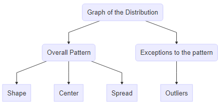
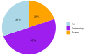

```{r, echo=FALSE, warning=FALSE}
knitr::opts_chunk$set(comment="#", fig.retina=2)
library(stats)
library(kableExtra)
library(knitr)
library(formattable)
library(ggplot2)
library(ggthemes)
library(ggExtra)
library(data.table)
library(dplyr, warn.conflicts = FALSE)
# library(rroughviz)
xaringanExtra::use_fit_screen()
set.seed(3)
load("Data-Frames-SUNY-Concepts-in-Statistics/actor.RData")
```

## Learning goals

- Create and interpret graphs (dot plots, pie charts, histograms) as a means of summarizing and communicating data meaningfully.

- Identify the shape of a distribution (right-skewed, left-skewed, symmetric, or uniform).

---
class: center middle

# Summarizing Quantitative Data Graphically

---

## Distribution of Quantitative Data

- In data analysis, one goal is to describe **patterns** (known as the **distribution**) of the variable in the data set and create a useful summary about the set.

- To describe patterns in data, we use descriptions of **shape**, **center**,
and **spread**. We also describe exceptions to the pattern. We call these exceptions **outliers**.

.center[
  
]

---

## Dot Plots

- A **dot plot** includes all values from the data set, with one dot for each occurrence of an observed value from the set.

--

**Example:** The data set contains 15 petal lengths of iris flower. Create a dot plot to describe the distribution of petal lengths.

.center[
```{r echo=FALSE, results = 'asis'} 
cat(paste(head(iris$Petal.Length,15), collapse=", "))
```
]

--

**Solution:** For each number in the data set, we draw a dot. We stack dots of the same value from bottom to up.

.center[
```{r echo=FALSE, results = 'asis', fig.width=6, fig.asp=0.5} 
# use the preloaded iris package in R
irisdot <- head(iris["Petal.Length"],15)
# find the max frequency (used `plyr` package)
yheightPL <- max(plyr::count(irisdot, vars = "Petal.Length"))
# basic dotplot (binwidth = the accuracy of the data)
dotchart = ggplot(irisdot, aes(x=Petal.Length), dpi = 600)
dotchart = dotchart + geom_dotplot(binwidth=0.1, method="histodot", dotsize = 0.6, fill="blue")
# dotchart = dotchart + stat_density(aes(y=0.1/7*..count..), geom="line", colour="red", linetype="dashed", size=1,adjust=1.2)
# use coor_fixed(ration=binwidth*dotsize*max frequency) to setup the right y axis height.
dotchart = dotchart + theme_bw() + coord_fixed(ratio=0.1*0.6*yheightPL)
# tweak the theme a little bit
dotchart = dotchart + theme(panel.background=element_blank(),
                            panel.border = element_blank(),
                            panel.grid.minor = element_blank(),
                            # plot.margin=unit(c(-4,0,-4,0), "cm"),
                            axis.line = element_line(colour = "black"),
                            axis.line.y = element_blank(),
)
# add more tick mark on x axis
dotchart = dotchart + scale_x_continuous(breaks = seq(1,1.8,0.1))
# add tick mark on y axis to reflect frequencies. Note yheightPL is max frequency.
dotchart = dotchart + scale_y_continuous(limits=c(0, 1), expand = c(0, 0), breaks = seq(0, 1,1/yheightPL), labels=seq(0,yheightPL))
# remove x y lables and remove vertical grid lines
dotchart = dotchart + labs(x=NULL, y=NULL) + removeGridX()
dotchart
```
]

---

## Practice: Heights Of Cherry Trees

The data set contains the heights of 20 Black Cherry Trees. Create a dot plot to describe the distribution of the heights.

.center[
```{r echo=FALSE, results = 'asis'} 
cat(paste(sort(tail(trees$Height,20)), collapse=", "))
```
]

---

## Histograms

- A **histogram** divides values of a variable into *equal-sized* intervals called **bins**  (classes in some books) and uses a rectangular bar to show the **frequency (count)** of observations in each interval.

- A **frequency distribution** is a table which contains bins, frequencies and/or **relative frequencies** which are  proportions (percentage) defined by the formula
  $$
    \text{Relative frequency} =\frac{\text{Class frequency}}{\text{Sample size}}.
  $$

- Each bin has a **lower bin limit**, which is the left endpoint of the interval, and an **upper bin limit**, which is the right endpoint of the interval.
  
- The **bin width** is the distance between the lower (or upper) bin limits of two consecutive bins.

- The difference between the maximum and the minimum data entries is called the **range**.
  
- The **midpoint** of a bin is the half of the sum of the lower and upper limits of the bin.

???
Dot plots work well with small data sets. Because, each data entry is a bin that contains all entries with the same value.
  
---

## Example: Histogram of mpg (1 of 2)

The following data set show the mpg (mile per gallon) of $`r SampleSize<-30` 30$ cars.  Construct a frequency table and frequency histogram for the data set using $`r Nbins<-ceiling(2*SampleSize^(1/3)); Nbins`$ bins.

.center[
```{r echo=FALSE, results = 'asis'}
cars <- head(mtcars$mpg,SampleSize)
cat(paste(cars, collapse=", "))
```
]

--

**Solution:**

- Find the maximum, minimum and range of the data set. In this example, the minimum is $`r sm<-min(cars); sm`$, the maximum is $`r lg<-max(cars); lg`$, and the range is $`r lg`-`r sm`=`r rg<-lg-sm; rg`$.

- Find the bin width which can be taken as a number between  $\frac{\mathrm{range}}{k}$ and $\frac{\mathrm{range}}{k-1}$, where . In this case, since $\frac{`r rg`}{`r Nbins`}\approx `r round(rg/Nbins, 3)`$  and $\frac{`r rg`}{`r Nbins`-1}\approx `r round(rg/(Nbins-1), 3)`$, we can take the bin width as $`r Bwidth<-ceiling(10*rg/Nbins)/10; Bwidth`$.

- Choose a **convenient starting point** as the first lower bin limit. The point can be a value less than or equal to the minimum so that no data value equal a bin limit other than the first lower bin limit and the last upper bin limit. For example, in this data set, we may start with `r bottom<-min(cars)-0.05; bottom`, then add the bin width to get all lower bin limits: `r lowerbins<- bottom+Bwidth*c(0:(Nbins-1)); lowerbins`.

---

## Example: Histogram of mpg (2 of 2)

**Solution:**(continued)

- The upper bin limit can be taken as the next lower bin limit. In this example, the upper bin limits can be taken as
`r upperbins<-lowerbins+Bwidth; upperbins`.

- Record counts in bins and create the frequency distribution table.

- Graph the histogram using the frequency distribution table.

.pull-left[
```{r echo=FALSE}
top <- max(upperbins)
br = seq(bottom, top, by=Bwidth)
bins = paste(head(br,-1), br[-1], sep="-")
freq   = hist(cars, breaks=br, include.lowest=TRUE, plot=FALSE)
freq.table <- data.frame(range = bins, frequency = freq$counts)
names(freq.table) <-c("Bin","Frequency")
kable(freq.table, align="cc")
```
]

.pull-right[
```{r echo=FALSE, results = 'asis', fig.width=7, fig.asp=0.6} 
carshist <- head(mtcars["mpg"],30)
ggplot(carshist, aes(x=mpg), dpi=600) +
  geom_histogram(binwidth=Bwidth,boundary=bottom,
                 fill="lightblue", col="white",size=1) +
  stat_density(aes(y=4*..count..), geom="line",
               colour="blue", linetype="dashed", size=1, adjust=1.2) +
  geom_vline(aes(xintercept=mean(mpg)),
          color="purple", linetype="dashed", size=1) +
  geom_vline(aes(xintercept=median(mpg)),
          color="red", linetype="dashed", size=1) +
  scale_x_continuous(breaks = seq(bottom, top, Bwidth/2)) +
  scale_y_continuous(breaks = seq(0, 9, 1)) +
  theme_bw(base_size = 12) +
  theme(panel.grid.minor = element_blank())
```
]

---

## Some Remarks on Histogram

- Avoid histograms with large bin widths and small bin widths. [See Histogram 2 of 4 in Concepts in Statistics for an interactive demonstration](https://courses.lumenlearning.com/wmopen-concepts-statistics/chapter/histograms-2-of-4/)

- When bin width is no given, we may first determine the number of bins. If the number of bins is $k$, then we choose a number with the same or one more decimal place that is greater than $\frac{\text{range}}{k}$, but no more than $\frac{\text{range}}{k-1}$ as the bin width. This is to avoid that the last bin limit is too much bigger than the max. 

  To determine the number of bins, there are some "rules of thumb". For example, the Rice rule takes the bin number $k = \lceil 2n^{1/3}\rceil$, where $\lceil 2n^{1/3}\rceil$ is the roundup of $2n^{1/3}$. 
  
  See the [Statistic How To](https://www.statisticshowto.datasciencecentral.com/choose-bin-sizes-statistics/) page for more discussion on choosing bin width.

- The convenient starting point should not be too much smaller than the min. The starting points together with the bin width affects the shape of the histogram. It'd be better to experiment with different choices of the starting point and the bin width.

- The area of a bar represents the relative frequency for the bin. There should be *no space* between any two bars.

---

## Practice: Petal lengths of irises

The following data set show the petal length of 20 irises. Construct a frequency table and frequency histogram for the data set using `r ceiling(2*20^(1/3))` bins.

.center[
```{r echo=FALSE, results = 'asis'} 
cat(paste(sample(iris$Petal.Length,20), collapse=", "))
```
]

---

## Common Descriptions of Shape Distribution

- **Right skewed** (or reverse $J$-shaped):  A right-skewed distribution has a lot of data at lower variable values. (Example: the histogram example.)

- **Left skewed** (or $J$-shaped):  A left skewed distribution has a lot of data at higher variable values with smaller amounts of data at lower variable values.

- **Symmetric with a central peak (or bell-shaped)**: A
central peak with a tail in both directions. A bell-shaped distribution has a lot of data in the center with smaller amounts of data tapering off in each direction. (Example: the petal length example.)

- **Uniform**: A rectangular shape, the same amount of
data for each variable value.

- For examples of left skewed and uniform distributions, please see the example in [dotpolt 2 of 2 in Concepts in Statistics](https://courses.lumenlearning.com/wmopen-concepts-statistics/chapter/dotplots-2-of-2/)

---

## Practice: Shapes of Distributions

Statistics are used to compare and sometimes identify authors. The following lists shows a simple random sample that compares the letter counts for three authors.

Terry: 7, 9, 3, 3, 3, 4, 1, 3, 2, 2

Davis: 3, 4, 4, 4, 1, 4, 5, 2, 3, 1

Maris: 2, 3, 4, 4, 4, 6, 6, 6, 8, 3

Create a dot plot for each sample and describe the shape of the distribution of each sample.

.footmark[
Source: [Example 2.7.1, OpenStax Introductory Statistics](https://stats.libretexts.org/Bookshelves/Introductory_Statistics)
]

---

## Measure of Centers

- **Mean**: The mean is the average, this is the quotient of the total sum by the total number.

- **Median**: The median is a value that separate the data into the lower half and the upper half. To calculate the median, sort the data first. If the number of data values is odd, the median is the middle value. Otherwise, the median is the mean of the middle two values.

- **Mode**: The mode is the value that has the most occurrence in the data set.

- Use the *mean* as a measure of center only for distributions that are *reasonably symmetric* with a central peak. When outliers are present, the mean is not a good choice.

- Use the *median* as a measure of center for all *other cases*.
  
- We need to use a graph to determine the shape of the distribution. So graph the data first.

---

## Mean and Median for Distributions in Different Shapes

`r knitr::include_url("https://istats.shinyapps.io/MeanvsMedian/", height="550px")`

.footmark[
Source: https://istats.shinyapps.io/MeanvsMedian/
]
---

## Practice: Choose appropriate measure of center.

A student survey was conducted at a major university. The following histogram shows distribution of alcoholic beverages consumed in a typical week.
1. What is the typical number of drinks a student has during a week?
2. Do the data suggest that drinking is a problem in this university?
.center[
```{r echo=FALSE, results = 'asis', fig.width=12, fig.asp=0.4} 
load("Data-Frames-SUNY-Concepts-in-Statistics/drinking.rdata")
drinking <- rename(data)
drinkinghabit<- drinking$Alcohol[!is.na(drinking$Alcohol)]
dfdrk <- data.frame(drinkinghabit)
colnames(dfdrk) <- c("Alcohol")
drhist <- ggplot(dfdrk, aes(x=Alcohol), dpi=600) +
  geom_histogram(binwidth=4, boundary=0,fill="lightblue", col="white") + 
  scale_x_continuous(breaks = seq(0, 36, 1)) + 
  scale_y_continuous(breaks = seq(0, 140,5)) +
  theme_bw(base_size = 12) +
geom_vline(aes(xintercept=mean(Alcohol)),       color="blue", linetype="dashed", size=1) +
geom_vline(aes(xintercept=median(Alcohol)), color="red", linetype="dashed", size=1) + 
# geom_vline(aes(xintercept=quantile(Alcohol)[2]), color="black", linetype="dashed", size=1) + 
#geom_vline(aes(xintercept=quantile(Alcohol)[4]), color="yellow", linetype="dashed", size=1) + 
ylab("Frequency")
#ggplot(dfdrk, aes(x="", y=Alcohol), dpi=600)+
#geom_boxplot(fill = "green")
drhist
```
]
.footmark[*The red line is over the median and the blue line is over the mean.*]

---
class: center middle

# Summarizing Categorical Data Graphically

---

## Pie Charts

- A **pie chart** is a pie with sectors represents categories and the area of each sector is proportional to the frequency of each category.  
  - The **frequency** of a category is the number of occurrences of elements in the category.
  - The proportion of a frequency to the size of the population or the sample is also called the **relative frequency**.

--

**Example:** The counts of majors of 100 students in a sample are shown in the table. Use a pie chart to organize the data.

.center[
| Grade | Frequency (Counts) |
| ----- | ------ |
| Art     | 30      |
| Engineering | 50      |
| Science    | 20      |
]

---

## Pie Charts (2/2)

**Solution:**

.pull-left[
- Find the relative frequency (percent) of each grade is shown in the following table.

.center[
| Major       | Frequency| Relative Frequency|
| ----------- | -------------------- | ------------------------------- |
| Art         | 30                   | 30%                             |
| Engineering | 50                   | 50%                             |
| Science     | 20                   | 20%                             |
| Total       | 100                  | 100%                             |
]
]

.pull-right[
- The following shows the pie chart.  
.center[
  
]
]
---

## Practice: Passengers on Titanic

The following data table summarize passengers on Titanic. Using a pie chart to describe the data table.

```{r echo=FALSE}
titanic <- data.frame(
  Class = c("1st", "2nd", "3rd", "Crew"),
  Passengers = c(325, 285, 706, 885)
)
knitr::kable(titanic, 'pipe', align = "cc")
```

---
class: center, middle

# Lab Instruction in Excel

---

## Create Frequency Tables (1 of 2)

In Excel, to create a frequency table for a data array, we need a bin array which is used to split the date set into smaller intervals. The values in a bin array in Excel are (upper) boundaries of intervals. With a data array and a bin array, we can use the Excel function `FREQUENCY (data_array, bins_array)` to create a frequency table.

Suppose the data set is in column A and the bin array is in column B. Here is how to create a frequency table using the function `FREQUENCY (data_array, bins_array)`:

1. In column C, right to the smallest value of the bin array enter `=FREQUENCY(` 
2. select the data values
3. in the formula bar, enter the symbol comma `,`
4. select the bin array
5. in the formula bar, enter `)`.

Hit the `Enter`, you will get a frequency table.

---

## Create Frequency Tables (2 of 2)

**Remark 1:** In this formula, the values in a bin array should be first $k-1$ upper class limits (or the last $k-1$ lower class limits), where $k$ is the number of bins. In Excel, if the bin array consists of 30, 40, and 50, then the bins will be $(-\infty,30]$, $(30,40]$, $(40, 50]$, $(50, \infty)$.

**Remark 2:** In older version of Excel, you may have to highlight cells for frequencies first, enter the `FREQUENCY` function secondly, and then hit `Ctrl+Shift+Enter` (or `Cmd+Shift+Enter` on Mac).

---

## Creating Charts in Excel

Excel has many built-in chart functions. To create a charts, 

1. Select the data array/table
2. Under the `Insert` tab, click on an appropriate chart in the `Charts` command set.

The appearance of chart can be changed after being created.

---

## Create Histogram Charts in Excel (1 of 3)

1. Select the data

2. On the `Insert` tab, in the `Charts` group, from the `Insert Statistic Chart` dropdown list, select `Histogram`:

   **Note:** The histogram contains a special first bin which always contains the smallest number. This is different from many textbooks.

---

## Create Histogram Charts in Excel (2 of 3)

To **format the histogram chart** is similar to format a Pie chart. For example, you can change bin width from `Format Axis`.

1. Right-click on the horizontal axis and choose `Format Axis` in the popup menu:

2. In the `Format Axis` pane, on the `Axis Options` tab, you may try different options for bins. 

---

## Create Histogram Charts in Excel (3 of 3)

**Remark:**

- Excel using a different convention to create histogram. The first bin is a closed interval and other bins are left open and right closed intervals.

- Select the **Overflow bin** checkbox and type the number, all values above this number will be added to the last bin.

- Select the **Underflow bin** checkbox and type the number, all values below and equal to this number will be added to the first bin.
- Histograms show the shape and the spread of quantitative data. For categorical data, discrete by its definition, bar charts are usually used to represent category frequencies.

---

## Create Histogram Charts in Excel using the `Analysis ToolPak`

Suppose your data set is in `Column A` in Excel.

- In the cell `B1`, put the *first lower bin limit*, which is a number slightly less than the minimum but has more decimal places than the data set.

- Create upper bin limits in column C.

- In Data menu, look for the Data Analysis ToolPak (if not, go to File > Options > Add-ins > Manage Excel Add-ins, check Analysis ToolPak). In the popup windows, find Histogram.

- In the input range, select your data set. In the bin range, select upper bins.

- Check Chart Output and hit OK. You will see the frequency table and histogram in Sheet 2.

- Change the gap between bars. Right click a bar and choose `Format Data Series...` and change the `Gap Width` to 2% or 1%.

---

## How to Create a Dotplot in Excel

- If you have a raw data set, follow the same procedure a creating a histogram but with a bin width equal the same accuracy of the data. For example, if you data set consists of integers, then choose 1 as the bin-width.

- Change the format of bars in the histogram.

  - Right click a bar and select `Format Data Series...`.
  
  - Find `Fill & Line` and select both `Picture or texture fill` and `Stack and Scale with`.
  
  - Click the button `Oneline...` and input *dot* in `search bing` and hit enter.
  
  - Select a picture you like and you will get a dot-plot.

---

## Lab Practice

Use Excel to complete the following tasks:

1. Create a random sample of 30 two-digit integers.

2. Create a histogram with 6 bins for the sample.

3. Describe the shape of the distribution of the sample of 30 two-digit integers.


