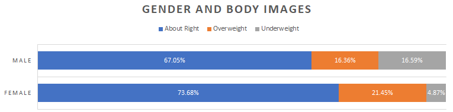

```{r, echo=FALSE, warning=FALSE}
knitr::opts_chunk$set(comment="#", fig.retina=2, crayon.enabled = TRUE)
# library(stats)
library(kableExtra)
library(knitr)
# library(formattable)
# library(ggplot2)
library(ggthemes)
library(ggExtra)
# library(dplyr,warn.conflicts = FALSE)
xaringanExtra::use_fit_screen()
```

## Learning Goals for Two-way Tables

- Summarize and interpret the relationship between two two qualitative (categorical) variables using two-way tables.

- Demonstrate understanding and find conditional, joint and marginal probability from a two-way frequency table.

- Create and analyze two-way table to answer probability questions.

---

## Two-way Frequency Tables

- As we organize and analyze data from two categorical variables, we make use of two-way tables.

- Information in a **two-way frequency table**:
  
  - Values of the two variables are displayed in the left column and the top row.
  
  - The body of table consists of frequency counts associated to pairs of values of the two variables.
  
  - The right column and the bottom row, which are called margins of the table, consists of row totals and column totals respectively.


- A number in a margin are called **marginal frequency**.

- A numbers in the body of the table is called **joint frequency**.

---

## Example: Body Image and Gender

The following table summarize responses of a random sample of 1,200 U.S. college students as part of a larger survey.

.center[
|                   | &nbsp; About Right &nbsp; | &nbsp; Overweight &nbsp; | &nbsp; Underweight &nbsp; | &nbsp; Row Totals &nbsp; |
| ----------------- | --------------- | -------------- | --------------- | -------------- |
| Female        | 560             | 163            | 37              | 760            |
| Male          | 295             | 72             | 73              | 440            |
| Column Totals | 855             | 235            | 110             | 1,200          |
]

.footmark[
  Source: [https://courses.lumenlearning.com/wmopen-concepts-statistics](https://courses.lumenlearning.com/wmopen-concepts-statistics/chapter/two-way-tables-1-of-5/)
]

---

## Two-Way Relative Frequency Tables and Probability

- A **two-way relative frequency table** is obtained from a two-way frequency table by converting  frequencies in a two-way table to relative frequencies.

- **Marginal probability**
  $$P(X)=\frac{\text{Marginal frequency in}~ X}{\text{Total}}$$

- **Conditional probability**
  $$P(X|Y)=\frac{\text{Joint frequency}}{\text{Marginal Frequency in}~Y} \quad \text{or}\quad P(Y|X)=\frac{\text{Joint frequency}}{\text{Marginal Frequency in}~X}$$

- **Joint probability**
  $$P(X ~\text{and}~ Y)=\frac{\text{Joint frequency}}{\text{Total}}$$

- Note that $P(X~\text{and}~Y)=P(X)\cdot P(Y|X)=P(Y)\cdot P(X|Y).$

---

## Example: Joint and marginal probabilities of body image and gender

The following table shows joint and marginal probabilities of body image and gender.

.center[
|                 | About Right | Overweight | Underweight | Row Totals |
| --------------- | ----------- | ---------- | ----------- | ---------- |
| Female          | &nbsp; $\frac{560}{1200}=46.67\%$ &nbsp; | &nbsp;  $\frac{163}{1200}=13.58\%$ &nbsp; | &nbsp; $\frac{37}{1200}=3.08\%$ &nbsp; | &nbsp; $\frac{760}{1200}=63.33\%$ &nbsp; |
| Male            | $\frac{295}{1200}=24.58\%$      | $\frac{72}{1200}=6.00\%$      | $\frac{73}{1200}=6.08\%$       | $\frac{440}{1200}=36.67\%$     |
| Column   Totals | $\frac{855}{1200}=71.25\%$      | $\frac{235}{1200}=19.58\%$     | $\frac{110}{1200}=9.17\%$       | $\frac{1200}{1200}=100.00\%$    |
]

---

## Example: Conditional probabilities of body image by gender

The following table shows probabilities of randomly select male or female who has a certain body image.

.center[
  |                 | About Right | Overweight | Underweight | Row Totals |
| --------------- | ----------- | ---------- | ----------- | ---------- |
| Female          | &nbsp; $\frac{560}{760}=73.68\%$ &nbsp; | &nbsp; $\frac{163}{760}=21.45\%$ &nbsp; | &nbsp; $\frac{37}{760}=4.87\%$ &nbsp; | &nbsp; $\frac{760}{760}=100.00\%$ &nbsp; |
| Male            | $\frac{295}{440}=67.05\%$      | $\frac{72}{440}=16.36\%$     | $\frac{73}{440}=16.59\%$      | $\frac{440}{440}=100.00\%$    |
]

---

## Example: Community College Enrollment (1/2)

The following table summarizes the full-time enrollment at a community college.

.center[
  |                   | Arts-Sci | Bus-Econ | Info Tech | Health Science | Graphics Design | Culinary Arts | Row Totals |
| ----------------- | ------------ | ------------ | ------------- | ------------------ | ------------------- | ----------------- | -------------- |
| Female        | 4,660        | 435          | 494           | 421                | 105                 | 83                | 6,198          |
| Male          | 4,334        | 490          | 564           | 223                | 97                  | 94                | 5,802          |
| Column Totals | 8,994        | 925          | 1,058         | 644                | 202                 | 177               | 12,000         |
]

What proportion of the total number of students are male students?  

--
**Solution:**
$$P(\text{Male})=\dfrac{5802}{12000}\approx 0.4835=48.35\%.$$

.footmark[
  Source: [https://courses.lumenlearning.com/wmopen-concepts-statistics](https://courses.lumenlearning.com/wmopen-concepts-statistics/chapter/two-way-tables-2-of-5/)
]

---

## Example: Community College Enrollment (2/2)

If we select a male student at random, what is the probability that he is in the Info Tech program?  

--
**Solution:**
$$P(\text{Info Tech}|\text{Male})=\dfrac{564}{5802}\approx 0.097=9.7\%.$$

--
If a student is selected at random, what is the probability that the student is a male and in the Info Tech program?  

--
**Solution:**
$$P(\text{Male and Info Tech})=\dfrac{564}{12000}= 0.047=4.7\%.$$

--
The probabilities are related:  

--
**Solution:**
$$P(\text{Male and Info Tech})=\dfrac{564}{12000}=\dfrac{5802}{12000}\cdot \dfrac{564}{5802}=P(\text{Male})\cdot P(\text{Info Tech}|\text{Male}).$$

---

## Practice: A table relates weights and heights

This table relates the weights and heights of a group of individuals participating in an observational study.

| &nbsp; &nbsp; Weight/Height &nbsp; &nbsp; | &nbsp; &nbsp; Tall &nbsp; &nbsp; | &nbsp; &nbsp; Medium &nbsp; &nbsp; | &nbsp; &nbsp; Short &nbsp; &nbsp; |
| :---: | :---: | :---: | :---: |
| Obese         | 18   | 28     | 14    |
| Normal        | 20   | 51     | 28    |
| Underweight   | 12   | 25     | 9     |

1. Find the total for each row and column
2. Find the probability that a randomly chosen individual from this group is Short.
3. Find the probability that a randomly chosen individual from this group is Obese and Short.
4. Find the probability that a randomly chosen individual from this group is Underweight given that the individual is Tall.

.footmark[Source: https://courses.lumenlearning.com/introstats1/chapter/contingency-tables/]

---

## Test of (No) Association

- To understand association between categorical variables, we may think conversely. How do we test no association?

- If the conditional probabilities are nearly equal for all categories, there may be no association between the variables. Conversely, if the conditional probabilities are different enough, we are confidence to say there is an association.
  
- In general, the bigger the differences in the conditional probabilities, the stronger the association between the variables.

- Two variables $X$ and $Y$ are **independent** if $P(X~\text{and}~Y)=P(X)\cdot P(Y)$. Equivalently, $P(X|Y)=P(X)$ and $P(Y|X)=P(Y)$.

---

## Example: Association between body image and gender (1/2)

Is body image related to gender?

.center[
|                   | &nbsp; &nbsp; About Right &nbsp; &nbsp; | &nbsp; &nbsp; Overweight &nbsp; &nbsp; | &nbsp; &nbsp; Underweight &nbsp; &nbsp; | Row Totals |
| ----------------- | --------------------- | -------------- | --------------- | -------------- |
| Female        | 560             | 163            | 37              | 760            |
| Male          | 295             | 72             | 73              | 440            |
| Column Totals | 855             | 235            | 110             | 1,200          |
]
  
---

## Example: Association between body image and gender (2/2)

**Solution:** Using Excel (stacked bar chart), we may compare side-by-side the conditional body image distributions for females and males
.center[

]

As a result of our analysis, we know that the conditional distributions of body images for males and females are quite different. We can conclude that there is enough difference to believe that those two categorical variables are in fact related.

---

## Percentage Reduction of Risk

- When calculating the probability of a negative outcome, we often refer to the probability as a **risk**.

- In general, we are interested in determining how much a new treatment reduces the risk compared to a reference risk

- The **percentage reduction of risk** is

  $$\text{percentage reduction of risk}=\frac{\text{new treatment risk}-\text{reference risk}}{\text{reference risk}}.$$

---

## Example: Risk and the Physicians’ Health Study (1/2)

Researchers in the Physicians’ Health Study (1989) designed a randomized double-blind experiment to determine whether aspirin reduces the risk of heart attack. Here are the final results.

|               | &nbsp; &nbsp; **Heart Attack** &nbsp; &nbsp; | &nbsp; &nbsp; **No Heart Attack** &nbsp; &nbsp; | **Row Totals** |
| :-----------------: | :----------------------: | :-------------------------: | :--------------: |
| **Aspirin**       | 139              | 10,898              | 11,037         |
| **Placebo**       | 239              | 10,795              | 11,034         |
| **Column Totals** | 378              | 21,693              | 22,071         |

*Does aspirin lower the risk of having a heart attack?*

.footmark[
  Source: [https://courses.lumenlearning.com/wmopen-concepts-statistics](https://courses.lumenlearning.com/wmopen-concepts-statistics/chapter/two-way-tables-4-of-5/)
]

---

## Example: Risk and the Physicians’ Health Study (2/2)

**Solution:** To answer this question, we compare two conditional probabilities:

- The probability of a heart attack given that aspirin was taken every other day.
  $$P(\text{heart attack}|\text{aspirin}) = 139 / 11,037 = 0.013$$
- The probability of a heart attack given that a placebo was taken every other day.
  $$P(\text{heart attack}|\text{placebo}) = 239 / 11,034 = 0.022$$

The result shows that taking aspirin reduced the risk from 0.022 to 0.013.

The percentage reduction of risk is
$$
\frac{\text{0.013}-\text{0.022}}{\text{0.022}}=\frac{-\text{0.009}}{\text{0.022}}\approx -\text{0.41}.
$$

Therefore, we conclude that taking aspirin results in a 41% reduction in risk.

---

## Hypothetical Two-way Tables

A **hypothetical two-way table**, also known as a hypothetical 1000 two-way table, is a two-way table constructed from given probability conditions with 1000 as the total frequency. It can be used to answer complex probability questions.

Sometimes, the total frequency can be taken to be 10,000 or a higher power of 10 so that joint frequencies are integers.
  
---

## Example: Birth gender prediction (1/2)

A pregnant woman often opts to have an ultrasound to predict the gender of her baby.
Assume the following facts are known:

- Fact 1: 48% of the babies born are female.
- Fact 2: The proportion of girls correctly identified is 9 out of 10.
- Fact 3: The proportion of boys correctly identified is 3 out of 4.

Use the above facts to answer the following questions.

1. If the examination predicts a girl, how likely the baby will be a girl?

2. If the examination predicts a boy, how likely the baby will be a boy?

--

**Solution:** Assume that we have ultrasound predictions for 1,000 random babies.

- Fact 1 means that $P(\text{Girl})=48\%$.
- Fact 2 means that $P(\text{Predicted as girl}|\text{Girl})=9/10$.
- Fact 3 means that $P(\text{Predicted as boy}|\text{Boy})=3/4$

---

## Example: Birth gender prediction (2/2)

**Solution: (Continued)**

Using those facts, we may create a two-way frequency table.
.center[
|                 | Girl           | Boy             | Row Totals  |
| --------------- | -------------------- | --------------------- | ----------- |
| Predict Girl  | $480\cdot\frac{9}{10}= 432$ | $520-390 = 130$ | $432+130=562$ |
| Predict Boy   | $480-432=48$     | $520\cdot\frac34=390$     | $48+390=438$  |
| Column   Totals | &nbsp; &nbsp; $48\%\cdot 1000=480$  &nbsp; &nbsp;          | &nbsp; &nbsp; $1000-480=520$  &nbsp; &nbsp;  | $1,000$       |
]

If the examination predicts a girl, the probability that the born baby is a girl is
$$P(\text{Girl}|\text{predict girl})=\frac{432}{562} \approx 0.769=76.9\%.$$

If the examination predicts a boy, the probability that the born baby is a boy is
$$P(\text{Boy} | \text{predict boy}) = \frac{390}{438} \approx 0.890=89\%.$$

---

## Practice

The table below is based on a 1988 study of accident records conducted by the Florida State Department of Highway Safety.
.center[
|                   |  &nbsp; **Nonfatal** &nbsp; | &nbsp; **Fatal** &nbsp; | &nbsp; **Row Totals** &nbsp; |
| ----------------- | ------------ | --------- | -------------- |
| **Seat Belt**     | 412,368      | 510       | 412,878        |
| **No Seat Belt**  | 162,527      | 1,601     | 164,128        |
| **Column Totals** | 574,895      | 2,111     | 577,006        |
]

*Does wearing a seat belt lower the risk of an accident resulting in a fatality?*

.footmark[Source: [https://courses.lumenlearning.com/wmopen-concepts-statistics](https://courses.lumenlearning.com/wmopen-concepts-statistics/chapter/two-way-tables-4-of-5/)
]

---

## Practice: Drug screening

A large company has instituted a mandatory employee drug screening program. Assume that the drug test used is known to be 99% accurate. That is, if an employee is a drug user, the test will come back positive (“drug detected”) 99% of the time. If an employee is a non-drug user, then the test will come back negative (“no drug detected”) 99% of the time. Assume that 2% of the employees of the company are drug users.

If an employee’s drug test comes back positive, what is the probability that the test is wrong and the employee is in fact a non drug user?

.footmark[
  Source: [https://courses.lumenlearning.com/wmopen-concepts-statistics](https://courses.lumenlearning.com/wmopen-concepts-statistics/chapter/two-way-tables-5-of-5/)
]

---

class: center middle

# Lab Instructions in Excel

---

## Create Stacked Bar Chart

- To create a a stacked bar chart of a two-way table
  
  - First select the data table.
  
  - Look for and click `Insert Column or Bar Chart` in the menu `Insert`-> `Charts`.
  
  - In the dropdown menu, choose the third option in 2-D Column (`100% Stacked Column`) or the third option 2-D Bar (`100% Stacked Bar`).
  
  - To switch row/column, in the output graph, right click the row axis or the column axis, and chose the option `Select Data...` to make a switch.

---

## Practice: Is there an association between gender and program selection

The following table summarize results from a study on program selection and gender.

.center[
  |                   | Arts-Sci | Bus-Econ | Info Tech | Health Science | Graphics Design | Culinary Arts | Row Totals |
| ----------------- | ------------ | ------------ | ------------- | ------------------ | ------------------- | ----------------- | -------------- |
| Female        | 4,660        | 435          | 494           | 421                | 105                 | 83                | 6,198          |
| Male          | 4,334        | 490          | 564           | 223                | 97                  | 94                | 5,802          |
| Column Totals | 8,994        | 925          | 1,058         | 644                | 202                 | 177               | 12,000         |
]

Use Excel to answer the following question about the study.

- Is there an association between gender and program selection? Why or why not?

- If they are associated, is the association strong or week?
