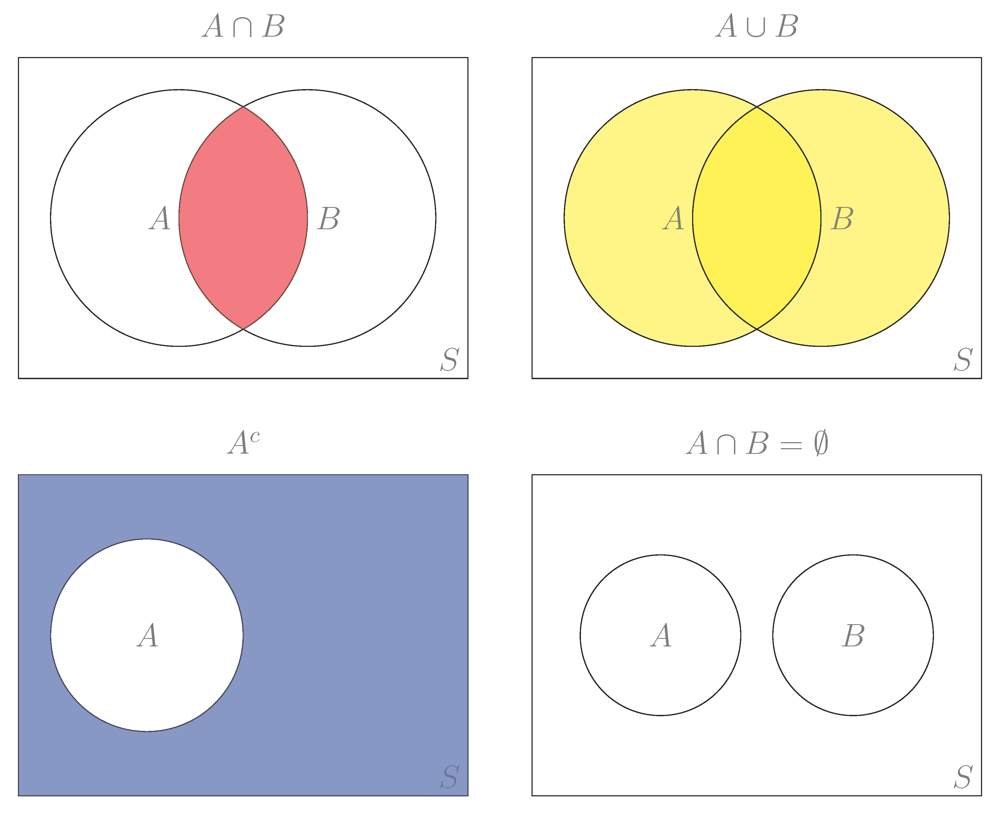
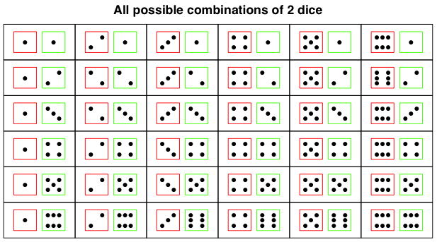

```{r, echo=FALSE,warning=FALSE}
knitr::opts_chunk$set(comment="#", fig.retina=2, crayon.enabled = TRUE, echo=FALSE)
set.seed(15)
# library(stats)
library(kableExtra)
library(knitr)
# library(formattable)
# library(ggplot2)
library(ggthemes)
library(ggExtra)
# library(dplyr,warn.conflicts = FALSE)
# library(animation)
# library(gifski)
xaringanExtra::use_fit_screen()
```

## Learning Goals for Probability and Probability Distribution

- Construct sample spaces and calculate probabilities for simple and/or compound events.

- Use appropriate rules of probability for compound events.

---

## Experiments, Sample Spaces, and Events

- An **experiment** is a procedure that can be infinitely repeated and has a well-defined set of outcomes.

- An **outcome** is the result of a single trial (individual repetition) of an experiment.

- A **chance experiment** (or **random experiment**) is an experiment that has more than one possible outcome and whose outcomes cannot be predicted with certainty.

- The **sample space** of a chance experiment is the set of all possible outcomes.

- An **event** is a subset of the sample space.

---

## Example: Chance Event

`r knitr::include_url("https://seeing-theory.brown.edu/basic-probability/index.html#section1",height="560px")`

.footmark[
  Source: [https://seeing-theory.brown.edu/basic-probability/index.html#section1](https://seeing-theory.brown.edu/basic-probability/index.html#section1)
]
---

## Complement, Intersection and Union

- The **complement** $E^c$ of event $E$ is the set of all outcomes in a sample space that are **NOT** included in
event $E$.

- The **intersection** $A\cap B$ of two events $A$ and $B$ is the set of all outcomes in the sample space that are shared by $A$ and $B$.

- The **union** $A\cup B$ of two events $A$ and $B$ is the set of all outcomes in the sample space that are either in $A$ or $B$.

- Two events $A$ and $B$ are **mutually exclusive** if there intersection $A\cap B$ is empty.

---

## Venn Diagrams for Complement, Intersection, and Union

.center[
  
]

---

## Classical Definition of Probability

- A **probability** $P(E)$ is the measures of how likely an outcome in the event $E$ will occur in a chance experiment.

- **Equally likely** means that each outcome of an experiment occurs with equal chance.

- When the outcomes in the sample space of an chance experiment are ***equally likely***, the probability of an event $E$ is
  $$P(E)=\dfrac{\text{number of outcomes in }E}{\text{number of outcomes in }S}$$

- Chance experiment that involves tossing fair coins, rolling fair dice and drawing a card from a well-mixed deck of cards have equally likely outcomes.

- Note that many chance experiment do not have equally likely outcomes. For example, the majors of students in a class are not equally likely outcomes.

---

## Example: Flipping a Coin

Imagine flipping one fair coin (which means the chance of a head and the chance of a tail are the same). What is the probability of getting the head.

**Solution:**
There are two possible outcomes: **Head** or **Tail**.

So the sample space is the set
$$S = \{\text{Head}, \text{Tail}\}.$$

The event $E$ of getting a head is the subset
$$E=\{\text{Head}\}.$$

The probability $P(E)=\dfrac{1}{2}=0.5$.

---

## Empirical Probability

- An **empirical (or a statistical) probability** is the relative frequency of occurrence of outcomes from observations in repeated experiments:

$$
\begin{aligned}
  P(E)=&\dfrac{\text{number of occurrence of event } E}{\text{total number of observations}}\\[0.5em]
  =&\dfrac{\text{frequency in }E}{\text{total frequency}}.
\end{aligned}
$$

---

## Example: Chance of Selecting a Math Major

A statistics class has 5 math majors and 20 other majors. If a students was randomly select from the class, what's the probability that the selected students is a math major?

--

**Solution:**
The sample space is the set of all students in the statistics class.
The event is the set of the 5 math majors.
Then the probability is
$$
  P(E)=\dfrac{\text{frequency of math majors}}{\text{total frequency of students}}=\dfrac{5}{25}=0.2.
$$

---

## Theoretical Probability

- Theoretical probability is an expected value that can be calculated by mathematical theory and assumptions.

- When all outcomes in the sample space are equally likely, the probability of a desired event $E$, known as a **theoretical probability**,  is calculated by

  $$
  P(E)=\dfrac{\text{number of desired outcomes for event }E}{\text{number of all possible outcomes}}.
  $$

- **Tree diagrams** are often used for counting all possible outcomes.

---

## Example: Flipping a Coin Twice

Find the probability of getting two heads when flipping a fair coins twice.

--

**Solution:** In the first time, the coin has two possible outcomes. The second time, the coin still has two possible outcomes. By the fundamental counting principle, we know that the sample space $S$ contains $2\cdot 2=4$ possible outcomes.
.center[

]
The event $E$ of getting 2 heads contains only one outcome: head and head. So the probability of getting two head when flipping a fair coin twice is
$$P(E)=\frac{1}{4}.$$

---

## Empirical vs Theoretical: Coin Flip Simulation

The purpose of this activity is to experiment with a simulation of flipping a **fair** coin, and to see if the P(H) = 0.5.

`r knitr::include_url("https://www.geogebra.org/material/iframe/id/112248", height="440px")`

.footmark[
  Source: [GeoGebra](http://ggbtu.be/mLZbwMZtJ) License: [CC BY SA](http://creativecommons.org/licenses/by/3.0/us/)
]

---

## Law of Large Numbers

- The empirical probability of an event is an "estimate" that based upon observed data from an experiment.

- The theoretical probability of an event is an "expected" probability based upon counting rules.

- **Law of Large Numbers:** As an experiment is repeated over and over, that is the number of trials getting larger and larger,  the empirical probability of an event approaches the theoretical probability of the event. ([Wiki: Law of large numbers](https://en.wikipedia.org/wiki/Law_of_large_numbers).)

- By the law of large number, we can say that the probability of any event is the **long-term relative frequency** of that event.

---

## Example: Law of Large Numbers by a Coin Flipping Simulation

A demonstration for the law of large number by simulating coin flipping.

<!-- Source: [The University of Chicago School Mathematics Project](http://ucsmp.uchicago.edu/secondary/applets/law-of-large-numbers/) -->

`r knitr::include_url("http://digitalfirst.bfwpub.com/stats_applet/stats_applet_10_prob.html", height="480px")`

.footmark[
  Source: [http://digitalfirst.bfwpub.com/stats_applet/stats_applet_10_prob.html](http://digitalfirst.bfwpub.com/stats_applet/stats_applet_10_prob.html)
]
---

## Practice: Red Light Runner

`r include_url("https://www.myopenmath.com/embedq2.php?id=7088&seed=2020&showansafter")`

---

## Practice: Flipping a Fair Coin Twice

Flipping a fair coin twice, find the probabilities of getting exactly one head.

---

## Fundamental Properties (that Define Probability)

- **Property 1:** For an event $E$, the probability $P(E)$ is ranged from 0 to 1:
  $$0\leq P(E)\leq 1.$$

- **Property 2:** If $S$ is the sample space, then $P(S)=1$.

- **Property 3:** The probability of an event $E=\{e_1,e_2, \cdots e_k\}$ of distinct outcome is equal to the sum of probabilities of individual outcomes:
  $$P(E)=P(e_1)+P(e_2)+\cdots+P(e_k)$$
  where $P(e_i)$ is the probability of getting the outcome $e_i$.

**Remark:** When an event $E$ consists of infinitely many outcomes, the right hand side of the equality in Property 3 will be an infinite sum.

---

## Two Easy Consequences

- **Easy consequence 1:** If events $A$ and $B$ are mutually exclusive, then
  $$P(A\cup B)=P(A)+P(B).$$

- **Easy consequence 2:** The probability $P(E)$ of an event $E$ and the probability $P(E^c)$ of the complement event $E^c$ satisfies the identity:
  $$P(E)+P(E^c)=1.$$

  Equivalently,
  $$
  P(E^c)=1-P(E)\quad\text{or}\quad P(E)=1-P(E^c).
  $$

---

## Example: Six-sided Die (1/2)

A six-sided fair die is rolled. Denote by $E$ the event of getting a number less than $3$.

1. Find the probability $P(E)$ of the event $E$.
2. Find the probability $P(E^c)$ of the complement $E^c$ of the event $E$.
3. Verify that $P(E)+P(E^c)=1$.

---

## Example: Six-sided Die (2/2)

**Solution:** The sample space of the six-sided die is $\{1,2,3,4,5,6\}$.

The event $E$ consists of 2 numbers: $E=\{1, 2\}$.

The probability is
$$
P(E)=\frac26=\frac13.
$$

The complement $E^c=\{3, 4, 5, 6\}$ and the probability is
$$
P(E^c)=\frac46=\frac23.
$$

Then $P(E)+P(E^c)=\frac13+\frac23=1.$

---

## Example: Sum of Two Numbers from Rolling Two Dice (1/2)

Two six-sided fair dice were rolled. Find the probability of getting two numbers whose sum is at least 4.

--

**Solution:** The sample space contains $6\cdot 6=36$ possible out comes.

.center[

]

.footmark[
  Source of image: [https://sasandr.wordpress.com/2012/05/04/rolling-the-dice-ii/](https://sasandr.wordpress.com/2012/05/04/rolling-the-dice-ii/)
]

---

## Example: Sum of Two Numbers from Rolling Two Dice (2/2)

**Solution: (continued)** Let $E$ be the event of the sum is at least 4. Then the complement $E^c$ consists pairs of numbers whose sum are at most 3. There are 3 such pairs:
$$E^c=\{(1, 1), (1, 2), (2, 1)\}.$$

Therefore,
$$
\begin{aligned}
  P(E^c)=&P((1,1))+P((1,2))+P((2,1))\\
  =&\frac16\cdot\frac16+\frac16\cdot\frac16+\frac16\cdot\frac16=\frac{1}{12}.
\end{aligned}
$$

Apply the complement rule, we find
$$P(E)=1-P(E^c)=\frac{11}{12}.$$

---

## Practice: Spinner with 12 Numbers

`r knitr::include_url("https://www.myopenmath.com/embedq2.php?id=7107&seed=2020&showansafter", height="500px")`

---

## Practice: M&M with a specific color

`r knitr::include_url("https://www.myopenmath.com/embedq2.php?id=34681&seed=2020&showansafter", height="500px")`

---

## Probability for Chance Experiment with Equally Likely Outcomes

When outcomes in the sample spaces are equally likely,

- the **probability of the intersection** of two events is
  $$
  P(A\cap B)=\dfrac{\text{numbers of elements in } A\cap B}{\text{number of elements in the sample space }S}.
  $$

- the **probability of the union** of two events is
  $$
  P(A\cup B)=\dfrac{\text{numbers of elements in } A\cup B}{\text{number of elements in the sample space }S}.
  $$

---

## The Addition Rule

In general, the probability of the union of two events from a chance experiment is defined by the basic rules and the addition rule.

- **Addition Rule:** the probability of the union of two events $A$ and $B$ is
  $$
  P(A\cup B)=P(A)+P(B)-P(A\cap B).
  $$

---

## Example: Intersection, Union and Mutually Exclusive (1/2)

A card was randomly drew from a deck of 52 cards.

1. What's the probability of getting a heart?
2. What's the probability of getting a face (king, queen, or jack)?
3. What's the probability of getting a heart face?
4. What's the probability of getting a heart or a face?
5. What's the probability of getting a club and spade?

.center[
  
<br>
]

.footmark[
  Image source: [Wikipedia: Standard 52-card deck](https://en.wikipedia.org/wiki/Standard_52-card_deck)
]

---

## Example: Intersection, Union and Mutually Exclusive (2/2)

**Solution:** The sample space $S$ consists of 52 cards. There are 13 hearts and 12 faces.
$$P(\text{heart})=\frac{13}{52}=\frac14,\quad P(\text{face})=\frac{12}{52}=\frac3{13}.$$
There are 3 heart face cards. Then
$$
P(\text{heart and face})=\frac{3}{52}=\frac{1}{14}.
$$
There are $22$ cards that are either hearts or faces. Then
$$
P(\text{heart or face})=\frac{22}{52}=\frac{11}{26}.
$$
Since there is no card which is club and spade, we have
$$
P(\text{club and spade})=0.
$$

.small[
**Note:** From the addition formula,
$P(\text{heart or face})=P(\text{heart})+P(\text{face})-P(\text{heart and face})=\frac{13}{52}+\frac{12}{52}-\frac{3}{52}=\frac{22}{52}=\frac{11}{26}.$
]

---

## Practice: Addition Rule

`r knitr::include_url("https://www.myopenmath.com/embedq2.php?id=67988&seed=2020&showansafter", height="500px")`

---

## The Conditional Probability

- The **conditional probability** of $A$ given $B$, written as $P(A\mid B)$, is the probability that event $A$ will occur given that the event $B$ has already occurred.

- In the case that the chance experiment has equally likely outcomes, the conditional probability is,
  $$
  P(A\mid B)=\dfrac{\text{numbers of elements in }A\cap B}{\text{number of elements in }B}.
  $$

- In general, we may use fundamental rules of probability and the multiplication rule to calculate the conditional probability.

---

## The Multiplication Rule

- **Multiplication Rule:** the probability of the intersection of two events $A$ and $B$ satisfies the following equality
  $$
  P(A\cap B)=P(B)P(A\mid B)=P(A)P(B\mid A).
  $$

- The multiplication rule gives a formula for conditional probability:
  $$
  P(B\mid A)=\dfrac{P(A\cap B)}{P(A)}\qquad\qquad P(A\mid B)=\dfrac{P(A\cap B)}{P(B)}.
  $$

---

## Independent Events

- Two events $A$ and $B$ are **independent** if
  $$
  P(A\mid B)=P(A)\quad \text{ or }
  \quad P(B)=P(B\mid A).
  $$
  Equivalently,
  $$
  P(A\cap B)=P(A)P(B).
  $$

- **Fundamental Counting Principle:** if there are $m$ ways of doing something and $n$ ways of doing another thing independently, then there are $m\cdot n$ ways of performing both actions *in order*.

---

## Example: Conditional Probability

A fair six-sided die is rolled.

Find the probability that the number rolled is a two, given that it is even.

--

**Solution:** Let $A$ be the event of all possible even outcomes. Then
$$A=\{2, 4, 6\}.$$

Let $B$ be the event consisting of the outcome 2. Then
$$B=\{2\}.$$

The intersection event $A\cap B$ consists of the number $2$.

By the definition of conditional probability,
$$P(B|A)=\dfrac{1}{3}.$$
.small[
**Note:** Since there are 6 possible outcomes in total, $P(A)=\frac36=\frac12$, $P(A\cap B)=\frac16$, and then $P(B|A)=\frac{P(A\cap B)}{P(A)}=\frac16/\frac12=\frac13$.
]
---

## Example: Fundamental Counting Principle and Multiplication Rule (1/2)

Consider flipping a fair coin and rolling a fair six-sided die together.

1. What's the probability that the coin shows a head?
2. Given that a head occurs, what's the probability that the die shows a number bigger than 4?
3. What's the probability of getting a head and a number bigger than 4?
4. Verify that flipping a head and rolling a number bigger than 4 are independent events.

--

**Solution:** By the fundamental counting principle, the sample space consists of $2\times 6=12$ elements. Let $H$ be the event of getting a head and $D$ be the event getting a number bigger than 4.

Then
$$
H=\\\{H1, H2, H3, H4, H5, H6\\\},\quad D=\\\{H5,H6,T5,T6\\\},\quad D\cap H=\\\{H5, H6\\\}.
$$
Therefore, The probability of getting a head is $P(H)=\frac{6}{12}=\frac12$. The probability of getting number bigger than 4 is $P(D)=\frac{4}{12}=\frac13$

---

## Example: Fundamental Counting Principle and Multiplication Rule (2/2)

**Solution: (continued)** Given that a head shows, the change of getting a number bigger than 4 is
$$P(D\mid H)=\frac{2}{6}=\frac13.$$

This can also be obtained by the multiplication rule,
$$P(D\cap H)=P(H)P(D\mid H)=\frac12\cdot\frac13=\frac16.$$

Since
$$P(D)=\frac13=P(D\mid H)\quad\text{and then}\quad P(D\cap H)=P(H)P(D|H)=P(H)P(D),$$
the events $H$ and $D$ are independent.

---

## Example: From Multiplication Rule to Addition Rule (1/2)

The probability that a student borrows a statistics book from the library is 0.3. The probability that a student borrows a biology book is 0.4. Given that a student borrowed a biology book, the probability that he/she borrows a statistics book is 0.6.

1. Find the probability that a student borrows a statistics book and a biology book.
2. Find the probability that a student barrows a statistics boor or a biology book.

---

## Example: From Multiplication Rule to Addition Rule (2/2)

**Solution:** Denote by $S$ the event that a student borrows a statistics book, and $B$ the event that the student borrows a biology book.

From the given conditions, we know that $P(S)=0.3$, $P(B)=0.4$ and $P(S\mid B)=0.6$.

By the multiplication rule, we know
$$
P(S\cap B)=P(B)P(S\mid B)=0.4\cdot 0.6=0.24.
$$

By the addition rule, we get
$$
\begin{aligned}
  P(S\cup B)=&P(S)+P(B)-P(S\cap B)\\
  =&0.3+0.4-0.24=0.46.
\end{aligned}
$$

---

## Sampling with Replacement or without Replacement

- **With replacement:** If each member of a population is replaced after it is picked, then that member has the possibility of being chosen more than once. When sampling is done with replacement, then events are considered to be independent, meaning the result of the first pick will not change the probabilities for the second pick.

- **Without replacement:** When sampling is done without replacement, each member of a population may be chosen only once. In this case, the probabilities for the second pick are affected by the result of the first pick. The events are considered to be dependent.

---

## Example: Drawing Cards with Replacement

Two cards were randomly drawn from a standard deck of 52 cards *with replacement*. Find the probability of getting exactly one club card.

--

**Solution:** There are two different pairs with exactly one club card: (club, not club), (not club, club).

When drawing with replacement, the events are considered to be independent. Therefore, the probability in those two situations are
$$P(\text{(club, not club)})=P(\text{club})\cdot P(\text{not club})=\frac{13}{52}\cdot\frac{39}{52},$$
$$P(\text{(not club, club)})=P(\text{not club})\cdot P(\text{club})=\frac{39}{52}\cdot\frac{13}{52}.$$
Then the probability of getting exactly one club is
$$P(\text{exactly one club})=\frac{13}{52}\cdot\frac{39}{52}+\frac{39}{52}\cdot\frac{13}{52}=\frac{3}{8}.$$

---

## Example: Drawing Cards without Replacement

Two cards were randomly drawn from a standard deck of 52 cards without replacement, which means the first card will not be put back.

- Find the probability that getting two spades.
- Find the probability that getting exactly one spade card.

--

**Solution:** Let $S1$ be the event of getting a spade in the first drawing and $S2\mid S1$ be the event of getting the second spade given the first card is a spade. The probability $P(S1)=\frac{13}{52}=\frac14$. The probability of $P(S2\mid S1)=\frac{12}{51}$. Then the probability of getting two spades is
$$
P(S1 \text{ and } S2)=P(S1)P(S2\mid S1)=\frac{1}{4}\cdot\frac{12}{51}=\frac{4}{51}.
$$

Let $NS1$ and $NS2$ be events of not getting a spade card in first and second drawing respectively. The probability of getting exactly one spade card is
$$
P(S1 \text{ and } NS2)+P(NS1\text{ and } S2)= \frac{13}{52}\cdot \frac{39}{51} + \frac{39}{52}\cdot\frac{13}{51}=\frac{13}{34}.
$$

---

## Practice: Guess a Password

`r knitr::include_url("https://www.myopenmath.com/embedq2.php?id=34710&seed=2020&showansafter", height="550px")`

---

## Practice: Conditional Probability

A special deck of 16 cards has 4 that are blue, 4 yellow, 4 green, and 4 red. The four cards of each color are numbered from one to four. A single card is drawn at random. Find the following probabilities.

1. The probability that the card drawn is red.
2. The probability that the card is red, given that it is not green.
3. The probability that the card is red, given that it is neither red nor yellow.
4. The probability that the card is red, given that it is not a four.

.footmark[
Source: [https://saylordotorg.github.io/text_introductory-statistics/s07-03-conditional-probability-and-in.html](https://saylordotorg.github.io/text_introductory-statistics/s07-03-conditional-probability-and-in.html)
]

---

## Practice: Conditional Probability Subject to Complement

`r knitr::include_url("https://www.myopenmath.com/embedq2.php?id=7151&seed=2020&showansafter", height="550px")`

---

## Practice: Pens Drawn from a Box without Replacement

A box contains 10 pens, 6 black and 4 red. Two pens are drawn without replacement, which means that the first one is not put back.

- What is the probability that both pens are red?
- What is the probability that at most one pen is red?
- What is the probability that at least one pen is red?

---

## Practice: Classical Question on Basic Rules of Probability

`r knitr::include_url("https://www.myopenmath.com/embedq2.php?id=162779&seed=2020&showansafter", height="550px")`
